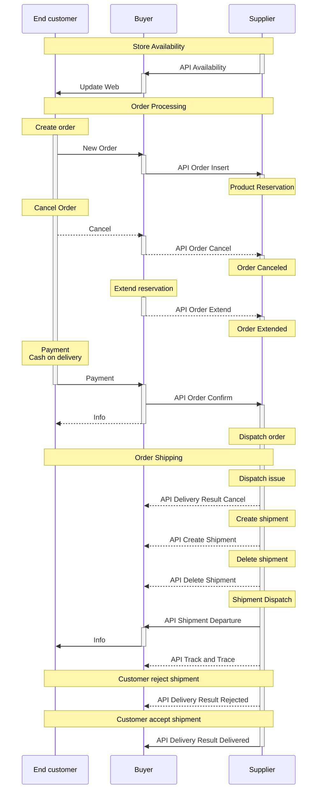

# Dropshipment API
{: .no_toc }

## Table of contents
{: .no_toc }

1. TOC
{:toc}

# Introduction {#introduction}

This documentation describes the features and capabilities of the **Dropshipment API**, which is intended for suppliers who want to
implement delivery of goods from the supplier directly to the end customer in its own information system.

The main part of the **Dropshipment API** is the **production Dropshipment API**, through which all necessary messages are exchanged 
for the successful completion of the entire business case. An additional component is the **Testing Dropshipment API**, which is 
intended to accelerate the connection of the supplier to the **production API**.

**Production Dropshipment API** consists of two parts:

+ ***[Buyer API][buyer-api]*** - Supplier pushes products *availability* and information about shipment 
    *dispatch* and *delivery*.
+ ***[Supplier API][supplier-api]*** - Which is used for *order* management

This separation aims to minimize delays of important events.

**Testing Dropshipment API** consists of two parts:

+ ***[Testing Buyer API][testing-buyer-api]*** - Works same as *[Buyer API][buyer-api]* but `test` variable is added to the URL.
+ ***[Testing Supplier API][testing-supplier-api]*** - Provides the ability to invoke a request to *[Supplier API][supplier-api]*

API provides specific test scenarios to detect API implementation errors. Both parts are implemented on Buyer side. 
No further implementation on the supplier side  is necessary. Just use of third party tools like Postman.


## Simplified communication scheme {#introduction--simplified-communication-scheme}



<!--  -->

## Upcoming features {#introduction--upcoming-features}

  - ??.2026 - **GLN**
    - *[Insert order][insert-order]*, *[Extend order][extend-order]*, *[Cancel order][cancel-order]* and *[Confirm order][confirm-order]* : 
        data length of `vatNo` changed from `100` to `30`
    - *[DeliveryAddress][ds-delivery-address]* : Object *[Address][ds-delivery-address]* renamed to [DeliveryAddress][ds-delivery-address]. 
        The attribute in JSON is still the same.
    - *[CompanyAddress][ds-company-address]* : A new object was introduced, used for invoicing purposes.
    - *[ShipmentAddress][ds-shipment-address]* : A new object was introduced, used for invoicing and routing purposes.
    - *[Confirm order][confirm-order] -> [Request][ds-order-confirm-request]* : New attribute `taxNo` added, used for invoicing purposes. 
    - *[Confirm order][confirm-order] -> [Request][ds-order-confirm-request]* : New attribute `glnList` added, used for invoicing purposes. 
    - *[Confirm order][confirm-order] -> [Request][ds-order-confirm-request]* : New attribute `shipmentDeliveryAddress` added, used for invoicing and routing purposes.
    - *[Confirm order][confirm-order] -> [Request][ds-order-confirm-request]* : New attribute `buyerAddress` added, used for invoicing purposes.
  - ??.2026 - **Delivery services**
    - *[Confirm order][confirm-order] -> [Request][ds-order-confirm-request]* : New attribute `shipmentDeliveryServices` added, used for carrier delivery serices.
    - *[Confirm order][confirm-order] -> [ShipmentDeliveryServices][ds-shipment-delivery-services]* : 
        New object contains three services. `oldApplianceRemoval`, `carryIn` and `basicInstallation`
    

## Versions {#introduction--versions}

  - **1.183** 29.05.2026
    - *[Shipping carrier][ds-shipping-carrier-code]* :  Added `DPDSK` for DPD Slovakia.
    - *[Shipping carrier delivery type][ds-shipping-carrier-delivery-type]* : 
        Added `DPDSK` for address delivery for *[shipping carrier][ds-shipping-carrier-code]* `DPDSK`.
    - *[Shipping carrier][ds-shipping-carrier-code]* :  Added `DPDHU` for DPD Hungary.
    - *[Shipping carrier delivery type][ds-shipping-carrier-delivery-type]* :
        Added `DPDHU` for address delivery for *[shipping carrier][ds-shipping-carrier-code]* `DPDHU`.
  - **1.182** 17.04.2026
    - *[Availability][availability]* : The limit per API message has changed from 50 MB to 30 MB.
  - **1.181** 14.04.2026
    - *[Error handling][error-handling] -> [Rate limits][rate-limits]* : New API behaviour introduced. Read more there.
    - *[Maintenance-free design][maintenance-free-design]* : The recommended maximum number of parallel supplier requests has changed from **10** to **5**.
  - **1.180** 03.03.2026
    - *[Confirm order][confirm-order] -> [Request][ds-order-confirm-request]* : Attribute `route` contains new attribute `routeDeliveryOrder`.
  - **1.179** 17.02.2026
    - *[Confirm order][confirm-order]* : We modified the *[Request][ds-order-confirm-request]* object. A new optional 
       attribute `shipmentExternalOrderNumber` was added, which is used for suppliers who print their own labels.
  - **1.178** 04.02.2026
    - *[Track and Trace][track-and-trace]* -> *[Request][ds-track-and-trace-request]* : `status` attribute updated.
    - *[TrackAndTraceStatus][ds-track-and-trace-status]* : New value `Stored` added to enum.
  - **1.177** 12.11.2025
    - *[Resend intervals][resend-intervals]* : Due to the high number of parallel operations on a single supplier, we are forced to limit this 
        behavior to improve performance. As a result, the limit for resending shipment requests has been reduced. The resending exception is 
        valid until the end of the year.
    - *[Maintenance-free design][maintenance-free-design]* : Adds parallel run recommendation.
  - **1.176** 16.10.2025
    - *[Confirm order][confirm-order] -> [Request][ds-order-confirm-request]* : `packageSorting` attribute updated.
    - *[PackageSortingGroup][ds-package-sorting-group]* : New value `CrossLC` added to enum.
  - **1.175** 19.09.2025
    - *[Authentication][authentication-token]* : Clarification of the casing used in the token calculation.
  - **1.174** 19.06.2025
    - *[Confirm order][confirm-order] -> [Request][ds-order-confirm-request]* : New attribute `packageSorting` for shipment package sorting before shipping.
  - **1.173** 21.05.2025
    - *[OrderNumber][ds-order-number]* : We are announcing a change to the order number format. The number will include the prefix DD. 
        The number change will be deployed in the near future. No API changes are required, considering that the order number was already marked as a string.
  - **1.172** 09.09.2024
    - *[Availability][availability]* : The `product.size1`, `product.size2`, `product.size3` and `product.weight` attributes are marked as 
        deprecated and optional before future removal. Product dimensions and weight are moved to Trade portal.
        The goal is to reduce the amount of data sent.
  - **1.171** 09.09.2024
    - *[Timeout settings][timeout-settings]* : Adds additional 15s for shipment and order messages for sender. Removes 20s for availability for receiver.
  - **1.170** 13.08.2024
    - *[Availability][availability]* : Adds new import type `PartialFull`. Only available on the new API URL. Contact Dropship Support for more information.
  - **1.169** 30.04.2024
    - *[Confirm order][confirm-order]* : *[Request][ds-order-confirm-request]* contains new attribute `route`(*[Route][ds-route]*). 
        Consists of attributes `routeName` and `routeStops`(*[RouteStop][ds-route-stop]*). Information is used on custom shipping stickers.
  - **1.168** 02.04.2024
    - *All API requests* : Adds clarification of the HTTP response status codes.
    - Relevant endpoints: *[Insert order][insert-order]*, *[Confirm order][confirm-order]*, *[Extend order][extend-order]*, *[Cancel order][cancel-order]*,
        *[Availability][availability]*, *[Delete shipment][delete-shipment]*, *[Shipment Departure][shipment-departure]*, 
        *[Create shipment][create-shipment]*, *[Track and Trace][track-and-trace]* and *[Delivery result][delivery-result]*. 
  - **1.167** 11.03.2024
    - *[CustomerId][ds-customer-id]* : Clarification of the use of the `customerId` attribute. 
        The attribute can be set for supplierBranchId and can be the same for all supplier branches. It is up to the supplier.
    - Relevant endpoints: *[Insert order][insert-order]*, *[Confirm order][confirm-order]*, *[Extend order][extend-order]*, *[Cancel order][cancel-order]* and 
        *[Invoke Insert order][testing-insert-order]*
  - **1.166** 12.12.2023    
    - *[Parcel shop identification][ds-parcel-shop-identification]* : Added `CZPOSTP`Post office delivery for shipping carrier code `CZPOST`.
  - **1.165** 16.08.2023
    - *[Full Availability][availability]* : 
        Full Availability is restricted to one request per day.
  - **1.164** 19.07.2023
    - *[Shipping carrier][ds-shipping-carrier-code]* :
        New shipping carrier `ALZA` added.
    - *[Shipping carrier delivery type][ds-shipping-carrier-delivery-type]* :
        New shipping carrier delivery types `ALZABRANCH` and `ALZABOX` are added for shipping carrier `ALZA`
    - *[Parcel shop identification][ds-parcel-shop-identification]* :
        New parcel shop identification `ALZABOX` are added for shipping carrier `ALZA`
    - *[Confirm order][confirm-order]* -> *[Request][ds-order-confirm-request]* :  
        Attribute `demandedExpeditionDate` is marked as deprecated.
    - *Shipping carrier identification* : Removed from documentation.
  - **1.163** 20.06.2023
    - *[Resend intervals][resend-intervals]* :
        Short and Default limit introduced. Preparations for strict enforcement of resending.
  - **1.162** 14.06.2023
    - *[Common Error Codes][common-error-codes]* :
        A new error code `-7` was added. Used in cases when resend limits are not followed.
    - *[Resend intervals][resend-intervals]* :
        Added a message subject relevant to the resend limit.
  - **1.161** 05.05.2023
    - *[SupplierProductCode][ds-supplier-product-code]* :
        Code length has been reduced from 100 characters to 50 characters.
  - **1.160** 02.05.2023
    - *[SupplierProductCode][ds-supplier-product-code]* :
        Introduces new data type for supplier product code. 
        Replaces all `code` attributes where are [String100][ds-string-100].
    - *[Availability][availability]* : 
        This especially impacts Availability where invalid supplier product codes will be ignored.
  - **1.159** 24.03.2023
    - *[Delete shipment][delete-shipment]* :
        Parameter `shipment` shortened from 100 characters to 50 characters.
    - *[Shipment Departure][shipment-departure]* : 
        Parameter `shipment` shortened from 100 characters to 50 characters.
    - *[Create shipment][create-shipment]* :
        Attribute `shipmentNumber` shortened from 100 characters to 50 characters.
    - *[Track and Trace][track-and-trace]* :
        Attribute `shipment` shortened from 100 characters to 50 characters. 
    - *Generate order packages* : 
        Removed from documentation
  - **1.158** 23.02.2023
    - *[Order Insert][insert-order]* :
        Added new attribute `serialNumbersExpected` in [OrderItem][ds-order-item].
  - **1.157** 28.11.2022
    - *[Shipping carrier delivery type][ds-shipping-carrier-delivery-type]* : 
        Added `DPDPARCELSHOP`, `DPDBOX` and `DPDALZABOX` for *[shipping carrier][ds-shipping-carrier-code]* `DPD`.
    - *[Parcel shop identification][ds-parcel-shop-identification]* : 
        Added `DPDPARCELSHOP`, `DPDBOX` and `DPDALZABOX` for DPD.
  - **1.156** 21.10.2022
    - *[Shipment Departure][shipment-departure]* : 
        `shippingCarrierIdentification` is not accepted anymore. Use `shippingCarrier` instead.
        The current request structure is [ShipmentDepartureRequest][ds-shipment-departure-request].
        The previous request structure was removed.
    - *[Confirm order][confirm-order]* : 
        `shippingCarrierIdentification` was removed from the request. Use `shippingCarrier` instead.
        The current request structure is [OrderConfirmRequest][ds-order-confirm-request].
        The previous request structure was removed.
    - *[Insert order][insert-order]* : 
        `alzaBarCode` was removed from the request.
        The current item structure is [OrderItem][ds-order-item].
        The previous item structure was removed.
    - *ShippingCarrierIdentification* : Not used anymore.
  - **1.155** 20.10.2022
    - *[API basics][api-basics]* : Clarification of use `timestamp` and `timestampUtc` attribute.
    - *[Authentication][authentication-token]* : Clarification of URL encode.
  - **1.154** 20.10.2022
    - *Generate order packages* : API message disabled.
  - **1.153** 20.10.2022
    - *[Cancel order][cancel-order]* : It is allowed to try to cancel the order after confirming the order.
        The supplier has a right to reject the attempt. See more in [Cancel order][cancel-order].
  - **1.152** 14.09.2022
    - *[Availability][availability]* : Due to non-compliance with the rules, it is necessary to take measures to eliminate 
        this behavior. When a certain limit is exceeded, messages could be rejected with an error code of `-5`. And it is 
        undesirable for the same message to be sent again.
  - **1.151** 06.09.2022
    - *[Confirm order][confirm-order]* : Fixed unclear description for attributes `demandedExpeditionDate` 
        and `shipmentDepartureTime`
  - **1.150** 05.09.2022
    - *[Create shipment][create-shipment]* : Adds Shipment consolidation rules.
    - *[Shipment departure][shipment-departure]* : Adds Shipment consolidation rules.
  - **1.149** 15.07.2022
    - *[Supplier product pricing][supplier-product-pricing]* : 
        Added a new topic that explains how product pricing is influenced by the supplier.
    - *[Availability][availability]* : 
        Introduced new attribute `productList[].countryPrice`, array of objects [CountryPrice][ds-country-price]
        necessary for *[Supplier product pricing][supplier-product-pricing]*
        This array replaces old structures for price, VAT and fees. 
        A attribute contains `country`, `currency`, `vat`, `sellingPriceWithoutVat` and `fees`. 
        Attribute `fees` of object [CountryPriceFees][ds-country-price-fees] consist of attributes `copyright` and `recycling`.
    - *[Availability][availability]* : 
        Attributes of **Legacy price mode** marked as ***Deprecated***. 
    - *[Order Insert][insert-order]* : 
        Attribute `orderItems[].unitPrice` marked as ***Deprecated***. Use `orderItems[].purchasePriceWithoutFees` 
        and `orderItems[].fees` instead.
  - **1.148** 22.03.2022
    - *[Order Insert][insert-order]* : 
        Introduced new attribute `orderItems[].purchasePriceWithoutFees`.
        Introduced new attribute `orderItems[].fees`. For future use in **Latest price mode**.
        See [OrderItem][ds-order-item].
  - **1.147** 16.02.2022
    - *[Create shipment][create-shipment]* : `packageId` changed from [Int16][ds-int-16] to [Int64][ds-int-64] for
    [ShipmentCreateItem][ds-shipment-create-item], [ShipmentCreatePackage][ds-shipment-create-package] 
    and [CreatedPackage][ds-created-package]
  - **1.146** 24.01.2022
    - *[Timestamp][ds-timestamp]* : Timestamp marked as [CET (Central European Time)](https://time.is/cs/CET) for clarification.
    - *[TimestampUtc][ds-timestamputc]* : Introduced new time format in [UTC (Coordinated Universal Time)](https://time.is/cs/UTC).
  - **1.145** 22.11.2021
    - *[Data types][data-types]* : Descriptions refined and tied to *[Data Structures][data-structures]*.
    - *[Data Structures][data-structures]* : 
        All structures refined and tied with coresponding [Data types][data-types]. 
        Added ranges and lengths of structures.
    - *[ErrorProduct][ds-error-product]* : the `price` attribute is no longer used.
    - *[Test Availability][testing-availability]* : The maximum number of products has increased to 100.  
  - **1.144** 28.07.2021
    - *[Shipping carrier][ds-shipping-carrier-code]* : New shipping carrier WE|DO introduced. With code `WEDO` 
        and delivery type `WEDOHD`
  - **1.143** 20.07.2021
    - *[Insert order][insert-order]* : Required attribute `supplierId` added. 
        Attribute `customerId` marked as required.
    - *[Confirm order][confirm-order]* : Required attribute `supplierId` and `supplierBranchId` added. 
        Attribute `customerId` marked as required. 
    - *[Extend order][extend-order]* : Required attribute `supplierId` and `supplierBranchId` added. 
        Attribute `customerId` marked as required.
    - *[Cancel order][cancel-order]* : Required attribute `supplierId` and `supplierBranchId` added. 
        Attribute `customerId` marked as required.
    - *[Authentication][authentication-token]* : Clarification of the term `client`
  - **1.142** 11.06.2021
    - *[Shipping carrier][ds-shipping-carrier-code]* : New shipping carrier GebrĂĽder Weiss introduced. With code `GebruderWeiss` 
        and delivery type `GebruderWeissStandard`
  - **1.141** 01.06.2021
    - *[Invoke Insert order][testing-insert-order]* : Adds custom `customerId` for communication with Supplier API.
  - **1.140** 19.05.2021
    - Changes effective from **September 2021**
    - *Generate order packages* : API message won't be accepted. 
        It is necessary to implement the *[Create shipment][create-shipment]* API message.
    - *Shipping carrier identification* : The data type will be removed from API 
        due to deprecation. Use *[Shipping carrier code][ds-shipping-carrier-code]* 
        and *[Shipping carrier delivery type][ds-shipping-carrier-delivery-type]* instead.
    - *[Confirm order][confirm-order]* : Attribute `shippingCarrierIdentification` will be removed from API message 
        due to deprecation. Use `shippingCarrier` instead.
    - *[Shipment departure][shipment-departure]* : Attribute `shippingCarrierIdentification` will be removed from API message 
        due to deprecation. Use `shippingCarrier` instead.
    - *[Insert order][insert-order]* : Attribute `alzaBarCode` will be removed from API message due to deprecation.  
  - **1.139** 18.05.2021
    - Testing API introduced.
    - *[Testing Supplier API][testing-supplier-api]* : API provides invocation of messages to *[Supplier API][supplier-api]*.
    - *[Testing Buyer API][testing-buyer-api]* : API providing same ability as *[Buyer API][buyer-api]* but in testing environment.
  - **1.138** 22.04.2021
    - *[FAQ][faq]* : New article with Frequently asked questions created.
  - **1.137** 14.01.2021
    - *[Shipment departure][shipment-departure]* : New object *[ShippingListGroup][ds-shipping-list-group]* with shipping list group 
      PDF URL added to response JSON object *[Shipment][ds-departured-shipment]* for shipments created by *[Create shipment][create-shipment]* API message. 
  - **1.136** 27.11.2020
    - *[Availability][availability]* : Added new rules for Update importType.
  - **1.135** 06.11.2020
    - *Shipping carrier identification* : Added `CZPOSTB` Česká pošta, Balíkovna.
    - *[Shipping carrier delivery type][ds-shipping-carrier-delivery-type]* : Added `CZPOSTB` Balíkovna delivery type to Česká pošta.
    - *[Parcel shop identification][ds-parcel-shop-identification]* : Added `CZPOSTB` Česká pošta Balíkovna.
  - **1.134** 15.09.2020
    - *[Availability][availability]* : A new optional `serialNumbers` attribute.
    - *[Insert order][insert-order]* : A new optional `serialNumbersRequired` attribute.
    - *[Shipment departure][shipment-departure]* : `items[].serials` marked as required if *Insert order* 
      `serialNumbersRequired` is true.
  - **1.133** 08.09.2020
    - *[Insert order][insert-order]* : Change response value requirement for attribute `validUntil`.
    - *[Extend order][extend-order]* : Change response value requirement for attribute `validUntil`.
  - **1.132** 01.09.2020
    - *[Shipping modes][shipping-modes]* : Added a topic that explains two ways to handle shipment delivery.
    - *Shipping carrier identification* : Added clarification on using `Supplier` value.
    - *[Shipping carrier delivery type][ds-shipping-carrier-delivery-type]* : Added clarification on using `Supplier` value.
    - *Generate order packages* : Marked as ***Deprecated***.
  - **1.131** 19.08.2020
    - *Generate order packages* : Added ability to process `ParcelShop` `shipmentDeliveryType`
  - **1.130** 22.07.2020
    - *Generate order packages* : Optional attribute `packageId` is added to `packages`.
  - **1.129** 16.07.2020
    - *[Timeout settings][timeout-settings]* : Added and set as required behavior.
  - **1.128** 13.07.2020
    - *[Create shipment][create-shipment]* : New API endpoint introduced for creating shipment for Buyer shipping mode.
    - *[Delete shipment][delete-shipment]* : New API endpoint introduced for deleting shipment for Buyer shipping mode.
  - **1.127** 08.07.2020
    - *[Shipment departure][shipment-departure]* : Clarification of the purpose of the shipment.
  - **1.126** 24.06.2020
    - *[Communication basics][communication-basics]* : New API service availability requirements added. 
  - **1.125** 23.06.2020
    - *[Confirm order][confirm-order]* : A new `shipmentDepartureTime` attribute has been added to the request. 
      Defines the time of shipment departure.
    - *[Shipment departure][shipment-departure]* : 
      A new `shipment.shippingList.shippingListId` attribute has been added to the response.
      A new `shipment.departureTime` attribute has been added to the response.
  - **1.124** 19.06.2020
    - *[Insert order][insert-order]* : Attribute `alzaBarCodes` may contain duplicates.
  - **1.123** 10.06.2020
    - *[Confirm order][confirm-order]* : A new `shipmentShippingMode` attribute has been added to the request. 
      Defines who handles *shipment number*, *package numbers*, *shipping list*, *shipping sticker* and *carrier data*.
    - *[Maintenance-free design][maintenance-free-design]* : Some points are marked as **required**
  - **1.122** 07.05.2020
    - *[Shipping carrier code][ds-shipping-carrier-code]* : FOFR added.
    - *[Shipping carrier delivery type][ds-shipping-carrier-delivery-type]* : FOFRSTD added.
  - **1.121** 14.04.2020
    - *[ApiaryUI](https://help.apiary.io/tools/interactive-documentation-v4/)* : Interactive Documentation v4 activated
  - **1.120** 10.04.2020
    - *[Shipping carrier code][ds-shipping-carrier-code]* : Shipping carrier HELICAR added.
    - *[Shipping carrier delivery type][ds-shipping-carrier-delivery-type]* : Shipping carrier delivery types HELICARSTD and HELICARUP added.
  - **1.119** 24.03.2020
    - *[Shipment departure][shipment-departure]* : New object shipment with shipping list PDF URL added to response 
      JSON for shipments created by *Generate order packages* API message 
  - **1.118** 18.03.2020
    - *Shipping carrier identification* : Marked as *deprecated*.
    - *[Shipping carrier code][ds-shipping-carrier-code]* : New data type for shipping carrier identification introduced.
    - *[Shipping carrier delivery type][ds-shipping-carrier-delivery-type]* : New data type for shipping carrier delivery type introduced.
    - *[Confirm order][confirm-order]*, *Generate order packages* and *[Shipment departure][shipment-departure]* : 
      Attribute `shippingCarrierIdentification` marked as *optional*. 
      New optional object `shippingCarrier` introduced which replaces attribute `shippingCarrierIdentification` in the future.
  - **1.117** 19.02.2020
    - *[Communication basics][communication-basics]* : `TLS` protocol version 1.2 or higher is required.
  - **1.116** 18.02.2020
    - *[Availability][availability]* : Refining the description of fields `productList[].fee` and `productList[].priceWithFee`.          
  - **1.115** 10.01.2020
    - *[Availability][availability]* : The current limit of 20,000 products is increased almost to 200,000 products per API message.
  - **1.114** 07.01.2020
    - API communication entities changed to the End customer, Buyer and Supplier due to contractual links.
    - *Generate order packages* : Method implementation conditions changed.
    - *[Track and Trace][track-and-trace]* : Method implementation conditions changed.
    - *[Shipment departure][shipment-departure]* : Starting June 2020, the attribute `items[].packageNumber` and `items[].quantity` 
        will be required.
  - **1.113** 18.11.2019
    - *Shipping carrier identification* : Najbert added.
  - **1.112** 08.11.2019
    - *[API basics][api-basics]* : New paragraph for API communication basics created. Part of introduction moved here.
    - *[API basics][api-basics]* : `User-Agent` header field is requiered
  - **1.111** 01.11.2019
    - *[Parcel shop identification][ds-parcel-shop-identification]* : New data type introduced. Used 
    for parcel shop identification.
    - *[Confirm order][confirm-order]* and *[Shipment departure][shipment-departure]* : New optional 
    object `parcelShop` introduced. Attributes `parcelShopIdentification` and `parcelShopBranchCode` are used for 
    identify target parcel shop
  - **1.110** 03.10.2019
    - *Generate order packages* : Added optional object `packages` with `weight` 
    and `volume` attributes.
    - *[Error handling][error-handling]* : Basic error handling rules introduced.
    - *[Common error codes][common-error-codes]* : Error codes `0` mentioned for completeness.
  - **1.109** 09.09.2019
    - *Shipping carrier identification* : Geis Point added.
  - **1.108** 26.07.2019
    - *[Maintenance-free design][maintenance-free-design]* statement update.
  - **1.107** 13.05.2019
    - *[Delivery result][delivery-result]* : New optional `errorProducts` array for Canceled status
  - **1.106** 11.04.2019
    - *[Buyer API][buyer-api]* : New API endpoint released. More information on specific API messages.
    - *[Extend order][extend-order]* : Added optional `validUntil` attribute with recommended expiration date

All older release messages for version **0.xxx** have been hidden due to the length of the list

<!--     
  - **0.105** 07.11.2018
    - *[Maintenance-free design][maintenance-free-design]* statement.
    - *[Extend order][extend-order]* : is marked as required.
    - *[Insert order][insert-order]* : Explicit mention of the use of error code `-3`.
    - *[Error codes][common-error-codes]* : Error code `-3` is marked as method-specific acceptable.
  - **0.104** 02.10.2018
    - *[Shipment departure][shipment-departure]* : `shipmentValue` and `shipmentValueCurrency` is conditionally marked as required. 
  - **0.103** 10.09.2018
    - *[Error codes][common-error-codes]* : New error code `-5` annouced.
    - *[Extend order][extend-order]* : First use of new error code.
  - **0.102** 02.08.2018
    - *Generate order packages* : New method to generate order packages. Work in progress.
  - **0.101** 25.7.2018
    - *[Availability][availability]* : Message limitation announced.
  - **0.100** 25.7.2018
    - *[Insert order][insert-order]* : Attribute `alzaBarCode` mark as deprecated. 
    - *[Insert order][insert-order]* : New attribute `alzaBarCodes` introduced. Future replacement for `alzaBarCode` attribute.
  - **0.99** 11.7.2018
    - Specify how to continue work with messages when an *[Error Code][common-error-codes]* occurs
  - **0.98** 3.4.2018
    - *[Confirm order][confirm-order]* : New attribute `shipmentValue` and `shipmentValueCurrency`
  - **0.97** 13.3.2018
    - *[Track and Trace][track-and-trace]* : `status` value `Delivery` added
    - *[Introduction][introduction]* : Sequence diagram updated
    - *[Shipment departure][shipment-departure]* : `shipmentWeight` and `package.weight` marked as required
    - *[Availability][availability]* : `product.size1`, `product.size2`, `product.size3` and `product.weight` marked as required
  - **0.96** 25.1.2018
    - *[Confirm order][confirm-order]* : New optional attribute `deliveryBranchId`
    - *[Communication basics][communication-basics]* : Commonly trusted `HTTPS` authentication *certificate* is required.
    - *[Track and Trace][track-and-trace]* : Specified conditionality of attributes
    - Specify data type for `quantity`
  - **0.95** 23.10.2017
    - *[Shipment departure][shipment-departure]* : New attributes `packages.fullNumber` and `packages.ttURL` (Track and Trace URL)
    - *[Track and Trace][track-and-trace]* : New attribute `fullPackageNumber`
  - **0.94** 5.10.2017
    - Please use lowercase in URL (API, Resource; for `HMAC` and request)
    - *[Track and Trace][track-and-trace]* : `status` value `Delivery` renamed to `Delivered`
  - **0.93** 27.9.2017
    - *[Shipment departure][shipment-departure]* : New optional attribute `items.code`, `phone` marked as *optional*
  - **0.92** 14.9.2017
    - *[Confirm order][confirm-order]* : New required attribute `paymentVS`
  - **0.91** 4.9.2017
    - Supplier API: `regNo` type changed to string
    - *[Insert order][insert-order]* : New optional `errorProducts`
  - **0.9** 31.8.2017
    - Trailing slashes removed from URLs
    - Supplier API: New attributes: `regNo` (IÄŚO) and `vatNo` (DIÄŚ) in all methods
    - *[Availability Import][availability]* :
      - `price` is without *recycling/copyright fee*
      - Added optional attributes `fee`, `priceWithFee`, `limited`
    - *[Shipment departure][shipment-departure]* :
      - *expectedDeliveryTime* renamed to `expectedDeliveryDate`
      - *Packages + Items* are now separated to Packages and standalone Items (with `packageNumber` relation)
      - Added `shippingCarrierIdentification`
      - Removed *shipmentPackagesNumber*, *packageOrder*
    - *[Track and Trace][track-and-trace]* :
      - Changed Method URL
      - *Order number* moved from URL to attributes, changed to optional
      - Added optional attributes *shipment* and *package*
    - *[Insert order][insert-order]* : Now can return `supplierOrder`
    - *[Confirm order][confirm-order]* :
      - `ShippingCarrierIdentification` cleanup
      - Removed *cashOnDeliveryAccountNumber* and *returnAddress*
    - Added list of Error codes
  - **0.81** 28.8.2017
    - *Server* removed from *[HMAC message][authentication-token]
    - *[Insert order][insert-order]* :
      - Attribute *supplierProductCode* renamed to `code` (consistency with *[Availability import][availability])
      - Removed redundant optional attribute *ean*
  - **0.8** 23.8.2017 
    - Add `supplierBranchId` identification to *[Insert order][insert-order]
  - **0.7** 11.8.2017 
    - Move delivery information from *[Insert order][insert-order]* to *[Confirm order][confirm-order]
  - **0.62** 10.8.2017 
    - API review, updated endpoint naming, customerId attribute in *[Supplier API][supplier-api]
  - **0.6** 1.8.2017 
    - Add *[Authentication HMAC token][authentication-token]
  - **0.5** 21.7.2017 
    - Initial draft
 -->
 

## Communication basics {#introduction--communication-basics}

  - Commonly trusted `HTTPS` authentication *certificate* is required.
  
  - `TLS` protocol version 1.2 or higher is required.
  
  - 23-hour API service availability in one day is required.
  
  - A 1-hour maintenance window has to be between 22:00 and 03:00.


## API basics {#introduction--api-basics}

  - All *requests* have to use `Content-Type` `application/json` header with `UTF-8` charset
    ([RFC 7231, section 3.1.1.5: Content-Type](https://datatracker.ietf.org/doc/html/rfc7231#section-3.1.1.5)).
    Example: `application/json; charset=utf-8`
  
  - All *requests* have to fill `User-Agent` header field ([RFC 7231, section 5.5.3: User-Agent](https://datatracker.ietf.org/doc/html/rfc7231#section-5.5.3)) 
    Example: `Dropship-API/1.0`
  
  - Required JSON *attributes* are marked as **required**, rest of *attributes* are **optional** or 
    **conditionally optional**. See *attribute* description
  
  - The JSON `timestamp` and `timestampUtc` attribute must always be up-to-date even in cases of repeated sending of the API message.
  

## Maintenance-free design {#introduction--maintenance-free-design}

Emphasis is placed on automation and maintenance-free communication.
Any process that can prevent user intervention is preferred.
Some of them are marked as **required**.
The following points outline this concept. 

 - In case that a valid JSON response is not delivered successfully, 
 it is assumed that the message is undelivered and the sender attempts to send the 
 message again until it has received a valid response JSON. Time between attempts should 
 be set according to *[Resend intervals][resend-intervals]* to prevent unnecessary overload. 
 This behavior is **required**.
 
 - Upon receipt of a valid JSON response is necessary to implement the rules 
 of acceptance in the *[Common error codes][common-error-codes]*. This behavior is **required**.
 
 - API message receiver should accept repeated same messages in a short period of time 
 without error due to a possible error in communication. Only the `timestamp` attribute can change.
 
 - In some cases, a combination of API messages can help to remove the current issue. 
 For example, when the *Supplier* does not implement *errorProducts* in the 
 *[Insert order][insert-order]* *method*. 
 In the case of an `Invalid price` error, you need to send the 
 *[Availability][availability]* message for the 
 specified products to correct prices to prevent another error.
 
 - Timing for time consuming operations such as Full/PartialFull *[Availability][availability]* is also important. 
 This can prevent unwanted collisions and unnecessary delays. The ideal time to send 
 is in the early morning hours.

 - The right timeout setup could prevent unnecessary messages sent. 
 See more in *[Timeout settings][timeout-settings]*. This behavior is **required**.

 - Parallel requests are not prohibited, but they need to be managed well. Some operations are dependent on each other 
 and must wait for each other if they are run in parallel. The current recommended maximum number of requests of the same type 
 from one supplier running in parallel is **5**. For more info follow to *[Rate limits][rate-limits]*

## Authentication token {#introduction--authentication-token}

 - Standard *[HMAC token][hmac]* is used for basic authentication. Token is *[Base64][base64]* encoded
 and you have to *[URL Encode][percent-encoding]* it again for usage in URI. 
 - Use the **same casing** for the `api` and `resource` part as in the URL. Previously, lowercase were required, but this is no longer the case.
 - Use **uppercase** for the `method` and `timestamp` part.
 - `client` for Supplier API is Buyer ID. `client` for Buyer API is Supplier ID.

```
token = base64encode(hmac("sha1", "secret", "{client}+{method}+{api}{resource}+{timestamp}"))
```


| Part      | Description                              | Example                       |
|-----------|------------------------------------------|-------------------------------|
| hash      | hash algorithm                           | `sha1`                        |
| secret    | Preshared secret key                     | `s3Cr37!`                     |
| client    | Supplier ID or Buyer ID ([Int32][ds-int-32])          | `1`                           |
| method    | HTTP call method (`GET`/`POST`/`DELETE`) | `POST`                        |
| server    | Webserver                                | `https://services.server.cz`  |
| api       | Common API URL                           | `/rest/api/v1`                |
| resource  | Specific resource call                   | `/order/DD12345678/delivery`  |
| timestamp | "timestamp" from JSON request            | `2025-06-01T19:33:43.513`     |

**Example of token calculation in C#**
```csharp
using System;
using System.Security.Cryptography;
using System.Text;

var secret = "s3Cr37!";
var message = "1+POST+/rest/api/v1/order/DD12345678/delivery+2025-06-01T19:33:43.513";

using (var hmac = new HMACSHA1(Encoding.UTF8.GetBytes(secret)))
{
  var hash = hmac.ComputeHash(Encoding.UTF8.GetBytes(message))
  var token = Convert.ToBase64String(hash);
  Console.WriteLine (token); // token = jDGARg+SaXMa8Ib++O92+ZX3ITQ=
}
```

**Example of token calculation in PHP**
```php
<?php
$secret = "s3Cr37!";
$message = "1+POST+/rest/api/v1/order/DD12345678/delivery+2025-06-01T19:33:43.513";
$token = base64_encode(hash_hmac("sha1", $message, $secret, true));
echo $token; // $token = jDGARg+SaXMa8Ib++O92+ZX3ITQ=
?>
```


**Example of request variants with URL Encoding**

All variants must be processable on the buyer and supplier side.
```
POST https://services.server.cz/rest/api/v1/order/DD12345678/delivery?token=jDGARg%2BSaXMa8Ib%2B%2BO92%2BZX3ITQ=

POST https://services.server.cz/rest/api/v1/order/DD12345678/delivery?token=jDGARg%2BSaXMa8Ib%2B%2BO92%2BZX3ITQ%3D
```


## Data types {#introduction--data-types}

Data types are simple types and are part of *[Data Structures][data-structures]*.

### Basic data types {#introduction--data-types--basic-data-types}

Basic types are based on `string` and `number`.

Numeric types
+ *[Int16][ds-int-16]*
+ *[Int32][ds-int-32]*
+ *[Int64][ds-int-64]*
+ *[Float][ds-float]*

String types
+ *[String10][ds-string-10]*
+ *[String20][ds-string-20]*
+ *[String30][ds-string-30]*
+ *[String50][ds-string-50]*
+ *[String100][ds-string-100]*
+ *[String500][ds-string-500]*

Specific types
+ *[Date][ds-date]*
+ *[Timestamp][ds-timestamp]*
+ *[TimestampUtc][ds-timestampUtc]*
+ *[Number][ds-number]*
+ *[Money][ds-money]*
+ *[Weight][ds-weight]*
+ *[Volume][ds-volume]*
+ *[VAT][ds-vat]*
+ *[GUID][ds-guid]*
+ *[Id][ds-id]*
+ *[Id64][ds-id-64]*
+ *[CustomerId][ds-customer-id]*
+ *[HmacToken][ds-hmac-token]* or *[Authentication][authentication-token]* for more information


### Enumerated data types {#introduction--data-types--enumerated-data-types}

Enumerated types are based on `enum`.

#### Country code {#introduction--data-types--enumerated-data-types--country-code}
See *[Country][ds-country]* data structrure for more information.

#### Currency code {#introduction--data-types--enumerated-data-types--currency-code}
See *[Currency][ds-currency]* data structrure for more information.

#### Country vs Currency {#introduction--data-types--enumerated-data-types--country-vs-currency}
We always accept the national currency of the country. Examples in table.

| Country | Currency |
|---------|----------|
| `CZ`    | `CZK`    |
| `SK`    | `EUR`    |
| `HU`    | `HUF`    |
| `AT`    | `EUR`    |
| `DE`    | `EUR`    |
| `PL`    | `PLN`    |

#### Error code {#introduction--data-types--enumerated-data-types--error-code}
For all possible error codes see *[ErrorCode][ds-error-code]*. Their subsets *[SuccessErrorCode][ds-success-error-code]* 
and *[FailErrorCode][ds-fail-error-code]* are applied accordingly.

#### Import type {#introduction--data-types--enumerated-data-types--import-type}
Used only in *[Availability][availability]* API message. 
See *[ImportType][ds-import-type]* data structrure for full list.

#### Track and Trace status {#introduction--data-types--enumerated-data-types--track-and-Trace-status}
Used only in *[Track and Trace][track-and-trace]* API message. 
See *[TrackAndTrace status][ds-track-and-trace-status]* data structrure for full list.

#### Delivery result status {#introduction--data-types--enumerated-data-types--Delivery-result-status}
Used only in *[Delivery result][delivery-result]* API message.
See *[DeliveryResultStatus][ds-delivery-result-status]* data structrure for full list.

#### Shipment delivery type {#introduction--data-types--enumerated-data-types}
Used only in *[Confirm order][confirm-order]* API message.
See *[ShipmentDeliveryType][ds-shipment-delivery-type]* data structrure for full list.

**Shipment consolidation rules** 

| shipmentDeliveryType | Allowed | Required |
|----------------------|---------|----------|
| `B2C`                | No      | No       |
| `B2B`                | No      | No       |
| `Branch`             | Yes     | Yes      |
| `ParcelShop`         | No      | No       |

#### Shipment shipping mode {#introduction--data-types--enumerated-data-types--shipment-shipping-mode}
See *[Shipping modes][shipping-modes]* for a full explanation.
Used only in *[Confirm order][confirm-order]* API message.
See *[ShipmentShippingMode][ds-shipment-shipping-mode]* data structrure for full list.

#### Shipping carrier code {#introduction--data-types--enumerated-data-types--shipping-carrier-code}

Identification of shipping carrier. 

Identification is used in *[Confirm order][confirm-order]*, 
*[Create shipment][create-shipment]* and in *[Shipment departure][shipment-departure]*.

See *[ShippingCarrierCode][ds-shipping-carrier-code]* data structrure for full list.


#### Shipping carrier delivery type {#introduction--data-types--enumerated-data-types--shipping-carrier-delivery-type}

Identification of delivery type. Mostly shipping carrier specific.

Identification is used in *[Confirm order][confirm-order]*,
*[Create shipment][create-shipment]* and in *[Shipment departure][shipment-departure]*.

For *[Confirm order][confirm-order]* special value **`Supplier`**  means that the supplier selects *Shipping carrier delivery type* 
according to *Shipping carrier code*. If the *Shipping carrier code* is not filled in, the shipment is delivered by the
supplier itself.

For *[Create shipment][create-shipment]*
and *[Shipment departure][shipment-departure]* in Buyer shipping mode special value **`Supplier`** is forbiden.

For *[Shipment departure][shipment-departure]* in Supplier shipping mode
special value **`Supplier`**  means that the supplier takes care of the delivery.

See *[ShippingCarrierDeliveryCode][ds-shipping-carrier-delivery-type]* data structrure for full list.


#### Parcel shop identification {#introduction--data-types--enumerated-data-types--parcel-shop-identification}

Identification is used in *[Confirm order][confirm-order]*, *[Create shipment][create-shipment]* 
and in *[Shipment departure][shipment-departure]*.

See *[ParcelShopIdentification][ds-parcel-shop-identification]* data structrure for full list.


## Error handling {#introduction--error-handling--error-handling}

***Required behavior.***

 - You should fill `errorMessage` for all error API responses.
 - API message has to be resend when valid API response is not delivered successfully
 - API message has to be resend when message data is not accepted. See *[Error codes][common-error-codes]*
 - Resent messages has to be send in specified intervals. See *[Resend intervals][resend-intervals]*


### Common error codes {#introduction--error-handling--common-error-codes--common-error-codes}

***Required behavior.***

| Error Code | Description                                   | Data accepted |
|------------|-----------------------------------------------|---------------|
| `0`        | Success. No error.                            | Yes           |
| `-1`       | Generic error (more info in `errorMessage`).  | No            |
| `-2`       | Invalid input data.                           | No            |
| `-3`       | Out of stock.                                 | Yes/No        |
| `-4`       | Invalid price.                                | No            |
| `-5`       | Operation rejected.                           | Yes/No        |
| `-6`       | Bad response.                                 | Yes           |
| `-7`       | Resend limit violated.                        | No            |

If message data is not accepted, message have to be resend until the problem is resolved. 

Error code `-3` and `-5` is accepted in specific methods.


### Resend intervals {#introduction--error-handling--resend-intervals}

***Required behavior.***

Resend intervals is applied to API message to avoid overload of Supplier or Buyer API. 

Resend refers to the main subject of the message. It can be a branch, a shipment or an order. 
If the message is received in a shorter time than the limit, the message is refused with `errorCode` `-7`.

Message is examined in depth for possible error correction then limit is not applied. 
For example, when creating a shipment when changing the number of packages.

Resend limits apply only to messages with a `responseCode` other than `-7`.

There are two limit categories. **Short** and **Default**. The **Short** limit is applied if only 2 or fewer other 
API messages are in the observed range. If there are more than 2 messages, the **Default** limit is applied.

**Values in brackets are temporary values. Follow the latest versions for further information.**

Interval units are in minutes.

| API message                                | Short limit | Default limit | Observed range | Subject  |
|--------------------------------------------|-------------|---------------|----------------|----------|
| *[Update availability][availability]*      |  1          | 10            | 30             | Branch   |
| *[PartialFull availability][availability]* |  1          | 1             | 60             | Branch   |
| *[Full availability][availability]*        | 10          | 10            | 60             | Branch   |
| *[Insert order][insert-order]*             |  1          | 10            | 60             | Order    |
| *[Extend order][extend-order]*             |  1          | 10            | 60             | Order    |
| *[Cancel order][cancel-order]*             |  1          | 10            | 60             | Order    |
| *[Confirm order][confirm-order]*           |  1          | 10            | 60             | Order    |
| *[Create shipment][create-shipment]*       |  1          | 15 (**5**)    | 60             | Shipment |
| *[Delete shipment][delete-shipment]*       |  1          | 15 (**5**)    | 60             | Shipment |
| *[Shipment departure][shipment-departure]* |  1          | 15 (**5**)    | 60             | Shipment |
| *[Track and Trace][track-and-trace]*       |  1          | 15 (**5**)    | 60             | Shipment |
| *[Delivery result][delivery-result]*       |  5          | 30            | 60             | Order    |

Increasing the interval to prevent massive API overload is desirable.


### Timeout settings {#introduction--error-handling--timeout-settings}

***Required behavior.***

Timeout should be set higher on sender side

| API message                                          | Buyer timeout [s] | Supplier timeout [s] |
|------------------------------------------------------|-------------------|----------------------|
| *[Availability][availability]*                       | 280               | 300                  |
| *[Insert order][insert-order]*                       | 80                | 60                   |
| *[Extend order][extend-order]*                       | 80                | 60                   |
| *[Cancel order][cancel-order]*                       | 80                | 60                   |
| *[Confirm order][confirm-order]*                     | 80                | 60                   |
| *[Create shipment][create-shipment]*                 | 60                | 80                   |
| *[Delete shipment][delete-shipment]*                 | 60                | 80                   |
| *[Shipment departure][shipment-departure]*           | 60                | 80                   |
| *[Track and Trace][track-and-trace]*                 | 60                | 80                   |
| *[Delivery result][delivery-result]*                 | 60                | 80                   |


### Rate limits {#introduction--error-handling--rate-limits}

Rate limits set rules for how an API should behave when processing a large number of parallel incoming requests from a single supplier.

With a large number of requests, requests may be delayed and if individual requests require longer processing time, a timeout may occur.

In extreme cases, the request may be automatically rejected due to exceeding the limit, which could degrade API performance for other suppliers. 
In such cases, the API will return HTTP error **429 "Too Many Requests"** and will not contain a body. 
The request must be resent according to the specified *[Resend intervals][resend-intervals]*.

Specific limits are intentionally not specifically stated here. The settings will change over time to meet performance needs.


## Shipping modes {#introduction--shipping-modes}

Shipping mode defines who handles **shipment number**, **package numbers**, **shipping list**, **shipping stickers** 
and **carrier data** which are necessary for shipment delivery for specific shipping carrier.

Shipping modes is possible combines.

The identification of which mode is used for the current order is defined in the `shipmnetShippingMode` 
attribute in the *[Confirm order][confirm-order]*.


### Supplier shipping mode {#introduction--shipping-modes--supplier-shipping-mode}

For suppliers who have already implemented or want to implement specific shipping carriers.

It is possible to use the transport contract of both the buyer and the supplier.

This mode is also known as **DSM**. More specificly :
* **DSMA** when buyer's transport contract is used.
* **DSMD** when supplier's transport contract is used.


### Buyer shipping mode {#introduction--shipping-modes--buyer-shipping-mode}

For suppliers who do not have implemented or are not able to implement specific shipping carriers.

It is possible to use only the transport contract of the buyer.

This mode is also known as **ASM**.

To obtain the **shipment number**, **package numbers** and **shipping sticker** is necessary to use 
the *[Create shipment][create-shipment]* API method.

In situations where an invalid shipment is generated, it can be deleted using *[Delete shipment][delete-shipment]*.

**Shipping list** is returned by *[Shipment departure][shipment-departure]* API message when Buyer shipping mode is detected.


## Product pricing {#introduction--product-pricing}

Product pricing defines who can affect the final price for the end customer.
The following product pricing variants cannot be combined with each other.


### Supplier product pricing {#introduction--product-pricing--supplier-product-pricing}

Supplier product pricing allows the supplier to potentially influence the price at which the end customer buys the product.
The purchase price of the product is calculated according to the commission level of the product category provided by the buyer.

This pricing variant is also known as **DPP**.

**This is preferred solution for product pricing.**

Supplier sends only selling price in attribude `productList[].countryPrices[].sellingPriceWithoutVat` 
of **Latest price mode** of *[Availability][availability]* API message . 

For more information see *[Availability][availability]* API message.


### Buyer product pricing {#introduction--product-pricing--buyer-product-pricing}

Buyer product pricing does not allow influence the price at which the end customer buys the product.

This pricing variant is also known as **APP**.

**This is legacy solution for product pricing.**

Supplier sends only purchase price in attribude `productList[].countryPrices[].purchasePriceWithoutFees` 
of **Latest price mode** of *[Availability][availability]* API message .

For more information see *[Availability][availability]* API message.


## FAQ {#introduction--faq}

**1. How to work with `Supplier` shippingCarrierDeliveryType ?**

The `shippingCarrierDeliveryType` `Supplier` is sent by Buyer in *[Confirm order][confirm-order]* API message. 

The `shippingCarrierDeliveryType` is sent back by Supplier in *[Create shipment][create-shipment]* and 
*[Shipment departure][shipment-departure]* API message. 

**1. A. In the case when `shippingCarrierCode` is sent too.**

For example:
```json
"shippingCarrier": {
    "shippingCarrierCode": "CZPOST",
    "shippingCarrierDeliveryType": "Supplier"
}
```

It is expected that supplier picks relevant `shippingCarrierDeliveryType` 
according to `shippingCarrierCode`. For example for `shippingCarrierCode` `CZPOST` it would be  
`CZPOSTD`. For example:
```json
  "shippingCarrier": {
        "shippingCarrierCode": "CZPOST",
        "shippingCarrierDeliveryType": "CZPOSTD"
    }
```

It is usually used for delivery to branches.
 

**1. B. In the case when `shippingCarrierCode` is not sent.**


For example:
```json
  "shippingCarrier": {
        "shippingCarrierDeliveryType": "Supplier"
    }
```

It is expected that supplier sent back `shippingCarrierDeliveryType`  
`Supplier` because there is not relevant `shippingCarrierCode`. For example:
```json
  "shippingCarrier": {
        "shippingCarrierDeliveryType": "Supplier"
    }
```

It is used in cases where the Supplier is also a shipping carrier and there is no general identification of this carrier.

**2. How to send 1 piece of product which is consist of two packages?**
 
This applies to messages *[Create shipment][create-shipment]* and *[Shipment departure][shipment-departure]*.

If the product consists of two packages, the `items` part of *[Create shipment][create-shipment]* API message 
would look like this:
```json
"items": [
    {
      "packageId": 1,
      "order": "DD12345678",
      "orderItemId": 54879848461,
      "quantity": 1
    },
    {
      "packageId": 2,
      "order": "DD12345678",
      "orderItemId": 54879848461,
      "quantity": 0
    }
]
```


If the product consists of two packages, the `items` part of *[Shipment departure][shipment-departure]* API message 
would look like this:
```json
"items": [
    {
      "packageNumber": "135NUM000A1",
      "order": "DD12345678",
      "orderItemId": 54879848461,
      "quantity": 1
    },
    {
      "packageNumber": "135NUM000A2",
      "order": "DD12345678",
      "orderItemId": 54879848461,
      "quantity": 0
    }
]
```


# Buyer API {#reference-buyer-api}

API on buyer side.


## Availability {#reference-buyer-api--availability}

[/dropship-validator/v1/availability?token={token}]

***Required method.***

It mainly updates *store* **availability** and *product* **price**.

 - The `Update` import type is used to update all changes to products.
 - The `PartialFull` import type is used to update the available product portfolio overnight to prevent it from being removed from the store.
 - Values older that approx `36 hours` are considered as unavailable.
 - **Limitation:** The current limit is 30 MB per API message.

#### Rules for Update `importType`
 - It is recommended to **not** send *name* attribute.
 - It is required to **not** send *dimensions* and *weight* attribute. They will be removed in the future.
 - It is required to send only products where is a change in attributes from previous successfully delivered product attributes.
 - It is required to accumulate changes with minimal 10-minute intervals.
 - It is required to send accumulated changes with maximal 1-hour intervals, if any.
 - It is forbidden to send all products at once. And not even divided into a series of consecutive messages.
 - If product count exceeds unwanted limits it could be message rejected with error code `-5`. This method accepts this error code.
   Resend could lead to another error.
 - Unwanted limits are dynamic, they can change according to system load and cannot be expressed by a simple constant.

#### Rules for PartialFull `importType`
 - Replaces Full `importType`.
 - Maximum number of products in one message is `10,000`.
 - If more than 10,000 products need to be send, please follow the *[resend intervals][resend-intervals]* for next message.
 - It is required to **not** send *dimensions* and *weight* attribute. They will be removed in the future.
 - It is required to send only products with `productList[].quantity` higher then 0.
 - `PartialFull` is only allowed to be sent at night between `00:00` and `06:00`.
 - It is not allowed to repeat products in individual successfully delivered messages during one night.
 - At least one message must be sent per night to avoid branch cleanup. If `Full` import is not send.

#### Rules for Full `importType` Deprecated
 - **This `importType` is deprecated. Use PartialFull instead.**
 - Products that are missing in `Full` import are considered as unavailable.
 - It is required to **not** send *dimensions* and *weight* attribute. They will be removed in the future.
 - It is restricted to one successful request per day. Further requests by prior arrangement only.

#### Product price modes

Due to the development and the need for backward compatibility, two modes have emerged. 
**Legacy price mode** and **Latest price mode**.  
Each mode uses own set of attributes and these attributes are not compatible. Combining these modes is not allowed!

 - **Legacy price mode** attributes **(Deprecated)**
    - `productList[].price`
    - `productList[].priceWithFee`
    - `productList[].fee`
    - `productList[].vat`
 - **Latest price mode** attributes **(Recommended)**
    - `productList[].countryPrices`

#### Rules for HTTP response status codes
 - **200** - OK status code. Message successfully processed. `errorCode` must be also `0`.
 - **400** - Bad request status code. Error ocured on application layer. See more in `errorCode` and `errorMessage`.
 - Any other status code is considered invalid and the request must be sent again according to the resend rules.

+ Parameters
    + token: jDGARg+SaXMa8Ib++O92+ZX3ITQ= ([HmacToken][ds-hmac-token], required) - HMAC Authentication token


### Availability request {#reference-buyer-api--availability--availability-request}

[POST]

Request ([AvailabilityRequest][ds-availability-request])  
Response ([GeneralResponse][ds-general-response])  

+ Request PartialFull import for Supplier product pricing  (application/json; charset=utf-8)

    + Body

         ```json
            {
                "supplierId": 12345,
                "supplierBranchId": 123,
                "timestamp": "2025-06-01T19:33:43.513",
                "importType": "PartialFull",
                "currency": "CZK",
                "productList": [
                    {
                        "name": "Product name 1",
                        "code": "Supplier-Code-01",
                        "ean": "Product-EAN-01",
                        "quantity": 1,
                        "countryPrices": [
                            {
                                "vat": 10.0,
                                "sellingPriceWithoutVat": 19.99,
                                "fees": {
                                    "copyright": 2,
                                    "recycling": 3.1
                                }
                            }
                        ]
                    },
                    {
                        "name": "Product name 2",
                        "code": "Supplier-Code-02",
                        "ean": "Product-EAN-02",
                        "quantity": 50,
                        "limited": true,
                        "countryPrices": [
                            {
                                "vat": 21.0,
                                "sellingPriceWithoutVat": 24.99,
                                "fees": {
                                    "copyright": 2,
                                    "recycling": 3.1
                                }
                            }
                        ]
                    }
                ]
            }
         ```


+ Response 200 (application/json; charset=utf-8)

    + Body

        ```json
            {
                 "errorCode": 0,
                 "errorMessage": ""
            }
        ```

+ Request PartialFull import for Buyer product pricing  (application/json; charset=utf-8)

    + Body

        ```json
            {
                "supplierId": 12345,
                "supplierBranchId": 123,
                "timestamp": "2025-06-01T19:33:43.513",
                "importType": "PartialFull",
                "currency": "CZK",
                "productList": [
                    {
                        "name": "Product name 1",
                        "code": "Supplier-Code-01",
                        "ean": "Product-EAN-01",
                        "quantity": 1,  
                        "countryPrices": [
                            {
                                "vat": 10.0,
                                "purchasePriceWithoutFees": 10.12,
                                "fees": {
                                    "copyright": 2,
                                    "recycling": 3.1
                                } 
                            }
                        ]
                    },
                    {
                        "name": "Product name 2",
                        "code": "Supplier-Code-02",
                        "ean": "Product-EAN-02",
                        "quantity": 50,
                        "limited": true,
                        "countryPrices": [
                            {
                                "vat": 21.0,
                                "purchasePriceWithoutFees": 10.12,
                                "fees": {
                                    "copyright": 2,
                                    "recycling": 3.1
                                } 
                            }
                        ]
                    }
                ]
            }
        ```

+ Response 200 (application/json; charset=utf-8)

    + Body

        ```json
            {
                 "errorCode": 0,
                 "errorMessage": ""
            }
        ```

+ Request Invalid PartialFull import (application/json; charset=utf-8)

    + Body

        ```json
            {
                "supplierId": 12345,
                "supplierBranchId": 123,
                "timestamp": "2025-06-01T19:33:43.513",
                "importType": "PartialFull",
                "currency": "CZK",
                "productList": [
                    {
                        "name": "Product name 1",
                        "ean": "Product-EAN-01",
                        "quantity": 1, 
                        "countryPrices": [
                            {
                                "vat": 10.0,
                                "purchasePriceWithoutFees": 15.7
                            }
                        ]
                    }
                ]
            }
        ```

+ Response 400 (application/json; charset=utf-8)

    + Body

        ```json
            {
                 "errorCode": -1,
                 "errorMessage": "productList[0].code missing"
            }
        ```


+ Request Update import for Supplier product pricing  (application/json; charset=utf-8)

    + Body

        ```json
            {
                "supplierId": 12345,
                "supplierBranchId": 123,
                "timestamp": "2025-06-01T19:33:43.513",
                "importType": "Update",
                "currency": "CZK",
                "productList": [
                    {
                        "code": "Supplier-Code-01",
                        "ean": "Product-EAN-01",
                        "quantity": 1,
                        "countryPrices": [
                            {
                                "vat": 10.0,
                                "sellingPriceWithoutVat": 19.99,
                                "fees": {
                                    "copyright": 2,
                                    "recycling": 3.1
                                } 
                            }
                        ]
                    }
                ]
            }
        ```

+ Response 200 (application/json; charset=utf-8)

    + Body

        ```json
            {
                 "errorCode": 0,
                 "errorMessage": ""
            }
        ```


+ Request Update import for Buyer product pricing  (application/json; charset=utf-8)

    + Body

        ```json
            {
                "supplierId": 12345,
                "supplierBranchId": 123,
                "timestamp": "2025-06-01T19:33:43.513",
                "importType": "Update",
                "currency": "CZK",
                "productList": [
                    {
                        "code": "Supplier-Code-01",
                        "ean": "Product-EAN-01",
                        "quantity": 1,
                        "countryPrices": [
                            {
                                "vat": 10.0,
                                "purchasePriceWithoutFees": 10.12,
                                "fees": {
                                    "copyright": 2,
                                    "recycling": 3.1
                                } 
                            }
                        ]
                    }
                ]
            }
        ```

+ Response 200 (application/json; charset=utf-8)

    + Body

        ```json
            {
                 "errorCode": 0,
                 "errorMessage": ""
            }
        ```

+ Request Invalid Update import (application/json; charset=utf-8)

    + Body

        ```json
            {
                "supplierId": 12345,
                "supplierBranchId": 123,
                "timestamp": "2025-06-01T19:33:43.513",
                "importType": "Update",
                "currency": "CZK",
                "productList": [
                    {
                        "ean": "Product-EAN-01",
                        "quantity": 1,
                        "countryPrices": [
                            {
                                "vat": 10.0,
                                "purchasePriceWithoutFees": 15.7
                            }
                        ]
                    }
                ]
            }
        ```

+ Response 400 (application/json; charset=utf-8)

    + Body

        ```json
            {
                 "errorCode": -1,
                 "errorMessage": "productList[0].code missing"
            }
        ```

## Create shipment {#reference-buyer-api--create-shipment}

[/dropship-validator/v1/shipment?token={token}]

***Buyer shipping mode method***

Create **shipment**. Shipment contains order items from one supplier branch which are 
transported to one address. The address could be the buyer's branch, parcel shop or end customer address. 
For the shipments delivered to the buyer's branch are required to group the orders to the consolidate packages.
It is also required to send the entire order in one shipment.

Generate carrier **shipping stickers** for packages and return them as `PDF`, ready to print as label on package. 

Method may be provided in the case of limited capabilities of the supplier.

**Shipment consolidation rules**

| shipmentDeliveryType | Allowed | Required |
|----------------------|---------|----------|
| `B2C`                | No      | No       |
| `B2B`                | No      | No       |
| `Branch`             | Yes     | Yes      |
| `ParcelShop`         | No      | No       |

#### Rules for HTTP response status codes
 - **201** - Created status code. Message successfully processed and shipment created. `errorCode` must be also `0`.
 - **400** - Bad request status code. Error ocured on application layer. See more in `errorCode` and `errorMessage`.
 - Any other status code is considered invalid and the request must be sent again according to the resend rules.

+ Parameters
    + token: jDGARg+SaXMa8Ib++O92+ZX3ITQ= ([HmacToken][ds-hmac-token], required) - HMAC Authentication token

### Create shipment request {#reference-buyer-api--create-shipment--create-shipment-request}

[POST]

Request ([ShipmentCreateRequest][ds-shipment-create-request])  
Response ([ShipmentCreateResponse][ds-shipment-create-response])
 
+ Request Successful creation (application/json; charset=utf-8)

    + Body

        ```json
            {
                "supplierId": 12345,
                "supplierBranchId": 212,
                "timestamp": "2025-06-01T19:33:43.513",
                "shippingCarrier": {
                    "shippingCarrierCode": "GEISPARCEL",
                    "shippingCarrierDeliveryType": "GEISPOINT"
                },
                "parcelShop": {
                    "parcelShopIdentification": "GEISPOINT",
                    "parcelShopBranchCode": "123"
                },
                "cashOnDeliveryValue": 250.0,
                "cashOnDeliveryValueCurrency": "CZK",
                "shipmentValue": 300.0,
                "shipmentValueCurrency": "CZK",
                "shipmentWeight": 0.9,
                "shipmentVolume": 750,
                "packages": [
                    {
                        "packageId": 1,
                        "weight": 0.4,
                        "volume": 200
                    },
                    {
                        "packageId": 2,
                        "weight": 0.5,
                        "volume": 550
                    }
                ],
                "items": [
                    {
                        "order": "DD12345678",
                        "orderItemId": 54879848461,
                        "quantity": 1,
                        "packageId": 1
                    },
                    {
                        "order": "DD12345678",
                        "orderItemId": 54879848462,
                        "quantity": 3,
                        "packageId": 2
                    }
                ]
            }
        ```

+ Response 201 (application/json; charset=utf-8)

    + Body

        ```json
            {
                "errorCode": 0,
                "errorMessage": "",
                "shipment": {
                    "shipmentNumber": "SHIP8765412",
                    "packages": [
                        {
                            "packageId": 1,
                            "number": "135NUM000B1",
                            "fullNumber": "700135NUM000B10000Q1",
                            "pdf": "https://test.buyer.cz/dropship-validator/Apps/pdfdoc.asp?s=1112223344&i=1&x=27s40308532101134N2D17264233"
                        },
                        {
                            "packageId": 2,
                            "number": "135NUM000B2",
                            "fullNumber": "700135NUM000B20000DW",
                            "pdf": "https://test.buyer.cz/dropship-validator/Apps/pdfdoc.asp?s=1112223344&i=2&x=27s40308532105133N2D17264251"
                        }
                    ],
                    "pdf": "https://test.buyer.cz/dropship-validator/Apps/pdfdoc.asp?s=1112223344&x=27s40308532105133N2D17267704"
                }
            }
        ```

+ Request Invalid creation (application/json; charset=utf-8)

    + Body

        ```json
            {
                "supplierId": 12345,
                "supplierBranchId": 212,
                "timestamp": "2025-06-01T19:33:43.513",
                "shippingCarrier": {
                    "shippingCarrierCode": "GEISPARCEL",
                    "shippingCarrierDeliveryType": "GEISPOINT"
                },
                "parcelShop": {
                    "parcelShopIdentification": "GEISPOINT",
                    "parcelShopBranchCode": "123"
                },
                "cashOnDeliveryValue": 250.0,
                "cashOnDeliveryValueCurrency": "CZK",
                "shipmentValue": 300.0,
                "shipmentValueCurrency": "CZK",
                "shipmentWeight": 0.9,
                "shipmentVolume": 750,
                "packages": [
                    {
                        "weight": 0.4,
                        "volume": 200
                    },
                    {
                        "packageId": 2,
                        "weight": 0.5,
                        "volume": 550
                    }
                ],
                "items": [
                    {
                        "order": "DD12345678",
                        "orderItemId": 54879848461,
                        "quantity": 1,
                        "packageId": 1
                    },
                    {
                        "order": "DD12345678",
                        "orderItemId": 54879848462,
                        "quantity": 3,
                        "packageId": 2
                    }
                ]
            }
        ```

+ Response 400 (application/json; charset=utf-8)

    + Body

        ```json
            {
              "errorCode": -2,
              "errorMessage": "Missing packageId in packages!"
            }
        ```


## Delete shipment {#reference-buyer-api--delete-shipment}

[/dropship-validator/v1/shipment/{shipment}?token={token}]

***Buyer shipping mode method***

Deletes shipment created by *[Create shipment][create-shipment]* API message before *[Shipment departure][shipment-departure]*.


#### Rules for HTTP response status codes
 - **200** - OK status code. Message successfully processed. `errorCode` must be also `0`.
 - **400** - Bad request status code. Error ocured on application layer. See more in `errorCode` and `errorMessage`.
 - Any other status code is considered invalid and the request must be sent again according to the resend rules.

+ Parameters
    + shipment: SHIP123456789 ([String50][ds-string-50], required) - Shipment Number to delete
    + token: jDGARg+SaXMa8Ib++O92+ZX3ITQ= ([HmacToken][ds-hmac-token], required) - HMAC Authentication token

### Delete shipment request [DELETE] {#reference-buyer-api--delete-shipment--delete-shipment-request-delete}

Request ([ShipmentDeleteRequest][ds-shipment-delete-request])  
Response ([GeneralResponse][ds-general-response])


+ Request Successful deletion (application/json; charset=utf-8)

    + Body

        ```json
            {
                "supplierId": 12345,
                "supplierBranchId": 212,
                "timestamp": "2025-06-01T19:33:43.513"
            }
        ```

+ Response 200 (application/json; charset=utf-8)
    
    + Body

        ```json
            {
                "errorCode": 0,
                "errorMessage": ""
            }
        ```

+ Request Failed deletion (application/json; charset=utf-8)

    + Body

        ```json
            {
                "supplierId": 12345,
                "supplierBranchId": 212,
                "timestamp": "2025-06-01T19:33:43.513"
            }
        ```

+ Response 400 (application/json; charset=utf-8)
    
    + Body

        ```json
            {
                "errorCode": -2,
                "errorMessage": "Unknown shipment!"
            }
        ```

## Shipment departure {#reference-buyer-api--shipment-departure}

[/dropship-validator/v1/shipment/{shipment}/departure?token={token}]

***Required method***

Report **shipment** departure for one **shipment**. Shipment contains order items from one supplier branch which are 
transported to one address. The address could be the buyer's branch, parcel shop or end customer address. 
For the shipments delivered to the buyer's branch are required to group the orders to the consolidate packages.
It is also required to send the entire order in one shipment.

**Shipment consolidation rules**

| shipmentDeliveryType | Allowed | Required |
|----------------------|---------|----------|
| `B2C`                | No      | No       |
| `B2B`                | No      | No       |
| `Branch`             | Yes     | Yes      |
| `ParcelShop`         | No      | No       |

#### Rules for HTTP response status codes
 - **200** - OK status code. Message successfully processed. `errorCode` must be also `0`.
 - **400** - Bad request status code. Error ocured on application layer. See more in `errorCode` and `errorMessage`.
 - Any other status code is considered invalid and the request must be sent again according to the resend rules.

+ Parameters
    + shipment: SHIP12345678 ([String50][ds-string-50], required) - Shipment Number
    + token: jDGARg+SaXMa8Ib++O92+ZX3ITQ= ([HmacToken][ds-hmac-token], required) - HMAC Authentication token

### Shipment departure request {#reference-buyer-api--shipment-departure--shipment-departure-request}

[POST]

Request ([ShipmentDepartureRequest][ds-shipment-departure-request])   
Response ([ShipmentDepartureResponse][ds-shipment-departure-response])  


+ Request Supplier shipping mode (application/json; charset=utf-8)

    + Body

        ```json
            {
                "supplierId": 12345,
                "supplierBranchId": 212,
                "timestamp": "2025-06-01T19:33:43.513",
                "shippingCarrier": {
                    "shippingCarrierCode": "GEISPARCEL",
                    "shippingCarrierDeliveryType": "GEISPOINT"
                },
                "parcelShop": {
                    "parcelShopIdentification": "GEISPOINT",
                    "parcelShopBranchCode": "123"
                },
                "expectedDeliveryDate": "2025-06-02",
                "cashOnDeliveryValue": 250.0,
                "cashOnDeliveryValueCurrency": "CZK",
                "shipmentValue": 300.0,
                "shipmentValueCurrency": "CZK",
                "shipmentWeight": 0.9,
                "shipmentVolume": 750,
                "packages": [
                    {
                        "number": "135NUM000A1",
                        "weight": 0.4,
                        "volume": 200
                    },
                    {
                        "number": "135NUM000A2",
                        "weight": 0.5,
                        "volume": 550
                    }
                ],
                "items": [
                    {
                        "order": "DD12345678",
                        "orderItemId": 54879848461,
                        "quantity": 1,
                        "packageNumber": "135NUM000A1",
                        "serials": ["SDF8774X1"]
                    },
                    {
                        "order": "DD12345678",
                        "orderItemId": 54879848462,
                        "quantity": 3,
                        "packageNumber": "135NUM000A1"
                    },
                    {
                        "order": "DD12345678",
                        "orderItemId": 54879848453,
                        "quantity": 2,
                        "packageNumber": "135NUM000A2",
                        "serials": ["ASD123A1", "ASD123A2"]
                    }
                ]
            }
        ```

+ Response 200 (application/json; charset=utf-8)
    
    + Body

        ```json
            {
                "errorCode": 0,
                "errorMessage": ""
            }
        ```


+ Request Buyer shipping mode (application/json; charset=utf-8)

    + Body

        ```json
            {
                "supplierId": 12345,
                "supplierBranchId": 212,
                "timestamp": "2025-06-01T19:33:43.513",
                "shippingCarrier": {
                    "shippingCarrierCode": "GEISPARCEL",
                    "shippingCarrierDeliveryType": "GEISPOINT"
                },
                "parcelShop": {
                    "parcelShopIdentification": "GEISPOINT",
                    "parcelShopBranchCode": "123"
                },
                "expectedDeliveryDate": "2025-06-02",
                "cashOnDeliveryValue": 250.0,
                "cashOnDeliveryValueCurrency": "CZK",
                "shipmentValue": 300.0,
                "shipmentValueCurrency": "CZK",
                "shipmentWeight": 0.9,
                "shipmentVolume": 750,
                "packages": [
                    {
                        "number": "135NUM000A1",
                        "weight": 0.4,
                        "volume": 200
                    },
                    {
                        "number": "135NUM000A2",
                        "weight": 0.5,
                        "volume": 550
                    }
                ],
                "items": [
                    {
                        "order": "DD12345678",
                        "orderItemId": 54879848461,
                        "quantity": 1,
                        "packageNumber": "135NUM000A1",
                        "serials": ["SDF8774X1"]
                    },
                    {
                        "order": "DD12345678",
                        "orderItemId": 54879848462,
                        "quantity": 3,
                        "packageNumber": "135NUM000A1"
                    },
                    {
                        "order": "DD12345678",
                        "orderItemId": 54879848453,
                        "quantity": 2,
                        "packageNumber": "135NUM000A2",
                        "serials": ["ASD123A1", "ASD123A2"]
                    }
                ]
            }
        ```

+ Response 200 (application/json; charset=utf-8)
    
    + Body

        ```json
            {
                "errorCode": 0,
                "errorMessage": "",
                "shipment": {
                    "departureTime": "2025-06-02T08:00:00.000",
                    "shippingList": {
                        "shippingListId": 1234567,
                        "pdf": "https://test.buyer.cz/dropship-validator/Apps/pdfdoc.asp?s=1234567AB&x=27s40308532105133N2D17264251"
                    },
                    "shippingListGroup": {
                        "shippingListGroupId": 12345,
                        "pdf": "https://test.buyer.cz/dropship-validator/Apps/pdfdoc.asp?s=12345CD&x=27sN2D1726425140308532105133"
                    }
                }
            }
        ```

+ Request Invalid shipment departure (application/json; charset=utf-8)

    + Body

        ```json
            {
                "supplierId": 12345,
                "supplierBranchId": 212,
                "timestamp": "2025-06-01T19:33:43.513",
                "shippingCarrier": {
                    "shippingCarrierCode": "GEISPARCEL",
                    "shippingCarrierDeliveryType": "GEISPOINT"
                },
                "parcelShop": {
                    "parcelShopIdentification": "GEISPOINT",
                    "parcelShopBranchCode": "123"
                },
                "expectedDeliveryDate": "2025-06-02",
                "cashOnDeliveryValue": 250.0,
                "cashOnDeliveryValueCurrency": "CZK",
                "shipmentValue": 300.0,
                "shipmentValueCurrency": "CZK",
                "shipmentWeight": 0.9,
                "shipmentVolume": 750,
                "packages": [
                    {
                        "number": "135NUM000A1",
                        "weight": 0.4,
                        "volume": 200
                    },
                    {
                        "number": "135NUM000A2",
                        "weight": 0.5,
                        "volume": 550
                    }
                ]
            }
        ```

+ Response 400 (application/json; charset=utf-8)

    + Body

        ```json
            {
                "errorCode": -2,
                "errorMessage": "Order items missing"
            }
        ```


## Track and Trace {#reference-buyer-api--track-and-trace}

[/dropship-validator/v1/track?token={token}]

***Conditionally optional method.***

Update shipment Track and Trace information.

Method is required in case of the supplier's own transport contract.

**At least one of the following attributes must be filled, even if they are marked as optional:**

  - order
  - shipment
  - package
  - fullPackageNumber
  
For shipments with `shipmentDeliveryType` ParcelShop sent in *[Confirm order][confirm-order]* is required to send Stored `status` before Delivered `status`.

#### Rules for HTTP response status codes
 - **200** - OK status code. Message successfully processed. `errorCode` must be also `0`.
 - **400** - Bad request status code. Error ocured on application layer. See more in `errorCode` and `errorMessage`.
 - Any other status code is considered invalid and the request must be sent again according to the resend rules.

+ Parameters
    + token: jDGARg+SaXMa8Ib++O92+ZX3ITQ= ([HmacToken][ds-hmac-token], required) - HMAC Authentication token
    
### Track and Trace request  {#reference-buyer-api--track-and-trace--track-and-trace-request}

[POST]

Request ([TrackAndTraceRequest][ds-track-and-trace-request])  
Response ([GeneralResponse][ds-general-response])


+ Request Delivered to the depot (application/json; charset=utf-8)

    + Body

        ```json
            {
                "supplierId": 123456,
                "timestamp": "2025-06-01T19:33:43.513",
                "order": "DD12345678",
                "package": "135487AA785BBCCEE",
                "fullPackageNumber": "135487AA785BBCCEEZZZ11133355",
                "status": "Depot",
                "statusTimestamp": "2025-06-01T19:30:00.000"
            }
        ```

+ Response 200 (application/json; charset=utf-8)

    + Body

        ```json
            {
                "errorCode": 0,
                "errorMessage": ""
            }
        ```

+ Request Final delivery (application/json; charset=utf-8)

    + Body

        ```json
            {
                "supplierId": 123456,
                "timestamp": "2025-06-01T19:33:43.513",
                "order": "DD12345678",
                "package": "135487AA785BBCCEE",
                "fullPackageNumber": "135487AA785BBCCEEZZZ11133355",
                "status": "Delivery",
                "statusTimestamp": "2025-06-01T19:30:00.000"
            }
        ```

+ Response 200 (application/json; charset=utf-8)

    + Body

        ```json
            {
                "errorCode": 0,
                "errorMessage": ""
            }
        ```

+ Request Delivered to the end customer or buyer's branch (application/json; charset=utf-8)

    + Body

        ```json
            {
                "supplierId": 123456,
                "timestamp": "2025-06-01T19:33:43.513",
                "order": "DD12345678",
                "package": "135487AA785BBCCEE",
                "fullPackageNumber": "135487AA785BBCCEEZZZ11133355",
                "status": "Delivered",
                "statusTimestamp": "2025-06-01T19:30:00.000"
            }
        ```

+ Response 200 (application/json; charset=utf-8)

    + Body

        ```json
            {
                "errorCode": 0,
                "errorMessage": ""
            }
        ```

+ Request Stored at parcel shop (application/json; charset=utf-8)

    + Body

        ```json
            {
                "supplierId": 123456,
                "timestamp": "2025-06-01T19:33:43.513",
                "order": "DD12345678",
                "package": "135487AA785BBCCEE",
                "fullPackageNumber": "135487AA785BBCCEEZZZ11133355",
                "status": "Stored",
                "statusTimestamp": "2025-06-01T19:30:00.000"
            }
        ```

+ Response 200 (application/json; charset=utf-8)

    + Body

        ```json
            {
                "errorCode": 0,
                "errorMessage": ""
            }
        ```

+ Request Rejected by the end customer or buyer's branch (application/json; charset=utf-8)

    + Body

        ```json
            {
                "supplierId": 123456,
                "timestamp": "2025-06-01T19:33:43.513",
                "order": "DD12345678",
                "package": "135487AA785BBCCEE",
                "fullPackageNumber": "135487AA785BBCCEEZZZ11133355",
                "status": "Rejected",
                "statusTimestamp": "2025-06-01T19:30:00.000"
            }
        ```

+ Response 200 (application/json; charset=utf-8)

    + Body

        ```json
            {
                 "errorCode": 0,
                 "errorMessage": ""
            }
        ```

+ Request Invalid update (application/json; charset=utf-8)

    + Body

        ```json
            {
                "supplierId": 123456,
                "timestamp": "2025-06-01T19:33:43.513",
                "order": "DD12345678",
                "package": "135487AA785BBCCEE",
                "fullPackageNumber": "135487AA785BBCCEEZZZ11133355",
                "status": "Delivered",
                "statusTimestamp": "2025-06-01T19:30:00.000"
            }
        ```

+ Response 400 (application/json; charset=utf-8)

    + Body

        ```json
            {
                "errorCode": -2,
                "errorMessage": "Invalid order number"
            }
        ```


## Delivery result {#reference-buyer-api--delivery-result}

[/dropship-validator/v1/order/{order}/delivery?token={token}]

***Required method.***

Order delivery final result.

Method is used in case of these situations:

 - issues with shipping, supplier wants to cancel order
 - the package was returned back to supplier's branch as a return shipment
 - supplier uses own carriage and report delivery result

#### Rules for HTTP response status codes
 - **200** - OK status code. Message successfully processed. `errorCode` must be also `0`.
 - **400** - Bad request status code. Error ocured on application layer. See more in `errorCode` and `errorMessage`.
 - Any other status code is considered invalid and the request must be sent again according to the resend rules.

+ Parameters
    + order: DD12345678 ([OrderNumber][ds-order-number], required) - Order Number
    + token: jDGARg+SaXMa8Ib++O92+ZX3ITQ= ([HmacToken][ds-hmac-token], required) - HMAC Authentication token

### Delivery result request {#reference-buyer-api--delivery-result--delivery-result-request}

[POST]

Request ([DeliveryResultRequest][ds-delivery-result-request])  
Response ([GeneralResponse][ds-general-response])


+ Request Delivery result Delivered (application/json; charset=utf-8)

    + Body

        ```json
            {
                "supplierId": 123456,
                "timestamp": "2025-06-01T19:33:43.513",
                "status": "Delivered",
                "statusTimestamp": "2025-06-01T19:30:00.000",
                "paymentVS": "123456781"
            }
        ```

+ Response 200 (application/json; charset=utf-8)

    + Body

        ```json
            {
                 "errorCode": 0,
                 "errorMessage": ""
            }
        ```

+ Request Delivery result Rejected (application/json; charset=utf-8)

    + Body

        ```json
            {
                "supplierId": 123456,
                "timestamp": "2025-06-01T19:33:43.513",
                "status": "Rejected",
                "statusTimestamp": "2025-06-01T19:30:00.000",
                "errorReason": "Rejected by the end customer or buyer",
                "paymentVS": "123456781"
            }
        ```

+ Response 200 (application/json; charset=utf-8)

    + Body

        ```json
            {
                 "errorCode": 0,
                 "errorMessage": ""
            }
        ```

+ Request Delivery result Canceled (application/json; charset=utf-8)

    + Body

        ```json
            {
                "supplierId": 123456,
                "timestamp": "2025-06-01T19:33:43.513",
                "status": "Canceled",
                "statusTimestamp": "2025-06-01T19:30:00.000",
                "errorReason": "Damaged during handling",
                "paymentVS": "123456781",
                "errorProducts": [
                    {
                        "code": "AXO001",
                        "quantity": 1
                    }
                ]
            }
        ```

+ Response 200 (application/json; charset=utf-8)

    + Body

        ```json
            {
                "errorCode": 0,
                "errorMessage": ""
            }
        ```

+ Request Invalid update (application/json; charset=utf-8)

    + Body

        ```json
            {
                "supplierId": 123456,
                "timestamp": "2025-06-01T19:33:43.513",
                "status": "Canceled",
                "statusTimestamp": "2025-06-01T19:30:00.000",
                "errorReason": "Damaged during handling",
                "paymentVS": "123456781",
                "errorProducts": [
                    {
                        "code": "AXO001",
                        "quantity": 1
                    }
                ]
            }
        ```

+ Response 400 (application/json; charset=utf-8)

    + Body

        ```json
            {
                "errorCode": -2,
                "errorMessage": "Can't cancel delivered order"
            }
        ```


# Supplier API {#reference-supplier-api}

API on supplier side.


## Insert order {#reference-supplier-api--insert-order}

[/dropship-validator/v1/order/{order}?token={token}]

***Required method.***

**Reserve** products for new order. Supplier is waiting for **Confirm order**.

If a reservation is not possible due to an insufficient quantity on a store, 
this method accepts `Out of stock` error code `-3`.

Currency of `purchasePriceWithoutFees` is in `itemsPriceCurrency`. This price is same as in
*[Availability][availability]* and serves only to compare prices.

**You *can* return list of `errorProducts` with invalid products:**
 - structure is similar as in *[Availability][availability]*, but you can omit all attributes except required supplier product `code`
 - you *can* specify actual *availability*
 - default *availability* is `0`, so the end customers can't order product again until next *[Availability][availability]*
 - you can ignore *errorProducts*, availability of all products in order will be set to `0`


#### Rules for HTTP response status codes
 - **201** - Created status code. Response successfully processed with `errorCode` `0`.
    It is invalid with status code `-3` but response is accepted and processed.
 - **200** - OK status code. Response successfully processed with `errorCode` `-3`.
    It is invalid with status code `0` but response is accepted and processed.
 - **400** - Bad request status code. It is invalid status code with `errorCode` `-3` but response is accepted and processed. 
    Otherwise it is as an error ocured on application layer. See `errorCode` and `errorMessage` for more. 
    The error must be corrected and the request sent again.
 - Any other status code is considered invalid and the request must be sent again.

+ Parameters
    + order: DD12345678 ([OrderNumber][ds-order-number], required) - Order Number 
    + token: jDGARg+SaXMa8Ib++O92+ZX3ITQ= ([HmacToken][ds-hmac-token], required) - HMAC Authentication token

### Insert order request {#reference-supplier-api--insert-order--insert-order-request}

[POST]

Request ([OrderInsertRequest][ds-order-insert-request])  
Response ([OrderInsertResponse][ds-order-insert-response])


+ Request Successful reservation to the address (application/json; charset=utf-8)

    + Body

        ```json
            {
                "timestamp": "2025-06-01T19:33:43.513",
                "customerId": 1,
                "supplierId": 100,
                "supplierBranchId": 123,
                "regNo": "5445454",
                "vatNo": "CZ123456",
                "itemsPriceCurrency": "CZK",
                "itemsPriceCountry": "CZ",
                "orderItems": [
                    {
                        "orderItemId": 480907779,
                        "code": "AXO001",
                        "quantity": 2,
                        "purchasePriceWithoutFees": 142.5,
                        "fees": {
                            "copyright": 0.59,
                            "recycling": 1.0
                        },
                        "serialNumbersExpected" : true,
                        "serialNumbersRequired" : false
                    },
                    {
                        "orderItemId": 480907780,
                        "code": "AXO002",
                        "quantity": 1,
                        "purchasePriceWithoutFees": 190.5,
                        "fees": {
                            "copyright": 0.59,
                            "recycling": 2.0
                        },
                        "serialNumbersExpected" : false,
                        "serialNumbersRequired" : false
                    }
                ]
            }
        ```

+ Response 201 (application/json; charset=utf-8)

    + Body

        ```json
            {
                "errorCode": 0,
                "errorMessage": "",
                "supplierOrder": "A56789123456",
                "validUntil": "2025-07-01T00:00:00.000"
            }
        ```

+ Request Successful reservation to the branch (application/json; charset=utf-8)

    + Body

        ```json
            {
                "timestamp": "2025-06-01T19:33:43.513",
                "customerId": 1,
                "supplierId": 100,
                "supplierBranchId": 123,
                "regNo": "5445454",
                "vatNo": "CZ123456",
                "itemsPriceCurrency": "CZK",
                "itemsPriceCountry": "CZ",
                "orderItems": [
                    {
                        "orderItemId": 480907779,
                        "code": "AXO001",
                        "quantity": 2,
                        "purchasePriceWithoutFees": 142.5,
                        "fees": {
                            "copyright": 0.59,
                            "recycling": 1.0
                        },
                        "alzaBarCodes": [
                            "BCX4809077791",
                            "BCX4809077792"
                        ],
                        "serialNumbersExpected" : true,
                        "serialNumbersRequired" : true
                    },
                    {
                        "orderItemId": 480907780,
                        "code": "AXO002",
                        "quantity": 1,
                        "purchasePriceWithoutFees": 190.5,
                        "fees": {
                            "copyright": 0.59,
                            "recycling": 2.0
                        },
                        "alzaBarCodes": [
                            "BCX4809077801"
                        ],
                        "serialNumbersExpected" : false,
                        "serialNumbersRequired" : false
                    }
                ]
            }
        ```

+ Response 201 (application/json; charset=utf-8)

    + Body

        ```json
            {
                "errorCode": 0,
                "errorMessage": "",
                "supplierOrder": "A56789123456",
                "validUntil": "2025-07-01T00:00:00.000"
            }
        ```

+ Request Out of stock (application/json; charset=utf-8)

    + Body

        ```json
            {
                "timestamp": "2025-06-01T19:33:43.513",
                "customerId": 1,
                "supplierId": 100,
                "supplierBranchId": 123,
                "regNo": "5445454",
                "vatNo": "CZ123456",
                "itemsPriceCurrency": "CZK",
                "itemsPriceCountry": "CZ",
                "orderItems": [
                    {
                        "orderItemId": 480907779,
                        "code": "AXO001",
                        "quantity": 2,
                        "purchasePriceWithoutFees": 142.5,
                        "fees": {
                            "copyright": 0.59,
                            "recycling": 1.0
                        },
                        "serialNumbersExpected" : true,
                        "serialNumbersRequired" : false
                    },
                    {
                        "orderItemId": 480907780,
                        "code": "AXO002",
                        "quantity": 1,
                        "purchasePriceWithoutFees": 190.5,
                        "fees": {
                            "copyright": 0.59,
                            "recycling": 2.0
                        },
                        "serialNumbersExpected" : false,
                        "serialNumbersRequired" : false
                    }
                ]
            }
        ```

+ Response 200 (application/json; charset=utf-8)

    + Body

        ```json
            {
                 "errorCode": -3,
                 "errorMessage": "Out of stock",
                 "errorProducts": [
                    {
                        "code": "AXO001",
                        "quantity": 1
                    }
                ]
            }
        ```

+ Request Invalid product (application/json; charset=utf-8)

    + Body

        ```json
            {
                "timestamp": "2025-06-01T19:33:43.513",
                "customerId": 1,
                "supplierId": 100,
                "supplierBranchId": 123,
                "regNo": "5445454",
                "vatNo": "CZ123456",
                "itemsPriceCurrency": "CZK",
                "itemsPriceCountry": "CZ",
                "orderItems": [
                    {
                        "orderItemId": 480907779,
                        "code": "AXO001_XXX",
                        "quantity": 2,
                        "purchasePriceWithoutFees": 142.5,
                        "fees": {
                            "copyright": 0.59,
                            "recycling": 1.0
                        },
                        "serialNumbersExpected" : true,
                        "serialNumbersRequired" : false
                    }
                ]
            }
        ```

+ Response 400 (application/json; charset=utf-8)

    + Body

        ```json
            {
                 "errorCode": -2,
                 "errorMessage": "Uknown product AXO001_XXX"
            }
        ```


## Cancel order {#reference-supplier-api--cancel-order}

[/dropship-validator/v1/order/{cancelOrder}?token={token}]

***Required method.***

When the buyer cancels the order before **[Confirm order][confirm-order]**, the supplier must cancel the order immediately.
In this state method doesn't accept error code `-5`.

When the buyer cancels the order after **[Confirm order][confirm-order]** and before **[Shipment departure][shipment-departure]**,
the supplier has right to reject the attempt. In this state method accepts error code `-5`.

After **[Shipment departure][shipment-departure]** is not possible to cancel order.

**Possible scenarios when order is confirmed**:
+ The supplier knows the order can be canceled. The supplier will respond with `errorCode` `0` and the order will be cancelled.
+ The supplier doesn't know if the order can be canceled. The supplier will respond with `errorCode` `-5` 
  and marks the order to cancellation. After manual or asynchronous processing, the supplier may call 
  **[Delivery Result Canceled][delivery-result]** if the order can be canceled.
+ The supplier knows the order can't be canceled due to the processing of the shipment. 
  The supplier will respond with `errorCode` `-5` and the order won't be canceled.
+ The supplier doesn't expect order cancel after **[Confirm order][confirm-order]**. The supplier will respond with `errorCode` `-1`. 
  The buyer's API gives a few tries and if still gets `-1` then the order won't be canceled.

#### Rules for HTTP response status codes
 - **200** - OK status code. Message successfully processed. `errorCode` must be also `0` or accepted `-5`.
 - **201** - Created status code. It is invalid status code but response is accepted and processed. `errorCode` must be also `0` or accepted `-5`.
 - **400** - Bad request status code. It is invalid status code with accepted `errorCode` `-5` but response is accepted and processed. 
    Otherwise it is as an error ocured on application layer. See `errorCode` and `errorMessage` for more. 
    The error must be corrected and the request sent again.
 - Any other status code is considered invalid and the request must be sent again.


+ Parameters
    + cancelOrder: DD12345678 ([OrderNumber][ds-order-number], required) - Order Number 
    + token: jDGARg+SaXMa8Ib++O92+ZX3ITQ= ([HmacToken][ds-hmac-token], required) - HMAC Authentication token

### Cancel order request [DELETE] {#reference-supplier-api--cancel-order--cancel-order-request-delete}

Request ([OrderCancelRequest][ds-order-cancel-request])  
Response ([GeneralResponse][ds-general-response])

 
+ Request Successful Cancel order (application/json; charset=utf-8)

    + Body

        ```json
            {
                "timestamp": "2025-06-01T19:33:43.513",
                "customerId": 1,
                "supplierId": 100,
                "supplierBranchId": 123,
                "regNo": "5445454",
                "vatNo": "CZ123456"
            }
        ```

+ Response 200 (application/json; charset=utf-8)

    + Body

        ```json
            {
                "errorCode": 0,
                "errorMessage": ""
            }
        ```

+ Request Unsuccessful Cancel order (application/json; charset=utf-8)

    + Body

        ```json
            {
                "timestamp": "2025-06-01T19:33:43.513",
                "customerId": 1,
                "supplierId": 100,
                "supplierBranchId": 123,
                "regNo": "5445454",
                "vatNo": "CZ123456"
            }
        ```

+ Response 200 (application/json; charset=utf-8)

    + Body

        ```json
            {
                "errorCode": -5,
                "errorMessage": "The order could not be canceled in the departure state."
            }
        ```

+ Request Failed Cancel order (application/json; charset=utf-8)

    + Body

        ```json
            {
                "timestamp": "2025-06-01T19:33:43.513",
                "customerId": 1,
                "supplierId": 100,
                "supplierBranchId": 123,
                "regNo": "5445454",
                "vatNo": "CZ123456"
            }
        ```

+ Response 400 (application/json; charset=utf-8)

    + Body

        ```json
            {
                "errorCode": -2,
                "errorMessage": "Unknown order."
            }
        ```


## Confirm order {#reference-supplier-api--confirm-order}

[/dropship-validator/v1/order/{order}/confirm?token={token}]

***Required method.***

**Starts Order** processing. Attributes contains *delivery address*, selected *shipping carrier* and *cash on delivery value*.

`demandedExpeditionDate` and `shipmentDepartureTime` are demanded date and time for shipment departure. 
It is not allowed to send the shipment earlier or later. The shipment is planned according to the customer's requirements.

#### Rules for HTTP response status codes
 - **200** - OK status code. Response successfully processed. `errorCode` must be also `0`.
 - **201** - Created status code. It is invalid status code but response is accepted and processed. `errorCode` must be also `0`.
 - **400** - Bad request status code. An error ocured on application layer. See `errorCode` and `errorMessage` for more. 
    The error must be corrected and the request sent again.
 - Any other status code is considered invalid and the request must be sent again.

+ Parameters
    + order: DD12345678 ([OrderNumber][ds-order-number], required) - Order Number 
    + token: jDGARg+SaXMa8Ib++O92+ZX3ITQ= ([HmacToken][ds-hmac-token], required) - HMAC Authentication token

### Confirm order request  {#reference-supplier-api--confirm-order--confirm-order-request}

[POST]

Request ([OrderConfirmRequest][ds-order-confirm-request])  
Response ([GeneralResponse][ds-general-response])

 
+ Request Successful Confirm order (application/json; charset=utf-8)

    + Body

        ```json
            {
                "timestamp": "2025-06-01T19:33:43.513",
                "customerId": 1,
                "supplierId": 100,
                "supplierBranchId": 123,
                "regNo": "5445454",
                "vatNo": "CZ123456",
                "shippingCarrier": {
                    "shippingCarrierCode": "GEISPARCEL",
                    "shippingCarrierDeliveryType": "GEISPOINT"
                },
                "parcelShop": {
                    "parcelShopIdentification": "GEISPOINT",
                    "parcelShopBranchCode": "123"
                },
                "shipmentDeliveryType": "ParcelShop",
                "shipmentShippingMode": "Supplier",
                "demandedExpeditionDate": "2025-06-02",
                "shipmentDepartureTime": "2025-06-02T08:00:00.000",
                "cashOnDeliveryValue": 450.0,
                "cashOnDeliveryValueCurrency": "CZK",
                "packageSorting": {
                    "packageSortingGroup": "Linehaul",
                    "packageSortingPrint": "L"
                },                
                "shipmentValue": 500.0,
                "shipmentValueCurrency": "CZK",
                "paymentVS": "123456781",
                "shipmentExternalOrderNumber":"A2026010901",
                "deliveryAddress": {
                    "companyName": "",
                    "addressName": "Franta Veverka",
                    "streetWithNumber": "HornĂ­ 147/4",
                    "city": "Praha 4",
                    "country": "CZ",
                    "zip": "14000",
                    "phone": "+420777666555",
                    "email": "franta@veverka.cz",
                    "note": "Pozor na Barbara (kocour), kouše"
                }
            }
        ```

+ Response 200 (application/json; charset=utf-8)
 
    + Body

        ```json
            {
                "errorCode": 0,
                "errorMessage": ""
            }
        ```

+ Request Failed Confirm order (application/json; charset=utf-8)

    + Body

        ```json
            {
                "timestamp": "2025-06-01T19:33:43.513",
                "customerId": 1,
                "supplierId": 100,
                "supplierBranchId": 123,
                "regNo": "5445454",
                "vatNo": "CZ123456",
                "shippingCarrier": {
                    "shippingCarrierCode": "GEISPARCEL",
                    "shippingCarrierDeliveryType": "GEISPOINT"
                },
                "parcelShop": {
                    "parcelShopIdentification": "GEISPOINT",
                    "parcelShopBranchCode": "123"
                },
                "shipmentDeliveryType": "ParcelShop",
                "demandedExpeditionDate": "2025-06-02",
                "shipmentDepartureTime": "2025-06-02T08:00:00.000",
                "cashOnDeliveryValue": 450.0,
                "cashOnDeliveryValueCurrency": "CZK",
                "packageSorting": {
                    "packageSortingGroup": "RegularDirect"
                },               
                "shipmentValue": 500.0,
                "shipmentValueCurrency": "CZK",
                "paymentVS": "123456781",
                "deliveryAddress": {
                    "companyName": "",
                    "addressName": "Franta Veverka",
                    "streetWithNumber": "HornĂ­ 147/4",
                    "city": "Praha 4",
                    "country": "CZ",
                    "zip": "14000",
                    "phone": "+420777666555",
                    "email": "franta@veverka.cz",
                    "note": "Pozor na Barbara (kocour), kouše"
                }
            }
        ```

+ Response 400 (application/json; charset=utf-8)

    + Body

        ```json
            {
                "errorCode": -1,
                "errorMessage": "Unknown error"
            }
        ```


+ Request Confirm order with route (application/json; charset=utf-8)

    + Body

        ```json
            {
                "timestamp": "2025-06-01T19:33:43.513",
                "customerId": 1,
                "supplierId": 100,
                "supplierBranchId": 123,
                "regNo": "5445454",
                "vatNo": "CZ123456",
                "shippingCarrier": {
                    "shippingCarrierCode": "GEISPARCEL",
                    "shippingCarrierDeliveryType": "GEISPOINT"
                },
                "parcelShop": {
                    "parcelShopIdentification": "GEISPOINT",
                    "parcelShopBranchCode": "123"
                },
                "route": {    
                    "routeName": "DS MP00001 -> CZLC4 -> CZLC3 -> PoÄŤernice",
                    "routeStops": [
                        {
                            "branchName": "CZLC4",
                            "ramp": "L321"     
                        },
                        {
                            "branchName": "CZLC3",
                            "ramp": "L05"
                        }
                    ]
                },                 
                "shipmentDeliveryType": "ParcelShop",
                "shipmentShippingMode": "Supplier",
                "demandedExpeditionDate": "2025-06-02",
                "shipmentDepartureTime": "2025-06-02T08:00:00.000",
                "cashOnDeliveryValue": 450.0,
                "cashOnDeliveryValueCurrency": "CZK",
                "packageSorting": {
                    "packageSortingGroup": "CrossLC",
                    "packageSortingPrint": "C"
                },                
                "shipmentValue": 500.0,
                "shipmentValueCurrency": "CZK",
                "paymentVS": "123456781",
                "deliveryAddress": {
                    "companyName": "",
                    "addressName": "Franta Veverka",
                    "streetWithNumber": "HornĂ­ 147/4",
                    "city": "Praha 4",
                    "country": "CZ",
                    "zip": "14000",
                    "phone": "+420777666555",
                    "email": "franta@veverka.cz",
                    "note": "Pozor na Barbara (kocour), kouše"
                }
            }
        ```

+ Response 200 (application/json; charset=utf-8)
 
    + Body

        ```json
            {
                "errorCode": 0,
                "errorMessage": ""
            }
        ```
            

+ Request Upcoming feature: Confirm order with GLN list (application/json; charset=utf-8)

    + Body

        ```json
            {
                "timestamp": "2025-06-01T19:33:43.513",
                "customerId": 1,
                "supplierId": 2934,
                "supplierBranchId": 529,
                "regNo": "5445454",
                "vatNo": "CZ123456",
                "taxNo": "CZ123456",
                "shippingCarrier": {
                    "shippingCarrierCode": "ALZA",
                    "shippingCarrierDeliveryType": "ALZABOX"
                },
                "parcelShop": {
                    "parcelShopIdentification": "ALZABOX",
                    "parcelShopBranchCode": "AB1790"
                },
                "route": {
                    "routeName": "DS321654 CZ 01 -> LC04 -> Liberecko B3",
                    "routeStops": [{ "branchName": "LC04", "ramp": "L12" }]
                },
                "shipmentDeliveryType": "ParcelShop",
                "shipmentShippingMode": "Buyer",
                "demandedExpeditionDate": "2025-06-02",
                "shipmentDepartureTime": "2025-06-02T08:00:00.000",
                "cashOnDeliveryValue": 0.0,
                "cashOnDeliveryValueCurrency": "CZK",
                "packageSorting": {
                    "packageSortingGroup": "CrossLC",
                    "packageSortingPrint": "C"
                },                
                "paymentVS": "123456781",
                "deliveryAddress": {
                    "companyName": "",
                    "addressName": "Andrea Nováková",
                    "streetWithNumber": "Vinohradská 105",
                    "city": "Praha",
                    "phone": "+420777666555",
                    "email": "novakova@gmail.com",
                    "country": "CZ",
                    "zip": "10000"
                },
                "shipmentValue": 368.0,
                "shipmentValueCurrency": "CZK",
                "glnList": {
                    "buyerGln": "8532165490005",
                    "orderedByGln": "8532165490005",
                    "invoiceeGln": "8532165490002",
                    "shipmentDeliveryGln": "8532165490011"
                },
                "shipmentDeliveryAddress": {
                    "companyName": "AlzaBox 19 Benešov",
                    "streetWithNumber": "Nádražní 2105",
                    "city": "Benešov",
                    "country": "CZ",
                    "zip": "25601"
                },
                "buyerAddress": {
                    "companyName": "Buyer.cz a.s.",
                    "streetWithNumber": "Náměstí míru 1/1",
                    "city": "Praha 1",
                    "country": "CZ",
                    "zip": "10000"
                }
            }
        ```

+ Response 200 (application/json; charset=utf-8)
 
    + Body

        ```json
            {
                "errorCode": 0,
                "errorMessage": ""
            }
        ```
            

+ Request Upcoming feature: Delivery services (application/json; charset=utf-8)

    + Body

        ```json
            {
                "timestamp": "2026-06-01T19:33:43.513",
                "customerId": 1,
                "supplierId": 100,
                "supplierBranchId": 123,
                "regNo": "5445454",
                "vatNo": "CZ123456",
                "shippingCarrier": {
                    "shippingCarrierCode": "TOPTRANS",
                    "shippingCarrierDeliveryType": "TOPTRANS"
                },
                "shipmentDeliveryType": "B2C",
                "shipmentShippingMode": "Supplier",
                "shipmentDeliveryServices": {
                    "oldApplianceRemoval": true,
                    "carryIn": true
                },                
                "demandedExpeditionDate": "2026-06-03",
                "shipmentDepartureTime": "2026-06-03T08:00:00.000",
                "cashOnDeliveryValue": 0.0,
                "cashOnDeliveryValueCurrency": "CZK",              
                "shipmentValue": 5000.0,
                "shipmentValueCurrency": "CZK",
                "paymentVS": "123456781",
                "shipmentExternalOrderNumber":"A2026010901",
                "deliveryAddress": {
                    "addressName": "Franta Veverka",
                    "streetWithNumber": "HornĂ­ 147/4",
                    "city": "Praha 4",
                    "country": "CZ",
                    "zip": "14000",
                    "phone": "+420777666555",
                    "email": "franta@veverka.cz"
                }
            }
        ```

+ Response 200 (application/json; charset=utf-8)
 
    + Body

        ```json
            {
                "errorCode": 0,
                "errorMessage": ""
            }
        ```


## Extend order {#reference-supplier-api--extend-order}

[/dropship-validator/v1/order/{order}/extend?token={token}]

***Required method.***

Some suppliers offers only limited-time reservation. This action will **extend order reservation**.

If the implementation of this method is not desirable, always return an error code `-5`.
This method accepts this error code.

In case of refusal to extend the reservation of the order, a [Order Cancel][cancel-order] will be sent.

#### Rules for HTTP response status codes
 - **200** - OK status code. Response successfully processed. `errorCode` must be also `0` or `-5`.
 - **201** - Created status code. It is invalid status code but response is accepted and processed. `errorCode` must be also `0` or `-5`.
 - **400** - Bad request status code. It is invalid status code with `errorCode` `-5` but response is accepted and processed. 
    Otherwise it is as an error ocured on application layer. See `errorCode` and `errorMessage` for more.
    The error must be corrected and the request sent again.
 - Any other status code is considered invalid and the request must be sent again.

+ Parameters
    + order: DD12345678 ([OrderNumber][ds-order-number], required) - Order Number
    + token: jDGARg+SaXMa8Ib++O92+ZX3ITQ= ([HmacToken][ds-hmac-token], required) - HMAC Authentication token

### Extend order request {#reference-supplier-api--extend-order--extend-order-request}

[POST]

Request ([OrderExtendRequest][ds-order-extend-request])  
Response ([OrderExtendResponse][ds-order-extend-response])


+ Request Successful Extend order (application/json; charset=utf-8)

    + Body

        ```json
            {
                "timestamp": "2025-06-01T19:33:43.513",
                "customerId": 1,
                "supplierId": 100,
                "supplierBranchId": 123,
                "regNo": "5445454",
                "vatNo": "CZ123456",
                "validUntil": "2025-07-01T00:00:00.000"
            }
        ```

+ Response 200 (application/json; charset=utf-8)

    + Body

        ```json
            {
                "errorCode": 0,
                "errorMessage": "",
                "validUntil": "2025-07-01T00:00:00.000"
            }
        ```

+ Request Unsuccessful Extend order (application/json; charset=utf-8)

    + Body

        ```json
            {
                "timestamp": "2025-06-01T19:33:43.513",
                "customerId": 1,
                "supplierId": 100,
                "supplierBranchId": 123,
                "regNo": "5445454",
                "vatNo": "CZ123456",
                "validUntil": "2025-07-01T00:00:00.000"
            }
        ```

+ Response 200 (application/json; charset=utf-8)

    + Body

        ```json
            {
                "errorCode": -5,
                "errorMessage": "Reservation expired."
            }
        ```

+ Request Failed Extend Order (application/json; charset=utf-8)

    + Body

        ```json
            {
                "timestamp": "2025-06-01T19:33:43.513",
                "customerId": 1,
                "supplierId": 100,
                "supplierBranchId": 123,
                "regNo": "5445454",
                "vatNo": "CZ123456",
                "validUntil": "2025-07-01T00:00:00.000"
            }
        ```

+ Response 400 (application/json; charset=utf-8)

    + Body

        ```json
            {
                "errorCode": -1,
                "errorMessage": "Uknown order."
            }
        ```


# Testing Buyer API {#reference-testing-buyer-api}

The Testing Buyer API has the same structure as *[production Buyer API][buyer-api]* but `test` variable is added to the URL. 
API is implemented on buyer side.

## Availability {#reference-testing-buyer-api--availability}

[/dropship-test/v2/availability?token={token}&test={test}]

A testing endpoint for buyer *[Availability][availability]* method. See *[Availability][availability]* for more details.

A testing endpoint accepts a maximum of 100 products.

+ Parameters
    + token: jDGARg+SaXMa8Ib++O92+ZX3ITQ= ([HmacToken][ds-hmac-token], required) - HMAC Authentication token
    + test: T001 ([String30][ds-string-30], required) - Test number 

### Test Availability request {#reference-testing-buyer-api--availability--test-availability-request}

[POST]

Request ([AvailabilityRequest][ds-availability-request])  
Response ([GeneralResponse][ds-general-response])  


+ Request PartialFull import for Supplier product pricing  (application/json; charset=utf-8)

    + Attributes ()

    + Body

        ```json
            {
                "supplierId": 12345,
                "supplierBranchId": 123,
                "timestamp": "2025-06-01T19:33:43.513",
                "importType": "PartialFull",
                "currency": "CZK",
                "productList": [
                    {
                        "name": "Product name 1",
                        "code": "Supplier-Code-01",
                        "ean": "Product-EAN-01",
                        "quantity": 1, 
                        "countryPrices": [
                            {
                                "vat": 10.0,
                                "sellingPriceWithoutVat": 19.99,
                                "fees": {
                                    "copyright": 2,
                                    "recycling": 3.1
                                } 
                            }
                        ]
                    },
                    {
                        "name": "Product name 2",
                        "code": "Supplier-Code-02",
                        "ean": "Product-EAN-02",
                        "quantity": 50,
                        "limited": true,
                        "countryPrices": [
                            {
                                "vat": 21.0,
                                "sellingPriceWithoutVat": 24.99,
                                "fees": {
                                    "copyright": 2,
                                    "recycling": 3.1
                                } 
                            }
                        ]
                    }
                ]
            }
        ```

+ Response 200 (application/json; charset=utf-8)

    + Body

        ```json
            {
                 "errorCode": 0,
                 "errorMessage": ""
            }
        ```

+ Request PartialFull import for Buyer product pricing  (application/json; charset=utf-8)

    + Body

        ```json
            {
                "supplierId": 12345,
                "supplierBranchId": 123,
                "timestamp": "2025-06-01T19:33:43.513",
                "importType": "PartialFull",
                "currency": "CZK",
                "productList": [
                    {
                        "name": "Product name 1",
                        "code": "Supplier-Code-01",
                        "ean": "Product-EAN-01",
                        "quantity": 1, 
                        "countryPrices": [
                            {
                                "vat": 10.0,
                                "purchasePriceWithoutFees": 10.12,
                                "fees": {
                                    "copyright": 2,
                                    "recycling": 3.1
                                } 
                            }
                        ]
                    },
                    {
                        "name": "Product name 2",
                        "code": "Supplier-Code-02",
                        "ean": "Product-EAN-02",
                        "quantity": 50,
                        "limited": true,
                        "countryPrices": [
                            {
                                "vat": 21.0,
                                "purchasePriceWithoutFees": 10.12,
                                "fees": {
                                    "copyright": 2,
                                    "recycling": 3.1
                                } 
                            }
                        ]
                    }
                ]
            }
        ```

+ Response 200 (application/json; charset=utf-8)

    + Body

        ```json
            {
                "errorCode": 0,
                "errorMessage": ""
            }
        ```

+ Request Update import for Supplier product pricing  (application/json; charset=utf-8)

    + Body

        ```json
            {
                "supplierId": 12345,
                "supplierBranchId": 123,
                "timestamp": "2025-06-01T19:33:43.513",
                "importType": "Update",
                "currency": "CZK",
                "productList": [
                    {
                        "code": "Supplier-Code-01",
                        "ean": "Product-EAN-01",
                        "quantity": 1,
                        "countryPrices": [
                            {
                                "vat": 10.0,
                                "sellingPriceWithoutVat": 19.99,
                                "fees": {
                                    "copyright": 2,
                                    "recycling": 3.1
                                } 
                            }
                        ]
                    }
                ]
            }
        ```

+ Response 200 (application/json; charset=utf-8)

    + Body

        ```json
            {
                "errorCode": 0,
                "errorMessage": ""
            }
        ```


+ Request Update import for Buyer product pricing  (application/json; charset=utf-8)

    + Body

        ```json
            {
                "supplierId": 12345,
                "supplierBranchId": 123,
                "timestamp": "2025-06-01T19:33:43.513",
                "importType": "Update",
                "currency": "CZK",
                "productList": [
                    {
                        "code": "Supplier-Code-01",
                        "ean": "Product-EAN-01",
                        "quantity": 1,
                        "countryPrices": [
                            {
                                "vat": 10.0,
                                "purchasePriceWithoutFees": 10.12,
                                "fees": {
                                    "copyright": 2,
                                    "recycling": 3.1
                                } 
                            }
                        ]
                    }
                ]
            }
        ```

+ Response 200 (application/json; charset=utf-8)

    + Body

        ```json
            {
                "errorCode": 0,
                "errorMessage": ""
            }
        ```


+ Request Invalid request (application/json; charset=utf-8)

    + Body

        ```json
            {
                "supplierId": 12345,
                "supplierBranchId": 123,
                "timestamp": "2025-06-01T19:33:43.513",
                "importType": "Update",
                "currency": "CZK",
                "productList": [
                    {
                        "ean": "Product-EAN",
                        "quantity": 1,
                        "countryPrices": [
                            {
                                "vat": 10.0,
                                "purchasePriceWithoutFees": 15.7
                            }
                        ]
                    }
                ]
            }
        ```

+ Response 400 (application/json; charset=utf-8)

    + Body

        ```json
            {
                "errorCode": -1,
                "errorMessage": "productList[0].code missing"
            }
        ```


## Create shipment {#reference-testing-buyer-api--create-shipment}

[/dropship-test/v2/shipment?token={token}&test={test}]

A testing endpoint for buyer *[Create shipment][create-shipment]* method. See *[Create shipment][create-shipment]* for more details.

+ Parameters
    + token: jDGARg+SaXMa8Ib++O92+ZX3ITQ= ([HmacToken][ds-hmac-token], required) - HMAC Authentication token
    + test: T001 ([String30][ds-string-30], required) - Test number 

### Test Create shipment request {#reference-testing-buyer-api--create-shipment--test-create-shipment-request}

[POST]

Request ([ShipmentCreateRequest][ds-shipment-create-request])  
Response ([ShipmentCreateResponse][ds-shipment-create-response])


+ Request Successful creation (application/json; charset=utf-8)

    + Body

        ```json
            {
                "supplierId": 12345,
                "supplierBranchId": 212,
                "timestamp": "2025-06-01T19:33:43.513",
                "shippingCarrier": {
                    "shippingCarrierCode": "GEISPARCEL",
                    "shippingCarrierDeliveryType": "GEISPOINT"
                },
                "parcelShop": {
                    "parcelShopIdentification": "GEISPOINT",
                    "parcelShopBranchCode": "123"
                },
                "cashOnDeliveryValue": 250.0,
                "cashOnDeliveryValueCurrency": "CZK",
                "shipmentValue": 199.0,
                "shipmentValueCurrency": "CZK",
                "shipmentWeight": 0.9,
                "shipmentVolume": 750,
                "packages": [
                    {
                        "packageId": 1,
                        "weight": 0.4,
                        "volume": 200
                    },
                    {
                        "packageId": 2,
                        "weight": 0.5,
                        "volume": 550
                    }
                ],
                "items": [
                    {
                        "order": "DD12345678",
                        "orderItemId": 54879848461,
                        "quantity": 1,
                        "packageId": 1
                    },
                    {
                        "order": "DD12345678",
                        "orderItemId": 54879848462,
                        "quantity": 3,
                        "packageId": 2
                    }
                ]
            }
        ```

+ Response 200 (application/json; charset=utf-8)

    + Body

        ```json
            {
                "errorCode": 0,
                "errorMessage": "The test case is still in progress.",
                "shipment": {
                    "shipmentNumber": "SHIP8765412",
                    "packages": [
                        {
                            "packageId": 1,
                            "number": "135NUM000B1",
                            "fullNumber": "700135NUM000B10000Q1",
                            "pdf": "https://test.buyer.cz/dropship-validator/Apps/pdfdoc.asp?s=1112223344&i=1&x=27s40308532101134N2D17264233"
                        },
                        {
                            "packageId": 2,
                            "number": "135NUM000B2",
                            "fullNumber": "700135NUM000B20000DW",
                            "pdf": "https://test.buyer.cz/dropship-validator/Apps/pdfdoc.asp?s=1112223344&i=2&x=27s40308532105133N2D17264251"
                        }
                    ],
                    "pdf": "https://test.buyer.cz/dropship-validator/Apps/pdfdoc.asp?s=1112223344&x=27s40308532105133N2D17267704"
                }
            }
        ```

+ Request Invalid creation (application/json; charset=utf-8)

    + Body

        ```json
            {
                "supplierId": 12345,
                "supplierBranchId": 212,
                "timestamp": "2025-06-01T19:33:43.513",
                "shippingCarrier": {
                    "shippingCarrierCode": "GEISPARCEL",
                    "shippingCarrierDeliveryType": "GEISPOINT"
                },
                "parcelShop": {
                    "parcelShopIdentification": "GEISPOINT",
                    "parcelShopBranchCode": "123"
                },
                "cashOnDeliveryValue": 250.0,
                "cashOnDeliveryValueCurrency": "CZK",
                "shipmentValue": 199.0,
                "shipmentValueCurrency": "CZK",
                "shipmentWeight": 0.9,
                "shipmentVolume": 750,
                "packages": [
                    {
                        "weight": 0.4,
                        "volume": 200
                    },
                    {
                        "packageId": 2,
                        "weight": 0.5,
                        "volume": 550
                    }
                ],
                "items": [
                    {
                        "order": "DD12345678",
                        "orderItemId": 54879848461,
                        "quantity": 1,
                        "packageId": 1
                    },
                    {
                        "order": "DD12345678",
                        "orderItemId": 54879848462,
                        "quantity": 3,
                        "packageId": 2
                    }
                ]
            }
        ```

+ Response 400 (application/json; charset=utf-8)
 
    + Body

        ```json
            {
                "errorCode": -2,
                "errorMessage": "The test case failed. Missing packageId in packages!"
            }
        ```


## Delete shipment {#reference-testing-buyer-api--delete-shipment}

[/dropship-test/v2/shipment/{shipment}?token={token}&test={test}]

A testing endpoint for buyer *[Delete shipment][delete-shipment]* method. See *[Delete shipment][delete-shipment]* for more details.

+ Parameters
    + shipment: SHIP12345678 ([String50][ds-string-50], required) - Shipment Number to delete
    + token: jDGARg+SaXMa8Ib++O92+ZX3ITQ= ([HmacToken][ds-hmac-token], required) - HMAC Authentication token
    + test: T001 ([String30][ds-string-30], required) - Test number 

### Test Delete shipment request [DELETE] {#reference-testing-buyer-api--delete-shipment--test-delete-shipment-request-delete}

Request ([ShipmentDeleteRequest][ds-shipment-delete-request])  
Response ([GeneralResponse][ds-general-response]) 

 
+ Request Successful Delete shipment (application/json; charset=utf-8)

    + Body

        ```json
            {
                "supplierId": 12345,
                "supplierBranchId": 212,
                "timestamp": "2025-06-01T19:33:43.513"
            }
        ```

+ Response 200 (application/json; charset=utf-8)
    
    + Body

        ```json
            {
                "errorCode": 0,
                "errorMessage": "The test case is completed successfully."
            }
        ```

+ Request Failed Delete shipment (application/json; charset=utf-8)

    + Body

        ```json
            {
                "supplierId": 12345,
                "supplierBranchId": 212,
                "timestamp": "2025-06-01T19:33:43.513"
            }
        ```

+ Response 400 (application/json; charset=utf-8)
    
    + Body

        ```json
            {
                "errorCode": -2,
                "errorMessage": "The test case failed. Unknown shipment!"
            }
        ```


## Shipment departure {#reference-testing-buyer-api--shipment-departure}

[/dropship-test/v2/shipment/{shipment}/departure?token={token}&test={test}]

A testing endpoint for buyer *[Shipment departure][shipment-departure]* method. 
See *[Shipment departure][shipment-departure]* for more details.

+ Parameters
    + shipment: SHIP12345678 ([String50][ds-string-50], required) - Shipment Number 
    + token: jDGARg+SaXMa8Ib++O92+ZX3ITQ= ([HmacToken][ds-hmac-token], required) - HMAC Authentication token
    + test: T001 ([String30][ds-string-30], required) - Test number 

### Test Shipment departure request {#reference-testing-buyer-api--shipment-departure--test-shipment-departure-request}

[POST]

Request ([ShipmentDepartureRequest][ds-shipment-departure-request])  
Response ([ShipmentDepartureResponse][ds-shipment-departure-response])  

 
+ Request Supplier shipping mode (application/json; charset=utf-8)

    + Body

        ```json
            {
                "supplierId": 12345,
                "supplierBranchId": 212,
                "timestamp": "2025-06-01T19:33:43.513",
                "shippingCarrier": {
                    "shippingCarrierCode": "GEISPARCEL",
                    "shippingCarrierDeliveryType": "GEISPOINT"
                },
                "parcelShop": {
                    "parcelShopIdentification": "GEISPOINT",
                    "parcelShopBranchCode": "123"
                },
                "expectedDeliveryDate": "2025-06-02",
                "cashOnDeliveryValue": 250.0,
                "cashOnDeliveryValueCurrency": "CZK",
                "shipmentValue": 199.0,
                "shipmentValueCurrency": "CZK",
                "shipmentWeight": 0.9,
                "shipmentVolume": 750,
                "packages": [
                    {
                        "number": "135NUM000A1",
                        "weight": 0.4,
                        "volume": 200
                    },
                    {
                        "number": "135NUM000A2",
                        "weight": 0.5,
                        "volume": 550
                    }
                ],
                "items": [
                    {
                        "order": "DD12345678",
                        "orderItemId": 54879848461,
                        "quantity": 1,
                        "packageNumber": "135NUM000A1",
                        "serials": ["SDF8774X1"]
                    },
                    {
                        "order": "DD12345678",
                        "orderItemId": 54879848462,
                        "quantity": 3,
                        "packageNumber": "135NUM000A1"
                    },
                    {
                        "order": "DD12345678",
                        "orderItemId": 54879848453,
                        "quantity": 2,
                        "packageNumber": "135NUM000A2",
                        "serials": ["ASD123A1", "ASD123A2"]
                    }
                ]
            }
        ```

+ Response 200 (application/json; charset=utf-8)
    
    + Body

        ```json
            {
                "errorCode": 0,
                "errorMessage": "The test case is still in progress."
            }
        ```

+ Request Buyer shipping mode (application/json; charset=utf-8)

    + Body

        ```json
            {
                "supplierId": 12345,
                "supplierBranchId": 212,
                "timestamp": "2025-06-01T19:33:43.513",
                "shippingCarrier": {
                    "shippingCarrierCode": "GEISPARCEL",
                    "shippingCarrierDeliveryType": "GEISPOINT"
                },
                "parcelShop": {
                    "parcelShopIdentification": "GEISPOINT",
                    "parcelShopBranchCode": "123"
                },
                "expectedDeliveryDate": "2025-06-02",
                "cashOnDeliveryValue": 250.0,
                "cashOnDeliveryValueCurrency": "CZK",
                "shipmentValue": 199.0,
                "shipmentValueCurrency": "CZK",
                "shipmentWeight": 0.9,
                "shipmentVolume": 750,
                "packages": [
                    {
                        "number": "135NUM000A1",
                        "weight": 0.4,
                        "volume": 200
                    },
                    {
                        "number": "135NUM000A2",
                        "weight": 0.5,
                        "volume": 550
                    }
                ],
                "items": [
                    {
                        "order": "DD12345678",
                        "orderItemId": 54879848461,
                        "quantity": 1,
                        "packageNumber": "135NUM000A1",
                        "serials": ["SDF8774X1"]
                    },
                    {
                        "order": "DD12345678",
                        "orderItemId": 54879848462,
                        "quantity": 3,
                        "packageNumber": "135NUM000A1"
                    },
                    {
                        "order": "DD12345678",
                        "orderItemId": 54879848453,
                        "quantity": 2,
                        "packageNumber": "135NUM000A2",
                        "serials": ["ASD123A1", "ASD123A2"]
                    }
                ]
            }
        ```

+ Response 200 (application/json; charset=utf-8)
    
    + Body

        ```json
            {
                "errorCode": 0,
                "errorMessage": "The test case is still in progress.",
                "shipment": {
                    "departureTime": "2025-06-02T08:00:00.000",
                    "shippingList": {
                        "shippingListId": 1234567,
                        "pdf": "https://test.buyer.cz/dropship-validator/Apps/pdfdoc.asp?s=1234567AB&x=27s40308532105133N2D17264251"
                    },
                    "shippingListGroup": {
                        "shippingListGroupId": 12345,
                        "pdf": "https://test.buyer.cz/dropship-validator/Apps/pdfdoc.asp?s=12345CD&x=27sN2D1726425140308532105133"
                    }
                }
            }
        ```

+ Request Invalid shipment departure (application/json; charset=utf-8)

    + Body

        ```json
            {
                "supplierId": 12345,
                "supplierBranchId": 212,
                "timestamp": "2025-06-01T19:33:43.513",
                "shippingCarrier": {
                    "shippingCarrierCode": "GEISPARCEL",
                    "shippingCarrierDeliveryType": "GEISPOINT"
                },
                "parcelShop": {
                    "parcelShopIdentification": "GEISPOINT",
                    "parcelShopBranchCode": "123"
                },
                "expectedDeliveryDate": "2025-06-02",
                "cashOnDeliveryValue": 250.0,
                "cashOnDeliveryValueCurrency": "CZK",
                "shipmentValue": 199.0,
                "shipmentValueCurrency": "CZK",
                "shipmentWeight": 0.9,
                "shipmentVolume": 750,
                "packages": [
                    {
                        "number": "135NUM000A1",
                        "weight": 0.4,
                        "volume": 200
                    },
                    {
                        "number": "135NUM000A2",
                        "weight": 0.5,
                        "volume": 550
                    }
                ]
            }
        ```

+ Response 400 (application/json; charset=utf-8)

    + Body

        ```json
            {
                "errorCode": -2,
                "errorMessage": "The test case failed. Order items missing"
            }
        ```


## Track and Trace {#reference-testing-buyer-api--track-and-trace}

[/dropship-test/v2/track?token={token}&test={test}]

A testing endpoint for buyer *[Track and Trace][track-and-trace]* method. 
See *[Track and Trace][track-and-trace]* for more details.

+ Parameters
    + token: jDGARg+SaXMa8Ib++O92+ZX3ITQ= ([HmacToken][ds-hmac-token], required) - HMAC Authentication token
    + test: T001 ([String30][ds-string-30], required) - Test number 

### Test Track and Trace request {#reference-testing-buyer-api--track-and-trace--test-track-and-trace-request}

[POST]

Request ([TrackAndTraceRequest][ds-track-and-trace-request])  
Response ([GeneralResponse][ds-general-response]) 

 
+ Request Delivered to the depot (application/json; charset=utf-8)

    + Body

        ```json
            {
                "supplierId": 123456,
                "timestamp": "2025-06-01T19:33:43.513",
                "order": "DD12345678",
                "package": "135487AA785BBCCEE",
                "fullPackageNumber": "135487AA785BBCCEEZZZ11133355",
                "status": "Depot",
                "statusTimestamp": "2025-06-01T19:30:00.000"
            }
        ```

+ Response 200 (application/json; charset=utf-8)

    + Body

        ```json
            {
                 "errorCode": 0,
                 "errorMessage": "The test case is still in progress."
            }
        ```

+ Request Final delivery (application/json; charset=utf-8)

    + Body

        ```json
            {
                "supplierId": 123456,
                "timestamp": "2025-06-01T19:33:43.513",
                "order": "DD12345678",
                "package": "135487AA785BBCCEE",
                "fullPackageNumber": "135487AA785BBCCEEZZZ11133355",
                "status": "Delivery",
                "statusTimestamp": "2025-06-01T19:30:00.000"
            }
        ```

+ Response 200 (application/json; charset=utf-8)

    + Body

        ```json
            {
                 "errorCode": 0,
                 "errorMessage": "The test case is still in progress."
            }
        ```

+ Request Delivered to the end customer or buyer's branch (application/json; charset=utf-8)

    + Body

        ```json
            {
                "supplierId": 123456,
                "timestamp": "2025-06-01T19:33:43.513",
                "order": "DD12345678",
                "package": "135487AA785BBCCEE",
                "fullPackageNumber": "135487AA785BBCCEEZZZ11133355",
                "status": "Delivered",
                "statusTimestamp": "2025-06-01T19:30:00.000"
            }
        ```

+ Response 200 (application/json; charset=utf-8)

    + Body

        ```json
            {
                 "errorCode": 0,
                 "errorMessage": "The test case is still in progress."
            }
        ```

+ Request Stored at parcel shop (application/json; charset=utf-8)

    + Body

        ```json
            {
                "supplierId": 123456,
                "timestamp": "2025-06-01T19:33:43.513",
                "order": "DD12345678",
                "package": "135487AA785BBCCEE",
                "fullPackageNumber": "135487AA785BBCCEEZZZ11133355",
                "status": "Stored",
                "statusTimestamp": "2025-06-01T19:30:00.000"
            }
        ```

+ Response 200 (application/json; charset=utf-8)

    + Body

        ```json
            {
                 "errorCode": 0,
                 "errorMessage": "The test case is still in progress."
            }
        ```

+ Request Rejected by the end customer or buyer's branch (application/json; charset=utf-8)

    + Body

        ```json
            {
                "supplierId": 123456,
                "timestamp": "2025-06-01T19:33:43.513",
                "order": "DD12345678",
                "package": "135487AA785BBCCEE",
                "fullPackageNumber": "135487AA785BBCCEEZZZ11133355",
                "status": "Rejected",
                "statusTimestamp": "2025-06-01T19:30:00.000"
            }
        ```

+ Response 200 (application/json; charset=utf-8)

    + Body

        ```json
            {
                 "errorCode": 0,
                 "errorMessage": "The test case is still in progress."
            }
        ```

+ Request Invalid update (application/json; charset=utf-8)

    + Body

        ```json
            {
                "supplierId": 123456,
                "timestamp": "2025-06-01T19:33:43.513",
                "order": "DD12345678",
                "package": "135487AA785BBCCEE",
                "fullPackageNumber": "135487AA785BBCCEEZZZ11133355",
                "status": "Delivered",
                "statusTimestamp": "2025-06-01T19:30:00.000"
            }
        ```

+ Response 400 (application/json; charset=utf-8)

    + Body

        ```json
            {
                "errorCode": -2,
                "errorMessage": "The test case failed. Invalid order number"
            }
        ```


## Delivery result {#reference-testing-buyer-api--delivery-result}

[/dropship-test/v2/order/{order}/delivery?token={token}&test={test}]

A testing endpoint for buyer *[Delivery result][delivery-result]* method. 
See *[Delivery result][delivery-result]* for more details.

+ Parameters
    + order: DD12345678 ([OrderNumber][ds-order-number], required) - Order Number
    + token: jDGARg+SaXMa8Ib++O92+ZX3ITQ= ([HmacToken][ds-hmac-token], required) - HMAC Authentication token
    + test: T001 ([String30][ds-string-30], required) - Test number 

### Test Delivery result request {#reference-testing-buyer-api--delivery-result--test-delivery-result-request}

[POST]

Request ([DeliveryResultRequest][ds-delivery-result-request])  
Response ([GeneralResponse][ds-general-response])  

+ Request Delivered (application/json; charset=utf-8)

    + Body

        ```json
            {
                "supplierId": 123456,
                "timestamp": "2025-06-01T19:33:43.513",
                "status": "Delivered",
                "statusTimestamp": "2025-06-01T19:30:00.000",
                "paymentVS": "123456781"
            }
        ```

+ Response 200 (application/json; charset=utf-8)

    + Body

        ```json
            {
                "errorCode": 0,
                "errorMessage": "The test case is completed successfully."
            }
        ```

+ Request Rejected (application/json; charset=utf-8)

    + Body

        ```json
            {
                "supplierId": 123456,
                "timestamp": "2025-06-01T19:33:43.513",
                "status": "Rejected",
                "statusTimestamp": "2025-06-01T19:30:00.000",
                "errorReason": "Rejected by the end customer or buyer",
                "paymentVS": "123456781"
            }
        ```

+ Response 200 (application/json; charset=utf-8)

    + Body

        ```json
            {
                "errorCode": 0,
                "errorMessage": "The test case is completed successfully."
            }
        ```

+ Request Canceled (application/json; charset=utf-8)

    + Body

        ```json
            {
                "supplierId": 123456,
                "timestamp": "2025-06-01T19:33:43.513",
                "status": "Canceled",
                "statusTimestamp": "2025-06-01T19:30:00.000",
                "errorReason": "Damaged during handling",
                "paymentVS": "123456781",
                "errorProducts": [
                    {
                        "code": "AXO001",
                        "quantity": 1
                    }
                ]
            }
        ```

+ Response 200 (application/json; charset=utf-8)

    + Body

        ```json
            {
                "errorCode": 0,
                "errorMessage": "The test case is completed successfully."
            }
        ```

+ Request Invalid update (application/json; charset=utf-8)

    + Body

        ```json
            {
                "supplierId": 123456,
                "timestamp": "2025-06-01T19:33:43.513",
                "status": "Canceled",
                "statusTimestamp": "2025-06-01T19:30:00.000",
                "errorReason": "Damaged during handling",
                "paymentVS": "123456781",
                "errorProducts": [
                    {
                        "code": "AXO001",
                        "quantity": 1
                    }
                ]
            }
        ```

+ Response 400 (application/json; charset=utf-8)

    + Body

        ```json
            {
                "errorCode": -2,
                "errorMessage": "The test case failed. Can't cancel delivered order"
            }
        ```


# Testing Supplier API {#reference-testing-supplier-api}

The Testing Supplier API is consists of endpoints that invokes requests to *[Supplier API][supplier-api]*.
API is implemented on buyer side.


## Insert order {#reference-testing-supplier-api--insert-order}

[/dropship-test/v2/order/insert/{test}?token={token}]

A testing endpoint to invoke *[Insert order][insert-order]* request to Supplier API

Also initiate new test and deactivate previous one.

+ Parameters
    + test: T001 ([String30][ds-string-30], required) - Test number 
    + token: jDGARg+SaXMa8Ib++O92+ZX3ITQ= ([HmacToken][ds-hmac-token], required) - HMAC Authentication token

### Invoke Insert order request {#reference-testing-supplier-api--insert-order--invoke-insert-order-request}

[POST]

Request ([InvokerOrderInsertRequest][ds-invoker-order-insert-request])  
Response ([InvokerOrderInsertResponse][ds-invoker-order-insert-response])  


+ Request Successful reservation (application/json; charset=utf-8)

    + Body

        ```json
            {
                "timestamp": "2025-06-01T19:33:43.513",
                "customerId": 1,
                "supplierId": 100,
                "supplierBranchId": 123,
                "codes": [
                    "AXO001",
                    "AXO002"
                ]
            }
        ```

+ Response 200 (application/json; charset=utf-8)

    + Body

        ```json
            {
                "errorCode": 0,
                "errorMessage": "The test case is still in progress.",
                "responseHTTPStatusCode": 201,
                "responseObject": {
                    "errorCode": 0,
                    "errorMessage": "",
                    "supplierOrder": "A56789123456",
                    "validUntil": "2025-07-01T00:00:00.000"
                }
            }
        ```


+ Request Intended Out of stock (application/json; charset=utf-8)

    + Body

        ```json
            {
                "timestamp": "2025-06-01T19:33:43.513",
                "customerId": 1,
                "supplierId": 100,
                "supplierBranchId": 123,
                "codes": [
                    "AXO001",
                    "AXO002"
                ]
            }
        ```

+ Response 200 (application/json; charset=utf-8)

    + Body

        ```json
            {
                "errorCode": 0,
                "errorMessage": "The test case is completed successfully.",
                "responseHTTPStatusCode": 400,
                "responseObject": {
                    "errorCode": -3,
                    "errorMessage": "Out of stock",
                    "errorProducts": [
                        {
                            "code": "AXO001",
                            "quantity": 1
                        }
                    ]
                }
            }
        ```

+ Request Unintended Out of stock (application/json; charset=utf-8)

    + Body

        ```json
            {
                "timestamp": "2025-06-01T19:33:43.513",
                "customerId": 1,
                "supplierId": 100,
                "supplierBranchId": 123,
                "codes": [
                    "AXO001",
                    "AXO002"
                ]
            }
        ```

+ Response 400 (application/json; charset=utf-8)

    + Body

        ```json
            {
                "errorCode": -6,
                "errorMessage": "The test case failed. Unexpected response errorCode. Expects 0. Receive -3",
                "responseHTTPStatusCode": 400,
                "responseObject": {
                    "errorCode": -3,
                    "errorMessage": "Out of stock",
                    "errorProducts": [
                        {
                            "code": "AXO001",
                            "quantity": 1
                        }
                    ]
                }
            }
        ```

+ Request Invalid Supplier Testing URL (application/json; charset=utf-8)

    + Body

        ```json
            {
                "timestamp": "2025-06-01T19:33:43.513",
                "customerId": 1,
                "supplierId": 100,
                "supplierBranchId": 123,
                "codes": [
                    "AXO001",
                    "AXO002"
                ]
            }
        ```

+ Response 400 (application/json; charset=utf-8)

    + Body

        ```json
            {
                "errorCode": -1,
                "errorMessage": "Problem with send request to Dropshipper!"
            }
        ```


## Extend order {#reference-testing-supplier-api--extend-order}

[/dropship-test/v2/order/extend/{test}?token={token}]

A testing endpoint to invoke *[Extend order][extend-order]* request to Supplier API

+ Parameters
    + test: T001 ([String30][ds-string-30], required) - Test number
    + token: jDGARg+SaXMa8Ib++O92+ZX3ITQ= ([HmacToken][ds-hmac-token], required) - HMAC Authentication token

### Invoke Extend order request {#reference-testing-supplier-api--extend-order--invoke-extend-order-request}

[POST]

Request ([InvokerSimpleRequest][ds-invoker-simple-request])  
Response ([InvokerOrderExtendResponse][ds-invoker-order-extend-response])  


+ Request Successful extension of the reservation (application/json; charset=utf-8)

    + Body

        ```json
            {
                "timestamp": "2025-06-01T19:33:43.513",
                "supplierId": 1
            }
        ```

+ Response 200 (application/json; charset=utf-8)

    + Body

        ```json
            {
                "errorCode": 0,
                "errorMessage": "The test case is still in progress.",
                "responseHTTPStatusCode": 200,
                "responseObject": {
                    "errorCode": 0,
                    "errorMessage": "",
                    "validUntil": "2025-07-01T00:00:00.000"
                }
            }
        ```

+ Request Intended failed reservation (application/json; charset=utf-8)

    + Body

        ```json
            {
                "timestamp": "2025-06-01T19:33:43.513",
                "supplierId": 1
            }
        ```

+ Response 200 (application/json; charset=utf-8)

    + Body

        ```json
            {
                "errorCode": 0,
                "errorMessage": "The test case is completed successfully.",
                "responseHTTPStatusCode": 400,
                "responseObject": {
                    "errorCode": -5,
                    "errorMessage": "Rejected"
                }
            }
        ```

+ Request Unintended failed reservation (application/json; charset=utf-8)

    + Body

        ```json
            {
                "timestamp": "2025-06-01T19:33:43.513",
                "supplierId": 1
            }
        ```

+ Response 400 (application/json; charset=utf-8)

    + Body

        ```json
            {
                "errorCode": -6,
                "errorMessage": "The test case failed. Unexpected response errorCode. Expects 0. Receive -5",
                "responseHTTPStatusCode": 400,
                "responseObject": {
                    "errorCode": -5,
                    "errorMessage": "Rejected"
                }
            }
        ```


## Cancel order {#reference-testing-supplier-api--cancel-order}

[/dropship-test/v2/order/cancel/{test}?token={token}]

A testing endpoint to invoke *[Cancel order][cancel-order]* request to Supplier API

+ Parameters
    + test: T001 ([String30][ds-string-30], required) - Test number 
    + token: jDGARg+SaXMa8Ib++O92+ZX3ITQ= ([HmacToken][ds-hmac-token], required) - HMAC Authentication token

### Invoke Cancel order request {#reference-testing-supplier-api--cancel-order--invoke-cancel-order-request}

[POST]

Request ([InvokerSimpleRequest][ds-invoker-simple-request])  
Response ([InvokerOrderCancelResponse][ds-invoker-order-cancel-response])  

+ Request Successful Cancel order (application/json; charset=utf-8)
    
    + Body

        ```json
            {
                "timestamp": "2025-06-01T19:33:43.513",
                "supplierId": 1
            }
        ```

+ Response 200 (application/json; charset=utf-8)

    + Body

        ```json
            {
                "errorCode": 0,
                "errorMessage": "The test case is completed successfully.",
                "responseHTTPStatusCode": 200,
                "responseObject": {
                    "errorCode": 0,
                    "errorMessage": ""
                }
            }
        ```

+ Request Failed Cancel order (application/json; charset=utf-8)
    
    + Body

        ```json
            {
                "timestamp": "2025-06-01T19:33:43.513",
                "supplierId": 1
            }
        ```

+ Response 200 (application/json; charset=utf-8)

    + Body

        ```json
            {
                "errorCode": -6,
                "errorMessage": "The test case failed. Unexpected response errorCode. Expects 0. Receive -5",
                "responseHTTPStatusCode": 400,
                "responseObject": {
                    "errorCode": -5,
                    "errorMessage": "Rejected"
                }
            }
        ```


## Confirm order {#reference-testing-supplier-api--confirm-order}

[/dropship-test/v2/order/confirm/{test}?token={token}]

Provides ability to invoke *[Confirm order][confirm-order]* request to Supplier API

+ Parameters
    + test: T001 ([String30][ds-string-30], required) - Test number 
    + token: jDGARg+SaXMa8Ib++O92+ZX3ITQ= ([HmacToken][ds-hmac-token], required) - HMAC Authentication token

### Invoke Confirm order request {#reference-testing-supplier-api--confirm-order--invoke-confirm-order-request}

[POST]

Request ([InvokerSimpleRequest][ds-invoker-simple-request])  
Response ([InvokerOrderConfirmResponse][ds-invoker-order-confirm-response])  


+ Request Successful Confirm order (application/json; charset=utf-8)

    + Body

        ```json
            {
                "timestamp": "2025-06-01T19:33:43.513",
                "supplierId": 1
            }
        ```

+ Response 200 (application/json; charset=utf-8)

    + Body

        ```json
            {
                "errorCode": 0,
                "errorMessage": "The test case is still in progress.",
                "responseHTTPStatusCode": 200,
                "responseObject": {
                    "errorCode": 0,
                    "errorMessage": ""
                }
            }
        ```

+ Request Failed Confirm order (application/json; charset=utf-8)

    + Body

        ```json
            {
                "timestamp": "2025-06-01T19:33:43.513",
                "supplierId": 1
            }
        ```

+ Response 400 (application/json; charset=utf-8)

    + Body

        ```json
            {
                "errorCode": -6,
                "errorMessage": "The test case failed. Unexpected response errorCode. Expects 0. Receive -5",
                "responseHTTPStatusCode": 400,
                "responseObject": {
                    "errorCode": -5,
                    "errorMessage": "Rejected"
                }
            }
        ```


# Data Structures {#data-structures}

### Timestamp (string) {#data-structures--timestamp}
Date + time format in [CET (Central European Time)](https://time.is/cs/CET) (`YYYY-MM-DDThh:mm:ss.nnn`).

Example: `2025-06-01T19:33:43.513`

### TimestampUtc (string) {#data-structures--timestamputc}
Date + time format in [UTC (Coordinated Universal Time)](https://time.is/cs/UTC) (`YYYY-MM-DDThh:mm:ss.nnn`).

Example: `2025-06-01T18:33:43.513`

### Date (string) {#data-structures--date}
Simple date format (`YYYY-MM-DD`).

Example: `2025-06-01`

### Int16 (number) {#data-structures--int-16}
16-bit signed integer number.

Example: `1234`

### Int32 (number) {#data-structures--int-32}
32-bit signed integer number.

Example: `-123456` `123456`

### Int64 (number) {#data-structures--int-64}
64-bit signed integer number.

Example: `12345678901`

### Float (number) {#data-structures--float}
Approximate floating-point numeric

Example: `1.123456`

### String10 (string) {#data-structures--string-10}
A string with a maximum length of 10 characters.

### String20 (string) {#data-structures--string-20}
A string with a maximum length of 20 characters.

### String30 (string) {#data-structures--string-30}
A string with a maximum length of 30 characters.

### String50 (string) {#data-structures--string-50}
A string with a maximum length of 50 characters.

### String100 (string) {#data-structures--string-100}
A string with a maximum length of 100 characters.

### String500 (string) {#data-structures--string-500}
A string with a maximum length of 500 characters.

### CustomerId ([Int32][ds-int-32]) {#data-structures--customer-id}
32-bit signed integer number.

It can be set for each branch of the supplier separately or it can be the same for all branches.

### OrderNumber ([String30][ds-string-30]) {#data-structures--order-number}
A string with a maximum length of 30 characters. 
Currently, two formats are possible.
The old one has about 10 digits.
And the new one with the prefix DD and about 8 digits.
The format may change in the future.

Old format example: `5478519223`

New format example: `DD14298199`

### GUID (string) {#data-structures--guid}
Globally Unique IDentifier in 4-dashed lowercase format [RFC 4122](https://datatracker.ietf.org/doc/html/rfc4122)

Example: `a20dc9c1-e0d6-4c17-97bc-3d87438307db`

### GLN (string) {#data-structures--gln}
Global Location Number. A string with a length of 13 characters according to **ISO 6523**.

Example: `9506000140445`

### SupplierProductCode ([String50][ds-string-50]) {#data-structures--supplier-product-code}
A case insensitive string with a maximum length of 50.

A character ruleset:
• Allows alphanumeric characters and diacritics.
• Allows special characters: `_` `-` `:` `/` `.` `#` `,` `(` `)` `+` `*` 
• Whitespace at the beginning and end of the string is ignored.

### Weight ([Float][ds-float]) {#data-structures--weight}
Decimal numeric with precision 9 and scale 4.

Min value: `0.0` Max value: `99999.9999`

Example: `5.2468`

### Volume ([Float][ds-float]) {#data-structures--volume}
Decimal numeric with precision 15 and scale 4.

Min value: `0.0` Max value: `9999999999.9999`

Example: `100000`

### Money ([Float][ds-float]) {#data-structures--money}
Decimal numeric with precision 15 and scale 2.

Min value: `0.0` Max value: `9999999999.99`

Example: `149.99`

### VAT ([Float][ds-float]) {#data-structures--vat}
Decimal numeric with precision 9 and scale 2.

Min value: `0.0` Max value: `99.99`

Example: `15.55`

### Number ([Int32][ds-int-32]) {#data-structures--number}
32-bit signed integer number.

Min value: `0` Max value: `2147483647`

Example: `15`

### Id ([Int32][ds-int-32]) {#data-structures--id}
32-bit signed integer number.

Min value: `1` Max value: `2147483647`

Example: `15`

### Id64 ([Int64][ds-int-64]) {#data-structures--id-64}
64-bit signed integer number.

Min value: `1` Max value: `9223372036854775807`

Example: `372036854775807`

### HmacToken (string) {#data-structures--hmac-token}
HMAC Authentication token

Example: `jDGARg+SaXMa8Ib++O92+ZX3ITQ=`


### Country (enum[string]) {#data-structures--country}
2 letter country code according to **ISO 3166-1 Alpha-2**. 
See *[Wiki][wiki-country-code]* or *[ISO][iso-country-code]* for more information.

Examples
+ `CZ`
+ `SK`
+ `DE`

### Currency (enum[string]) {#data-structures--currency}
3 letter currency code code according to **ISO 4217**. 
See *[Wiki][wiki-currency-code]* or *[ISO][iso-currency-code]* for more information.

Examples
+ `CZK`
+ `EUR`
+ `USD`

### ErrorCode (enum[number]) {#data-structures--error-code}
+  `0` - Success.
+ `-1` - Generic error (more info in `errorMessage`). 
+ `-2` - Invalid input data.                          
+ `-3` - Out of stock.                                
+ `-4` - Invalid price.                               
+ `-5` - Operation rejected.                           
+ `-6` - Bad response.   

### SuccessErrorCode (enum[number]) {#data-structures--success-error-code}
+  `0` - Success (No error / Warning message).  

### FailErrorCode (enum[number]) {#data-structures--fail-error-code}
+ `-1` - Generic error(more info in `errorMessage`). 
+ `-2` - Invalid input data.                          
+ `-3` - Out of stock.                                
+ `-4` - Invalid price.                               
+ `-5` - Operation rejected.                            
+ `-6` - Bad response.  

### ImportType (enum[string]) {#data-structures--import-type}
+ `PartialFull` - Update only provided items. Used for nightly batch import.
+ `Update` - Update only provided items
+ `Full` - Missing items in Full import are considered as unavailable. **Deprecated**

### TrackAndTraceStatus (enum[string]) {#data-structures--track-and-trace-status}
+ `Depot` - The shipment was delivered to carrier depot.
+ `Delivery` - The shipment is being delivered to the recipient from depot.
+ `Stored` - The shipment was stored at parcel shop for pickup by the end customer.
+ `Delivered` - The shipment was delivered to the end customer or buyer branch.
+ `Rejected` - The shipment was rejected.

### DeliveryResultStatus (enum[string]) {#data-structures--delivery-result-status}
+ `Canceled` - Canceled by supplier (issues with goods)
+ `Delivered` - Sucessfully delivered to the end customer or buyer branch
+ `Rejected` - Rejected by the end customer or buyer, returned back to supplier

### ShipmentDeliveryType (enum[string]) {#data-structures--shipment-delivery-type}
+ `B2C` - End customer client (carrier will contact customer)
+ `B2B` - Business client
+ `Branch` - Delivery to branch
+ `ParcelShop` - Delivery to parcel shop

### ShipmentShippingMode (enum[string]) {#data-structures--shipment-shipping-mode}
+ `Buyer` - Buyer handles *shipment number*, *package numbers*, *shipping list*, *shipping sticker* and *carrier data*
+ `Supplier` - Supplier handles *shipment number*, *package numbers*, *shipping list*, *shipping sticker* and *carrier data*

### ShippingCarrierCode (enum[string]) {#data-structures--shipping-carrier-code}
+ `ALZA` - Alza
+ `CZPOST` - Czech Post
+ `DHL` - DHL
+ `DPD` - DPD Czechia
+ `DPDSK` - DPD Slovakia
+ `DPDHU` - DPD Hungary
+ `FOFR` - RSC Logistics
+ `GebruderWeiss` - Gebruder Weiss
+ `GEISPARCEL` - Geis Parcel
+ `GEISCARGO` - Geis Cargo
+ `GLS` - GLS
+ `GO` - GO!
+ `HELICAR` - HELICAR
+ `MagyarPOST` - Magyar Posta 
+ `Najbert` - Courier Najbert
+ `PPL` - PPL
+ `RHENUS` - Rhenus HD
+ `SKPOST` - Slovakia Post
+ `SKYNET` - SKYNET
+ `TOPTRANS` - TOPTRANS
+ `UPS` - UPS
+ `WEDO` - WE DO
+ `ZASILKOVNA` - Packeta
+ `ZavolejSiKuryra` - Zavolejsikuryra.cz

### ShippingCarrierDeliveryType (enum[string]) {#data-structures--shipping-carrier-delivery-type}
+ `Supplier`
    For Confirm order message, it means that the supplier is choosing the best delivery type.
    For other messages, it means than the supplier is shipping carrier.
+ `COURIER` 
    Universal courier delivery type. At this time just for Shipping carrier code `Najbert`
+ `ALZABRANCH` - Alza branch delivery for shipping carrier code `ALZA`
+ `ALZABOX` - AlzaBox delivery for shipping carrier code `ALZA`
+ `CZPOSTD` - Address delivery for shipping carrier code `CZPOST`
+ `CZPOSTP` - Post office delivery for shipping carrier code `CZPOST`
+ `CZPOSTB` - BalĂ­kovna delivery for shipping carrier code `CZPOST`
+ `DHL` - For shipping carrier code `DHL`
+ `DPD` - Address delivery for shipping carrier code `DPD`
+ `DPDSK` - Address delivery for shipping carrier code `DPDSK`
+ `DPDHU` - Address delivery for shipping carrier code `DPDHU`
+ `DPDALZABOX` - AlzaBox delivery for shipping carrier code `DPD`
+ `DPDBOX` - DPDBox delivery for shipping carrier code `DPD`
+ `DPDPARCELSHOP` - ParcelShop delivery for shipping carrier code `DPD`
+ `FOFRSTD` - For shipping carrier code `FOFR`
+ `GebruderWeissStandard` - For shipping carrier code `GebruderWeiss`
+ `GEIS` - Address delivery for shipping carrier code `GEISPARCEL`
+ `GEISPOINT` - Geis Point delivery for shipping carrier code  `GEISPARCEL`
+ `GEISCARGO` - For shipping carrier code `GEISCARGO`
+ `GLS` - For shipping carrier code `GLS`
+ `GO` - For shipping carrier code `GO`
+ `HELICARSTD` - Standard delivery for shipping carrier code `HELICAR`
+ `HELICARUP` - Upstairs delivery for shipping carrier code `HELICAR` 
+ `MagyarPOSTHD` - Address delivery for shipping carrier code `MagyarPOST`
+ `MagyarPOSTPO` - Post office delivery for shipping carrier code `MagyarPOST`
+ `MagyarPOSTPP` - Post Point delivery for shipping carrier code `MagyarPOST`
+ `MagyarPOSTPT` - Parcel Terminal delivery for shipping carrier code `MagyarPOST`
+ `PPL` - Address delivery for shipping carrier code `PPL`
+ `PPLPARCELSHOP` - Parcelshop delivery for shipping carrier code `PPL` 
+ `RHENUS` - For shipping carrier code `RHENUS`
+ `SKPOSTD` - Address delivery for shipping carrier code `SKPOST`
+ `SKPOSTP` - Post office delivery for shipping carrier code `SKPOST`
+ `SKYNET` - For shipping carrier code `SKYNET`
+ `TOPTRANS` - For shipping carrier code `TOPTRANS`
+ `UPS` - For shipping carrier code `UPS`
+ `WEDOHD` - Home delivery `WEDO`
+ `ZASILKOVNA` - For shipping carrier code `ZASILKOVNA`
+ `ZavolejSiKuryra` - For shipping carrier code `ZavolejSiKuryra`

### ParcelShopIdentification (enum[string]) {#data-structures--parcel-shop-identification}
+ `ALZABOX` - AlzaBox delivery for shipping carrier code `ALZA`
+ `CZPOSTB` - BalĂ­kovna for shipping carrier code `CZPOST`
+ `CZPOSTP` - Post office delivery for shipping carrier code `CZPOST`
+ `DPDALZABOX` - AlzaBox delivery for shipping carrier code `DPD`
+ `DPDBOX` - DPDBox delivery for shipping carrier code `DPD`
+ `DPDPARCELSHOP` - ParcelShop delivery for shipping carrier code `DPD`
+ `GEISPOINT` - Geis Point delivery for shipping carrier code  `GEISPARCEL`
+ `PPLPARCELSHOP` - Parcelshop delivery for shipping carrier code `PPL` 
+ `ZASILKOVNA` - For shipping carrier code `ZASILKOVNA`

### PackageSortingGroup (enum[string]) {#data-structures--package-sorting-group}
+ `RegularDirect` - Default group
+ `Linehaul` - Linehaul group
+ `CrossLC` - CrossLC group

### ParcelShop (object) {#data-structures--parcel-shop}
+ **parcelShopIdentification** ([ParcelShopIdentification][ds-parcel-shop-identification], required) - Parcel shop identification
+ **parcelShopBranchCode** ([String50][ds-string-50], required) - Parcel shop branch identification

### ShippingCarrierConfirm (object) {#data-structures--shipping-carrier-confirm}
+ **shippingCarrierCode** ([ShippingCarrierCode][ds-shipping-carrier-code], optional) - Shipping carrier code. For `Supplier` delivery type could be attribute empty. 
+ **shippingCarrierDeliveryType** ([ShippingCarrierDeliveryType][ds-shipping-carrier-delivery-type], required) - Shipping carrier delivery type

### ShippingCarrier (object) {#data-structures--shipping-carrier}
+ **shippingCarrierCode** ([ShippingCarrierCode][ds-shipping-carrier-code], optional) - Required same Shipping carrier code as sent in Confirm order.
+ **shippingCarrierDeliveryType** ([ShippingCarrierDeliveryType][ds-shipping-carrier-delivery-type], required) - Shipping carrier delivery type

### ShippingCarrierStrict (object) {#data-structures--shipping-carrier-strict}
+ **shippingCarrierCode** ([ShippingCarrierCode][ds-shipping-carrier-code], required) - Shipping carrier code.
+ **shippingCarrierDeliveryType** ([ShippingCarrierDeliveryType][ds-shipping-carrier-delivery-type], required) - Shipping carrier delivery type

### CountryPrice (object) {#data-structures--country-price}
+ **country** ([Country][ds-country], optional)
    Optional if the country is the same as the branch country. Otherwise required.  
    Target country.
+ **currency** ([Currency][ds-currency], optional)
    Optional if the currency is the same as the import 'currency'. Otherwise required.  
    National currency of the `country`.
+ **vat** ([VAT][ds-vat], required)
    Value added tax in percentage (10, 15, 21, ...).
+ **purchasePriceWithoutFees** ([Money][ds-money], optional)
    Unit purchase price for buyer (excl. VAT, excl. recycling/copyright fee).
    Optional for **Latest price mode**. Required if attribute `sellingPriceWithoutVat` is empty.   
    Incompatible with `sellingPriceWithoutVat`, `price`, `priceWithFee` and `fee`.
+ **sellingPriceWithoutVat** ([Money][ds-money], optional)
    Unit selling price for the end customer (excl. VAT, incl. fees).   
    Optional for **Latest price mode**. Required if attribute `purchasePriceWithoutFees` is empty.
    Incompatible with `purchasePriceWithoutFees`.
+ **fees** ([CountryPriceFees][ds-country-price-fees], optional)
    Recycling and copyright unit fees. If it is not filled in, it means that the fees are 0.

### CountryPriceFees (object) {#data-structures--country-price-fees}
+ **copyright** ([Money][ds-money], optional) 
    Copyright unit fee. If it is not filled in, it means that the fee is 0.
+ **recycling** ([Money][ds-money], optional) 
    Recycling unit fee. If it is not filled in, it means that the fee is 0.

### Product (object) {#data-structures--product}
+ **code** ([SupplierProductCode][ds-supplier-product-code], required) - Supplier product code
+ **name** ([String500][ds-string-500], optional) - Product name
+ **ean** ([String20][ds-string-20], required) - Product EAN code
+ **quantity** ([Number][ds-number], required) - Amount available in stock. 
+ **limited** (boolean, optional)
    Amount in data is limited. We can try send an order that exceeds the reported quantity.   
    Example: Real availability 450, reported 50 ("50+").   
    Default value is `false`.
+ **serialNumbers** (boolean, optional)
    Serial numbers will be provided. If `true` then serial numbers will be expected 
    in `items[].serials` in *Shipment departure* API message.   
    Default value is `false`.  
+ **countryPrices** (array[[CountryPrice][ds-country-price]], optional)
    Required for **Latest price mode**.   
    Forbidden for **Legacy price mode**.   
    Price setting for target countries.
+ **availability** ([String100][ds-string-100], optional)
    Alternative delivery text information (`"7 days"`, `"3 weeks"`) (max 120 chars)
+ **expectedAvailability** ([Date][ds-date], optional)
    Expected availability date.
+ **size1** ([Number][ds-number], optional)
    **Deprecated - will be removed in the future.**
    
    Product size, smallest dimension (in mm).   
+ **size2** ([Number][ds-number], optional)
    **Deprecated - will be removed in the future.**
    
    Product size (in mm).   
+ **size3** ([Number][ds-number], optional)
    **Deprecated - will be removed in the future.**
    
    Product size, largest dimension (in mm).   
+ **weight** ([Weight][ds-weight], optional)
    **Deprecated - will be removed in the future.**
    
    Product weight (in kg).   
+ **price** ([Money][ds-money], optional)
    **Deprecated - replaced by attribute `countryPrices[].purchasePriceWithoutFees`**   
    Required for **Legacy price mode**.  
    Forbidden for **Latest price mode**.   
    Unit purchase price for buyer (excl. VAT, excl. recycling/copyright fee).
+ **priceWithFee** ([Money][ds-money], optional) 
    **Deprecated - without replacement**   
    Optional for **Legacy price mode**.   
    Forbidden for **Latest price mode**.   
    Unit purchase price for buyer (excl. VAT, incl. recycling/copyright fee).
    The fee is 0 if the `fee` and `priceWithFee` fields are not filled.
+ **fee** ([Money][ds-money], optional) 
    **Deprecated - replaced by attribute `countryPrices[].fees`**   
    Optional for **Legacy price mode**.   
    Forbidden for **Latest price mode**.   
    Recycling/copyright fee.   
    The fee is 0 if the `fee` and `priceWithFee` fields are not filled.
+ **vat** ([VAT][ds-vat], optional)
    **Deprecated - replaced by attribute `countryPrices[].vat`**   
    Required for **Legacy price mode**.   
    Forbidden for **Latest price mode**.     
    Value added tax in percentage (10, 15, 21, ...)    

### ErrorProduct (object) {#data-structures--error-product}
+ **code** ([SupplierProductCode][ds-supplier-product-code], required) - Supplier product code
+ **quantity** ([Number][ds-number], optional) - Amount available in stock (default `0`). 
+ **limited** (boolean, optional) - Amount in data is limited (default `false`)
+ **price** ([Money][ds-money], optional) - 
    **Deprecated - It is no longer used. The price correction must be sent via Availability**.
    
    Unit purchase price for buyer (excl. VAT, excl. recycling/copyright fee; default `original price`)

### DeliveryAddress (object) {#data-structures--delivery-address}
+ **companyName** ([String100][ds-string-100], optional) - Company name / Branch name. Required if `addressName` is empty. 
+ **addressName** ([String100][ds-string-100], optional) - Customer name. Required if `companyName` is empty.
+ **streetWithNumber** ([String100][ds-string-100], required) - Street address with number
+ **city** ([String100][ds-string-100], required) - City
+ **country** ([Country][ds-country], required) - Country code
+ **zip** ([String10][ds-string-10], required) - Zip Code (normalized, without spaces)
+ **phone** ([String30][ds-string-30], required) - Phone number
+ **email** ([String100][ds-string-100], required) - Email address
+ **note** ([String500][ds-string-500], optional) - Delivery note

### CompanyAddress (object) {#data-structures--company-address}
+ **companyName** ([String100][ds-string-100], required) - Company name 
+ **streetWithNumber** ([String100][ds-string-100], required) - Street address with number
+ **city** ([String100][ds-string-100], required) - City
+ **country** ([Country][ds-country], required) - Country code
+ **zip** ([String10][ds-string-10], required) - Zip Code (normalized, without spaces)

### ShipmentAddress (object) {#data-structures--shipment-address}
+ **companyName** ([String100][ds-string-100], optional) - Company name / Branch name. Required if `addressName` is empty. 
+ **addressName** ([String100][ds-string-100], optional) - Customer name. Required if `companyName` is empty.
+ **streetWithNumber** ([String100][ds-string-100], required) - Street address with number
+ **city** ([String100][ds-string-100], required) - City
+ **country** ([Country][ds-country], required) - Country code
+ **zip** ([String10][ds-string-10], required) - Zip Code (normalized, without spaces)

### ShipmentDeliveryServices (object) {#data-structures--shipment-delivery-services}
+ **oldApplianceRemoval** (boolean, optional) - Removal of old appliance
+ **carryIn** (boolean, optional) - Delivery to your apartment. Service may vary depending on the carrier.
+ **basicInstallation** (boolean, optional) - Basic installation. Service may vary by carrier.

### GLNList (object) {#data-structures--gln-list}
+ **buyerGln** ([GLN][ds-gln], optional) - GLN of the buying company
+ **orderedByGln** ([GLN][ds-gln], optional) - GLN of the ordering company
+ **invoiceeGln** ([GLN][ds-gln], optional) - GLN of the invoicing company
+ **shipmentDeliveryGln** ([GLN][ds-gln], optional) - GLN of the place where the shipment is delivered by the supplier

### CreatedShipment (object) {#data-structures--created-shipment}
+ **shipmentNumber** ([String50][ds-string-50], required) - Shipment identification
+ **packages** (array[[CreatedPackage][ds-created-package]], required) - List of created packages
+ **pdf** ([String500][ds-string-500], required) - Downloadable PDF with all carrier stickers for whole shipment

### CreatedPackage (object) {#data-structures--created-package}
+ **packageId** ([Id64][ds-id-64], optional) - `packageId` from request if contains
+ **number** ([String100][ds-string-100], required) - Created package number
+ **fullNumber** ([String100][ds-string-100], optional) - Created full package number
+ **pdf** ([String500][ds-string-500], required) - Downloadable PDF with carrier sticker

### ShipmentCreatePackage (object) {#data-structures--shipment-create-package}
+ **packageId** ([Id64][ds-id-64], required) - Identification of the package. Used to identify package in response.
+ **weight** ([Weight][ds-weight], required) - Weight (in kg)
+ **volume** ([Volume][ds-volume], optional) - Volume (in cm3)

### ShipmentCreateItem (object) {#data-structures--shipment-create-item}
+ **order** ([OrderNumber][ds-order-number], required) - Order number.
+ **orderItemId** ([Id64][ds-id-64], optional) - Unique *Order item ID*. **Preferred** item identification. 
  For **Branch delivery** is this attribute required.
+ **code** ([SupplierProductCode][ds-supplier-product-code], optional)
    Supplier product code.   
    Required for cases when you can't supply `orderItemId`.
+ **packageId** ([Id64][ds-id-64], required) - Identification of the package. Used to bond with `packages.packageId`.
+ **quantity** ([Number][ds-number], required) - Quantity.

### DeparturedShipment (object) {#data-structures--departured-shipment}
+ **departureTime** ([Timestamp][ds-timestamp], optional) - Shipment departure time in CET
+ **shippingList** ([ShippingList][ds-shipping-list], required) - Shipping list
+ **shippingListGroup** ([ShippingListGroup][ds-shipping-list-group], optional) - Shipping list group

### ShippingList (object) {#data-structures--shipping-list}
+ **shippingListId** ([Id][ds-id], required) - Shipping list ID
+ **pdf** ([String500][ds-string-500], required) - Downloadable PDF with shipping list

### ShippingListGroup (object) {#data-structures--shipping-list-group}
+ **shippingListGroupId** ([Id][ds-id], required) - Shipping list group ID
+ **pdf** ([String500][ds-string-500], required) - Downloadable PDF with shipping list group

### ShipmentDeparturePackage (object) {#data-structures--shipment-departure-package}
+ **number** ([String100][ds-string-100], required) - Package number (short, internal)
+ **fullNumber** ([String100][ds-string-100], optional) - Full package number (identical to the package sticker. Substring is usually 
  used as tracking number for track and trace)
+ **ttUrl** ([String500][ds-string-500], optional) - Track and Trace URL (prefered way to provide correct Track and Trace)
+ **weight** ([Weight][ds-weight], required) - Weight (in kg)
+ **volume** ([Volume][ds-volume], optional) - Volume (in cm3)
+ **value** ([Money][ds-money], optional) - Package value
+ **valueCurrency** ([Currency][ds-currency], optional) - Package value currency code

### ShipmentDepartureItem (object) {#data-structures--shipment-departure-item}
+ **order** ([OrderNumber][ds-order-number], required) - Order number
+ **orderItemId** ([Id64][ds-id64], optional)
    Unique *Order item ID*. Preferred item identification.   
    For *Branch delivery* is this attribute required.
+ **code** ([SupplierProductCode][ds-supplier-product-code], optional)
    Supplier product code.   
    Required for cases when you can't supply `orderItemId`.
+ **packageNumber** ([String100][ds-string-100], required) - Related package number.
+ **quantity** ([Number][ds-number], required) - Quantity. 
+ **serials** (array[[String50][ds-string-50]], optional) - Serial numbers. Required if `serialNumbersRequired` is `true` in *Order Inser* API message.

### OrderItem (object) {#data-structures--order-item}
+ **orderItemId** ([Id64][ds-id-64], required) - Unique `Order Item ID`. This value is used for items identification
+ **code** ([SupplierProductCode][ds-supplier-product-code], required) - Supplier product code
+ **quantity** ([Number][ds-number], required) - Required quantity
+ **unitPrice** ([Money][ds-money], optional)
    **Deprecated - Replaced by `purchasePriceWithoutFees`**  
    Unit purchase price for buyer (excl. VAT, excl. recycling/copyright fee).  
    This is price from `productList[].price` or `productList[].countryPrices[].purchasePriceWithoutFees` 
    of Availability API message. If the purchase price was not provided from Supplier, it was calculated from the 
    `productList[].countryPrices[].sellingPriceWithoutVat` according to the commission of the product category.
+ **purchasePriceWithoutFees** ([Money][ds-money], required)
    Unit purchase price for buyer (excl. VAT, excl. recycling/copyright fee).  
    This is price from `productList[].price` or `productList[].countryPrices[].purchasePriceWithoutFees` 
    of Availability API message. If the purchase price was not provided from Supplier, it was calculated from the 
    `productList[].countryPrices[].sellingPriceWithoutVat` according to the commission of the product category.
+ **fees** ([CountryPriceFees][ds-country-price-fees], optional)  
    Recycling and copyright unit fees. Filled only for **Latest price mode**.
+ **alzaBarCodes** (array[[String30][ds-string-30]], optional)
    Custom piece identification for **delivery to branch**.  
    Print these *barcodes* (`Code-128BC`) on each piece to identify each individual piece. 
    The barcode count will be equal to the quantity.
    
    Example: `BCX4809077792`
+ **serialNumbersExpected** (boolean, optional)
    If `true` and `serialNumbersRequired` is `false` then serial numbers should be sent in `items[].serials` 
    in *Shipment departure* API message. 
    The case does not strictly require serial numbers, but the lack of serial numbers should be addressed in the future.
    
    Default value is `false`.  
+ **serialNumbersRequired** (boolean, optional)
    If `true` then ignore `serialNumbersExpected` and serial numbers will be required in `items[].serials` 
    in *Shipment departure* API message.
    
    Default value is `false`.   

### GeneralResponse (object) {#data-structures--general-response}
+ **errorCode** ([ErrorCode][ds-error-code], required) - Error Code
+ **errorMessage** ([String500][ds-string-500], optional)
    Required for `errorCode` < 0.  
    Error message for `errorCode` < 0.  
    Warning message for `errorCode` = 0.  

### Route (object) {#data-structures--route}
+ **routeName** ([String100][ds-string-100], optional) - Route name
+ **routeStops** (array[[RouteStop][ds-route-stop]], optional) - Route stops
+ **routeDeliveryOrder** ([Int16][ds-int-16], optional) - Print following number to package sticker for easier delivery.
  For Supplier shipping mode only.

### RouteStop (object) {#data-structures--route-stop}
+ **branchName** ([String30][ds-string-30], optional) - Branch name
+ **ramp** ([String10][ds-string-10], optional) - (un)loading ramp

### PackageSorting (object) {#data-structures--package-sorting}
+ **packageSortingGroup** ([PackageSortingGroup][ds-package-sorting-group], required) - Package sorting group. 
  Packages from different groups should not be physically mixed during shipping.
+ **packageSortingPrint** ([String10][ds-string-10], optional) - Print following text to package sticker for better identification. 
  For Supplier shipping mode only.


### AvailabilityRequest (object) {#data-structures--availability-request}
+ **supplierId** ([Id][ds-id], required) - Supplier Id (provided by the Buyer). Used for authentication token calculation. 
+ **supplierBranchId** ([Id][ds-id], required) - Supplier Branch Id (provided by the Buyer). 
    Suppliers can have multiple Branches with different stock availability. This identification is passed to **Insert order**
+ **timestamp** ([Timestamp][ds-timestamp], required) - Time of action in CET
+ **importType** ([ImportType][ds-import-type], required) - Import type
+ **currency** ([Currency][ds-currency], required) - National currency of the country of the branch.
+ **productList** (array[[Product][ds-product]], required) - Product list

### ShipmentCreateRequest (object) {#data-structures--shipment-create-request}
+ **supplierId** ([Id][ds-id], required) - Supplier ID (provided by the Buyer). Used for authentication token calculation. 
+ **supplierBranchId** ([Id][ds-id], required) - Supplier Branch ID (provided by the Buyer). 
+ **timestamp** ([Timestamp][ds-timestamp], required) - Time of action in CET
+ **shippingCarrier** ([ShippingCarrierStrict][ds-shipping-carrier-strict], required) - Shipping carrier identification.
+ **parcelShop**([ParcelShop][ds-parcel-shop], optional) - Parcel shop detail. Required if `parcelShop` object is contained in Confirm order
+ **cashOnDeliveryValue** ([Money][ds-money], required) - Cash on delivery
+ **cashOnDeliveryValueCurrency** ([Currency][ds-currency], required) - Cash on delivery Currency code
+ **shipmentValue** ([Money][ds-money], optional) - Total shipment value. 
  The attribute is required if `shipmentValue` attribute is sent via `Confirm order`.
+ **shipmentValueCurrency** ([Currency][ds-currency], optional) - Total shipment value Currency code. 
  The attribute is required if `shipmentValue` attribute is filled.
+ **shipmentWeight** ([Weight][ds-weight], required) - Total weight in kg
+ **shipmentVolume** ([Volume][ds-volume], optional) - Total volume in cm3  
+ **packages** (array[[ShipmentCreatePackage][ds-shipment-create-package]], required) - Array of *Packages*
+ **items** (array[[ShipmentCreateItem][ds-shipment-create-item]], required) - Array of *Items*

### ShipmentCreateResponse (object) {#data-structures--shipment-create-response}
+ **errorCode** ([ErrorCode][ds-error-code], required) - Error Code
+ **errorMessage** ([String500][ds-string-500], optional)
    Required for `errorCode` < 0.  
    Error message for `errorCode` < 0.  
    Warning message for `errorCode` = 0.
+ **shipment** ([CreatedShipment][ds-created-shipment], optional)
    Required if `errorCode` = 0.
    Created shipment.

### ShipmentDeleteRequest (object) {#data-structures--shipment-delete-request}
+ **supplierId** ([Id][ds-id], required) - Supplier ID (provided by the Buyer). Used for authentication token calculation. 
+ **supplierBranchId** ([Id][ds-id], required) - Supplier Branch ID (provided by the Buyer). 
+ **timestamp** ([Timestamp][ds-timestamp], required) - Time of action in CET

### ShipmentDepartureRequest (object) {#data-structures--shipment-departure-request}
+ **supplierId** ([Id][ds-id], required) - Supplier ID (provided by the Buyer). Used for authentication token calculation. 
+ **supplierBranchId** ([Id][ds-id], optional) - Supplier Branch ID (provided by the Buyer). Required for multi-branch supplier. 
+ **timestamp** ([Timestamp][ds-timestamp], required) - Time of action in CET
+ **shippingCarrier** ([ShippingCarrier][ds-shipping-carrier], required) - Used Shipping carrier. Required for new Suppliers.
+ **parcelShop**([ParcelShop][ds-parcel-shop], optional) - Parcel shop detail. Required if `parcelShop` object is contained in Confirm order
+ **expectedDeliveryDate** ([Date][ds-date], optional) - Estimated delivery date
+ **cashOnDeliveryValue** ([Money][ds-money], required) - Cash on delivery
+ **cashOnDeliveryValueCurrency** ([Currency][ds-currency], required) - Cash on delivery Currency code
+ **shipmentValue** ([Money][ds-money], optional) - Total shipment value. 
  The attribute is required if `shipmentValue` attribute is sent via `Confirm order`.
+ **shipmentValueCurrency** ([Currency][ds-currency], optional) - Total shipment value Currency code. 
  The attribute is required if `shipmentValue` attribute is filled.
+ **shipmentWeight** ([Weight][ds-weight], required) - Total weight in kg
+ **shipmentVolume** ([Volume][ds-volume], optional) - Total volume in cm3
+ **deliveryAddress** ([DeliveryAddress][ds-delivery-address], optional) - Delivery address where the shipment will be delivered
+ **packages** (array[[ShipmentDeparturePackage][ds-shipment-departure-package]], required) - Array of *Packages*.  
+ **items** (array[[ShipmentDepartureItem][ds-shipment-departure-item]], required) - Array of *Items*.

### ShipmentDepartureResponse (object) {#data-structures--shipment-departure-response}
+ **errorCode** ([ErrorCode][ds-error-code], required)
    Error Code
+ **errorMessage** ([String500][ds-string-500], optional)
    Required for `errorCode` < 0.  
    Error message for `errorCode` < 0.  
    Warning message for `errorCode` = 0.
+ **shipment** ([DeparturedShipment][ds-departured-shipment], optional)
    Required for `errorCode` = 0 and **Buyer shipping mode**.  
    Departured shipment

### TrackAndTraceRequest (object) {#data-structures--track-and-trace-request}
+ **supplierId** ([Id][ds-id], required) - Supplier Id (provided by the Buyer). Used for authentication token calculation. 
+ **order** ([OrderNumber][ds-order-number], optional) - Order number (our indentification). Conditionally required.
+ **shipment** ([String50][ds-string-50], optional) - Shipment number (your identifaction used in *Shipment departure*). Conditionally required.
+ **package** ([String100][ds-string-100], optional) - Package number. Conditionally required.
+ **fullPackageNumber** ([String100][ds-string-100], optional) - Full package number. Conditionally required.
+ **timestamp** ([Timestamp][ds-timestamp], required) - Time of action in CET
+ **status** ([TrackAndTraceStatus][ds-track-and-trace-status], required) - Delivery state
+ **statusTimestamp** ([Timestamp][ds-timestamp], required) - Status time in CET

### DeliveryResultRequest (object) {#data-structures--delivery-result-request}
+ **supplierId** ([Id][ds-id], required) - Supplier Id (provided by the Buyer). Used for authentication token calculation. 
+ **timestamp** ([Timestamp][ds-timestamp], required) - Time of action in CET
+ **status** ([DeliveryResultStatus][ds-delivery-result-status], required) - Delivery information
+ **statusTimestamp** ([Timestamp][ds-timestamp], required) - Status time in CET
+ **errorReason** ([String500][ds-string-500], optional) - Reason for Canceled or Rejected
+ **paymentVS** ([String30][ds-string-30], optional) - Actual Payment Variable Symbol
+ **errorProducts** (array[[ErrorProduct][ds-error-product]], optional) - Optional array of invalid products for Canceled status

### OrderInsertRequest (object) {#data-structures--order-insert-request}
+ **timestamp** ([Timestamp][ds-timestamp], required) - Time of action in CET
+ **customerId** ([CustomerId][ds-customer-id], required) - Buyer ID (provided by the Supplier). Used for authentication token calculation.
+ **supplierId** ([Id][ds-id], required) - Supplier ID (provided by the Buyer). 
+ **regNo** ([String30][ds-string-30], optional) - Buyer Registration Identification Number.
+ **vatNo** ([String30][ds-string-30], optional) - Buyer VAT Identification Number.
+ **supplierBranchId** ([Id][ds-id], required) - Supplier Branch ID (same value as in Availability method). 
+ **itemsPriceCurrency** ([Currency][ds-currency], required) - Item Currency code (from Availability import)
+ **itemsPriceCountry** ([Country][ds-country], optional) - Target country of prices (from Availability import)
+ **orderItems** (array[[OrderItem][ds-order-item]], required)

### OrderInsertResponse (object) {#data-structures--order-insert-response}
+ **errorCode** ([ErrorCode][ds-error-code], required) - Error Code
+ **errorMessage** ([String500][ds-string-500], optional)
    Required for `errorCode` < 0.  
    Error message for `errorCode` < 0.  
    Warning message for `errorCode` = 0.
+ **supplierOrder** ([String30][ds-string-30], optional) - Ignored for `errorCode` < 0. Internal supplier order number.
+ **validUntil** ([Timestamp][ds-timestamp], optional)
    Ignored for `errorCode` < 0.  
    Validity period of a reservation in CET. Default value is `Today` + 30 days. 
    Required value is at least `Today` + 1 day. Optimal value is `Today` + days of minimum guaranteed reservation from contract.
+ **errorProducts** (array[[ErrorProduct][ds-error-product]], optional)
    Ignored for `errorCode` = 0.  
    Array of invalid products for unsuccessful reservation.

### OrderCancelRequest (object) {#data-structures--order-cancel-request}
+ **timestamp** ([Timestamp][ds-timestamp], required) - Time of action in CET
+ **customerId** ([CustomerId][ds-customer-id], required) - Buyer ID (provided by the Supplier). Used for authentication token calculation. 
+ **supplierId** ([Id][ds-id], required) - Supplier ID (provided by the Buyer).
+ **supplierBranchId** ([Id][ds-id], required) - Supplier Branch ID (same value as in Availability method).
+ **regNo** ([String30][ds-string-30], optional) - Buyer Registration Identification Number.
+ **vatNo** ([String30][ds-string-30], optional) - Buyer VAT Identification Number.

### OrderExtendRequest (object) {#data-structures--order-extend-request}
+ **timestamp** ([Timestamp][ds-timestamp], required) - Time of action in CET
+ **customerId** ([CustomerId][ds-customer-id], required) - Buyer ID (provided by the Supplier). Used for authentication token calculation. 
+ **supplierId** ([Id][ds-id], required) - Supplier ID (provided by the Buyer).
+ **supplierBranchId** ([Id][ds-id], required) - Supplier Branch ID (same value as in Availability method).
+ **regNo** ([String30][ds-string-30], optional) - Buyer Registration Identification Number.
+ **vatNo** ([String30][ds-string-30], optional) - Buyer VAT Identification Number.
+ **validUntil** ([Timestamp][ds-timestamp], optional) - Recommanded validUntil in CET

### OrderExtendResponse (object) {#data-structures--order-extend-response}
+ **errorCode** ([ErrorCode][ds-error-code], required) - Error Code
+ **errorMessage** ([String500][ds-string-500], optional)
    Required for `errorCode` < 0.  
    Error message for `errorCode` < 0.  
    Warning message for `errorCode` = 0.
+ **validUntil** ([Timestamp][ds-timestamp], optional)
    Required for `errorCode` = 0.  
    Validity period of a reservation in CET. Required value is at least `Now` + 12 hours.

### OrderConfirmRequest (object) {#data-structures--order-confirm-request}
+ **timestamp** ([Timestamp][ds-timestamp], required) - Time of action in CET
+ **customerId** ([CustomerId][ds-customer-id], required) - Buyer ID (provided by the Supplier). Used for authentication token calculation.
+ **supplierId** ([Id][ds-id], required) - Supplier ID (provided by the Buyer).
+ **supplierBranchId** ([Id][ds-id], required) - Supplier Branch ID (same value as in Availability method).
+ **regNo** ([String30][ds-string-30], optional) - Buyer Registration Identification Number.
+ **vatNo** ([String30][ds-string-30], optional) - Buyer VAT Identification Number.
+ **taxNo** ([String30][ds-string-30], optional) - Byuer Tax Identification Number. **Upcoming feature**
+ **shippingCarrier** ([ShippingCarrierConfirm][ds-shipping-carrier-confirm], required) - Shipping carrier.
+ **parcelShop**([ParcelShop][ds-parcel-shop, optional) - Parcel shop detail. Required with `ParcelShop` value 
    of `shipmentDeliveryType` attribute
+ **route** ([Route][ds-route], optional) - Route information for custom shipping sticker
+ **shipmentDeliveryType** ([ShipmentDeliveryType][ds-shipment-delivery-type], required) - Delivery type. Information is passed to 
    shipment carrier
+ **shipmentShippingMode** ([ShipmentShippingMode][ds-shipment-shipping-mode], required) - Defines who handles *shipment number*, 
    *package numbers*, *shipping list*, *shipping sticker* and *carrier data*
+ **shipmentDeliveryServices** ([ShipmentDeliveryServices][ds-shipment-delivery-services], optional) - Delivery services of shipment by carrier.  **Upcoming feature**
+ **shipmentValue** ([Money][ds-money], optional) - Total shipment value
+ **shipmentValueCurrency** ([Currency][ds-currency], optional) - Total shipment value Currency code
+ **packageSorting** ([PackageSorting][ds-package-sorting], optional) - Package sorting
+ **demandedExpeditionDate** ([Date][ds-date], optional) 
    **Deprecated - Replaced by `shipmentDepartureTime`**. It is necessary remove time part.

    Requested date of dispatch.
+ **shipmentDepartureTime** ([Timestamp][ds-timestamp], required) - Requested shipment departure time in CET.
+ **cashOnDeliveryValue** ([Money][ds-money], required) - Cash on delivery to collect
+ **cashOnDeliveryValueCurrency** ([Currency][ds-currency], required) - Cash on delivery Currency code
+ **paymentVS** ([String30][ds-string-30], required) - Cash on delivery payment Variable Symbol
+ **deliveryBranchId** ([Id][ds-id], optional) - Contains Buyer branch ID if *Branch* delivery type is filled.
+ **shipmentExternalOrderNumber** ([String50][ds-string-50], optional)
    External order number assigned to the shipment, used to identify the order in external systems. Required for label printing.
+ **deliveryAddress** ([DeliveryAddress][ds-delivery-address], required) - The delivery address where the shipment will be finally delivered
+ **glnList** ([GLNList][ds-gln-list], optional) - **Upcoming feature**
+ **buyerAddress** ([CompanyAddress][ds-company-address], optional) - Buyer company address for invoicing. **Upcoming feature**
+ **shipmentDeliveryAddress** ([ShipmentAddress][ds-shipment-address], optional) - The address where the supplier delivers the shipment. May be different from `deliveryAddress`. **Upcoming feature**
 
### InvokerSimpleRequest (object) {#data-structures--invoker-simple-request}
+ **timestamp** ([Timestamp][ds-timestamp], required) - Time of action in CET
+ **supplierId** ([Id][ds-id], required) - Supplier identification (provided by the Buyer). Used for authentication token calculation.

### InvokerOrderInsertRequest {#data-structures--invoker-order-insert-request}
+ **timestamp** ([Timestamp][ds-timestamp], required) - Time of action in CET
+ **customerId** ([CustomerId][ds-customer-id], required) - Buyer ID used for communication with Supplier API. Default is 1.
+ **supplierId** ([Id][ds-id], required) - Supplier ID (provided by the Buyer). Used for authentication token calculation.
+ **supplierBranchId** ([Id][ds-id], required) - Supplier Branch Id (same value as in Availability method). 
+ **codes** (array[[SupplierProductCode][ds-supplier-product-code]], required) - Supplier product codes

### InvokerOrderInsertResponse {#data-structures--invoker-order-insert-response}
+ **errorCode** ([ErrorCode][ds-error-code], required)
    Error Code
+ **errorMessage** ([String500][ds-string-500], optional)
    Required for `errorCode` < 0.  
    Error message for `errorCode` < 0.  
    Warning message for `errorCode` = 0.
+ **responseHTTPStatusCode** ([Int32][ds-int-32], optional)
    HTTP statu code from Supplier API
+ **responseObject** ([OrderInsertResponse][ds-order-insert-response], optional)
    Filled with Supplier API response when it's valid

### InvokerOrderCancelResponse {#data-structures--invoker-order-cancel-response}
+ **errorCode** ([ErrorCode][ds-error-code], required) - Error Code
+ **errorMessage** ([String500][ds-string-500], optional) - Error message. Required for `errorCode` < 0.
+ **responseHTTPStatusCode** ([Int32][ds-int-32], optional) - HTTP statu code from Supplier API
+ **responseObject** ([GeneralResponse][ds-general-response], optional) - Filled with Supplier API response when it's valid

### InvokerOrderExtendResponse {#data-structures--invoker-order-extend-response}
+ **errorCode** ([ErrorCode][ds-error-code], required)
    Error Code
+ **errorMessage** ([String500][ds-string-500], optional)
    Required for `errorCode` < 0.  
    Error message for `errorCode` < 0.  
    Warning message for `errorCode` = 0.
+ **responseHTTPStatusCode** ([Int32][ds-int-32], optional)
    HTTP statu code from Supplier API
+ **responseObject** ([OrderExtendResponse][ds-order-extend-response], optional)
    Filled with Supplier API response when it's valid

### InvokerOrderConfirmResponse {#data-structures--invoker-order-confirm-response}
+ **errorCode** ([ErrorCode][ds-error-code], required) - Error Code
+ **errorMessage** ([String500][ds-string-500], optional) - Error message. Required for `errorCode` < 0.
+ **responseHTTPStatusCode** ([Int32][ds-int-32], optional) - HTTP statu code from Supplier API
+ **responseObject** ([GeneralResponse][ds-general-response], optional) - Filled with Supplier API response when it's valid


[introduction]:                         #introduction
[upcoming-features]:                    #introduction--upcoming-features
[versions]:                             #introduction--versions
[simplified-communication-scheme]:      #introduction--simplified-communication-scheme
[communication-basics]:                 #introduction--communication-basics
[api-basics]:                           #introduction--api-basics
[maintenance-free-design]:              #introduction--maintenance-free-design
[authentication-token]:                 #introduction--authentication-token

[data-types]:                           #introduction--data-types
[basic-data-types]:                     #introduction--data-types--basic-data-types
[enumerated-data-types]:                #introduction--data-types--enumerated-data-types
[country-code]:                         #introduction--data-types--enumerated-data-types--country-code
[country-vs-currency]:                  #introduction--data-types--enumerated-data-types--country-vs-currency
[currency-code]:                        #introduction--data-types--enumerated-data-types--currency-code
[delivery-result-status]:               #introduction--data-types--enumerated-data-types--delivery-result-status
[error-code]:                           #introduction--data-types--enumerated-data-types--error-code
[import-type]:                          #introduction--data-types--enumerated-data-types--import-type
[parcel-shop-identification]:           #introduction--data-types--enumerated-data-types--parcel-shop-identification
[shipment-shipping-mode]:               #introduction--data-types--enumerated-data-types--shipment-shipping-mode
[shipping-carrier-code]:                #introduction--data-types--enumerated-data-types--shipping-carrier-code
[shipping-carrier-delivery-type]:       #introduction--data-types--enumerated-data-types--shipping-carrier-delivery-type
[track-and-trace-status]:               #introduction--data-types--enumerated-data-types--track-and-trace-status

[error-handling]:                       #introduction--error-handling--error-handling
[common-error-codes]:                   #introduction--error-handling--common-error-codes--common-error-codes
[resend-intervals]:                     #introduction--error-handling--resend-intervals
[timeout-settings]:                     #introduction--error-handling--timeout-settings
[rate-limits]:                          #introduction--error-handling--rate-limits
[shipping-modes]:                       #introduction--shipping-modes
[buyer-shipping-mode]:                  #introduction--shipping-modes--buyer-shipping-mode
[supplier-shipping-mode]:               #introduction--shipping-modes--supplier-shipping-mode
[product-pricing]:                      #introduction--product-pricing
[supplier-product-pricing]:             #introduction--product-pricing--supplier-product-pricing
[buyer-product-pricing]:                #introduction--product-pricing--buyer-product-pricing
[faq]:                                  #introduction--faq

[supplier-api]:                         #reference-supplier-api
[insert-order]:                         #reference-supplier-api--insert-order
[cancel-order]:                         #reference-supplier-api--cancel-order
[extend-order]:                         #reference-supplier-api--extend-order
[confirm-order]:                        #reference-supplier-api--confirm-order

[buyer-api]:                            #reference-buyer-api
[availability]:                         #reference-buyer-api--availability
[create-shipment]:                      #reference-buyer-api--create-shipment
[delete-shipment]:                      #reference-buyer-api--delete-shipment
[shipment-departure]:                   #reference-buyer-api--shipment-departure
[track-and-trace]:                      #reference-buyer-api--track-and-trace
[delivery-result]:                      #reference-buyer-api--delivery-result

[testing-supplier-api]:                 #reference-testing-supplier-api
[testing-insert-order]:                 #reference-testing-supplier-api--insert-order
[testing-cancel-order]:                 #reference-testing-supplier-api--cancel-order
[testing-confirm-order]:                #reference-testing-supplier-api--confirm-order
[testing-extend-order]:                 #reference-testing-supplier-api--extend-order

[testing-buyer-api]:                    #reference-testing-buyer-api
[testing-availability]:                 #reference-testing-buyer-api--availability
[testing-create-shipment]:              #reference-testing-buyer-api--create-shipment
[testing-delete-shipment]:              #reference-testing-buyer-api--delete-shipment
[testing-delivery-result]:              #reference-testing-buyer-api--delivery-result
[testing-shipment-departure]:           #reference-testing-buyer-api--shipment-departure
[testing-track-and-trace]:              #reference-testing-buyer-api--track-and-trace

[data-structures]:                      #data-structures
[ds-timestamp]:                         #data-structures--timestamp
[ds-timestamputc]:                      #data-structures--timestamputc
[ds-date]:                              #data-structures--date
[ds-int-16]:                            #data-structures--int-16
[ds-int-32]:                            #data-structures--int-32
[ds-int-64]:                            #data-structures--int-64
[ds-float]:                             #data-structures--float
[ds-string-10]:                         #data-structures--string-10
[ds-string-20]:                         #data-structures--string-20
[ds-string-30]:                         #data-structures--string-30
[ds-string-50]:                         #data-structures--string-50
[ds-string-100]:                        #data-structures--string-100
[ds-string-500]:                        #data-structures--string-500
[ds-customer-id]:                       #data-structures--customer-id
[ds-supplier-product-code]:             #data-structures--supplier-product-code
[ds-weight]:                            #data-structures--weight
[ds-volume]:                            #data-structures--volume
[ds-money]:                             #data-structures--money
[ds-vat]:                               #data-structures--vat
[ds-hmac-token]:                        #data-structures--hmac-token
[ds-country]:                           #data-structures--country
[ds-currency]:                          #data-structures--currency
[ds-guid]:                              #data-structures--guid
[ds-gln-list]:                          #data-structures--gln-list
[ds-gln]:                               #data-structures--gln
[ds-number]:                            #data-structures--number
[ds-order-number]:                      #data-structures--order-number
[ds-id]:                                #data-structures--id
[ds-id-64]:                             #data-structures--id-64

[ds-error-code]:                        #data-structures--error-code
[ds-success-error-code]:                #data-structures--success-error-code
[ds-fail-error-code]:                   #data-structures--fail-error-code
[ds-import-type]:                       #data-structures--import-type
[ds-track-and-trace-status]:            #data-structures--track-and-trace-status
[ds-delivery-result-status]:            #data-structures--delivery-result-status
[ds-shipment-delivery-type]:            #data-structures--shipment-delivery-type
[ds-shipment-shipping-mode]:            #data-structures--shipment-shipping-mode
[ds-shipment-delivery-services]:        #data-structures--shipment-delivery-services
[ds-shipping-carrier-code]:             #data-structures--shipping-carrier-code
[ds-shipping-carrier-delivery-type]:    #data-structures--shipping-carrier-delivery-type
[ds-parcel-shop-identification]:        #data-structures--parcel-shop-identification
[ds-route]:                             #data-structures--route
[ds-route-stop]:                        #data-structures--route-stop
[ds-delivery-address]:                  #data-structures--delivery-address
[ds-company-address]:                   #data-structures--company-address
[ds-shipment-address]:                  #data-structures--shipment-address
[ds-package-sorting-group]:             #data-structures--package-sorting-group

[ds-shipping-list]:                     #data-structures--shipping-list
[ds-shipping-list-group]:               #data-structures--shipping-list-group
[ds-departured-shipment]:               #data-structures--departured-shipment
[ds-product]:                           #data-structures--product
[ds-error-product]:                     #data-structures--error-product
[ds-parcel-shop]:                       #data-structures--parcel-shop
[ds-shipping-carrier-confirm]:          #data-structures--shipping-carrier-confirm
[ds-shipping-carrier]:                  #data-structures--shipping-carrier
[ds-shipping-carrier-strict]:           #data-structures--shipping-carrier-strict
[ds-country-price]:                     #data-structures--country-price
[ds-country-price-fees]:                #data-structures--country-price-fees
[ds-created-shipment]:                  #data-structures--created-shipment
[ds-created-package]:                   #data-structures--created-package
[ds-shipment-create-item]:              #data-structures--shipment-create-item
[ds-shipment-create-package]:           #data-structures--shipment-create-package
[ds-shipment-departure-package]:        #data-structures--shipment-departure-package
[ds-shipment-departure-item]:           #data-structures--shipment-departure-item
[ds-order-item]:                        #data-structures--order-item
[ds-package-sorting]:                   #data-structures--package-sorting

[ds-availability-request]:              #data-structures--availability-request
[ds-order-insert-request]:              #data-structures--order-insert-request
[ds-order-insert-response]:             #data-structures--order-insert-response
[ds-order-extend-request]:              #data-structures--order-extend-request
[ds-order-extend-response]:             #data-structures--order-extend-response
[ds-order-cancel-request]:              #data-structures--order-cancel-request
[ds-order-confirm-request]:             #data-structures--order-confirm-request
[ds-shipment-create-request]:           #data-structures--shipment-create-request
[ds-shipment-create-response]:          #data-structures--shipment-create-response
[ds-shipment-delete-request]:           #data-structures--shipment-delete-request
[ds-shipment-departure-request]:        #data-structures--shipment-departure-request
[ds-shipment-departure-response]:       #data-structures--shipment-departure-response
[ds-track-and-trace-request]:           #data-structures--track-and-trace-request
[ds-delivery-result-request]:           #data-structures--delivery-result-request
[ds-general-response]:                  #data-structures--general-response

[ds-invoker-simple-request]:            #data-structures--invoker-simple-request
[ds-invoker-order-insert-request]:      #data-structures--invoker-order-insert-request
[ds-invoker-order-insert-response]:     #data-structures--invoker-order-insert-response
[ds-invoker-order-extend-response]:     #data-structures--invoker-order-extend-response
[ds-invoker-order-confirm-response]:    #data-structures--invoker-order-confirm-response
[ds-invoker-order-cancel-response]:     #data-structures--invoker-order-cancel-response

[hmac]:                 https://en.wikipedia.org/wiki/Hash-based_message_authentication_code
[base64]:               https://msdn.microsoft.com/library/system.convert.tobase64string.aspx
[percent-encoding]:     https://en.wikipedia.org/wiki/Percent-encoding

[wiki-country-code]:    https://en.wikipedia.org/wiki/ISO_3166-1_alpha-2
[wiki-currency-code]:   https://en.wikipedia.org/wiki/ISO_4217
[iso-country-code]:     https://www.iso.org/iso-3166-country-codes.html
[iso-currency-code]:    https://www.iso.org/iso-4217-currency-codes.html
