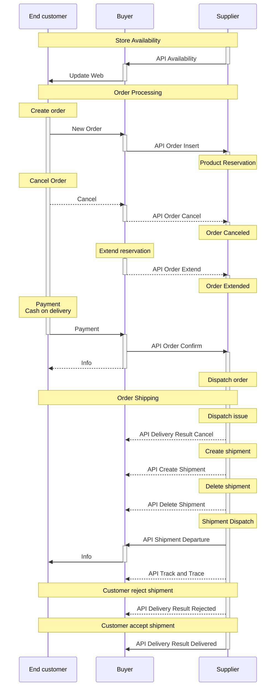

# Introduction {#introduction}
{: .no_toc }

## Table of contents
{: .no_toc .text-delta }

1. TOC
{:toc}

This documentation describes the features and capabilities of the **Dropshipment API**, which is intended for suppliers who want to
implement delivery of goods from the supplier directly to the end customer in its own information system.

The main part of the **Dropshipment API** is the **production Dropshipment API**, through which all necessary messages are exchanged 
for the successful completion of the entire business case. An additional component is the **Testing Dropshipment API**, which is 
intended to accelerate the connection of the supplier to the **production API**.

**Production Dropshipment API** consists of two parts:

+ ***[Buyer API][buyer-api]*** - Supplier pushes products *availability* and information about shipment 
    *dispatch* and *delivery*.
+ ***[Supplier API][supplier-api]*** - Which is used for *order* management

This separation aims to minimize delays of important events.

**Testing Dropshipment API** consists of two parts:

+ ***[Testing Buyer API][testing-buyer-api]*** - Works same as *[Buyer API][buyer-api]* but `test` variable is added to the URL.
+ ***[Testing Supplier API][testing-supplier-api]*** - Provides the ability to invoke a request to *[Supplier API][supplier-api]*

API provides specific test scenarios to detect API implementation errors. Both parts are implemented on Buyer side. 
No further implementation on the supplier side  is necessary. Just use of third party tools like Postman.


## Simplified communication scheme {#introduction--simplified-communication-scheme}



<!--  -->

## Upcoming features {#introduction--upcoming-features}

  - ??.2026 - **GLN**
    - *[Insert order][insert-order]*, *[Extend order][extend-order]*, *[Cancel order][cancel-order]* and *[Confirm order][confirm-order]* : 
        data length of `vatNo` changed from `100` to `30`
    - *[DeliveryAddress][ds-delivery-address]* : Object *[Address][ds-delivery-address]* renamed to [DeliveryAddress][ds-delivery-address]. 
        The attribute in JSON is still the same.
    - *[CompanyAddress][ds-company-address]* : A new object was introduced, used for invoicing purposes.
    - *[ShipmentAddress][ds-shipment-address]* : A new object was introduced, used for invoicing and routing purposes.
    - *[Confirm order][confirm-order] -> [Request][ds-order-confirm-request]* : New attribute `taxNo` added, used for invoicing purposes. 
    - *[Confirm order][confirm-order] -> [Request][ds-order-confirm-request]* : New attribute `glnList` added, used for invoicing purposes. 
    - *[Confirm order][confirm-order] -> [Request][ds-order-confirm-request]* : New attribute `shipmentDeliveryAddress` added, used for invoicing and routing purposes.
    - *[Confirm order][confirm-order] -> [Request][ds-order-confirm-request]* : New attribute `buyerAddress` added, used for invoicing purposes.
  - ??.2026 - **Delivery services**
    - *[Confirm order][confirm-order] -> [Request][ds-order-confirm-request]* : New attribute `shipmentDeliveryServices` added, used for carrier delivery serices.
    - *[Confirm order][confirm-order] -> [ShipmentDeliveryServices][ds-shipment-delivery-services]* : 
        New object contains three services. `oldApplianceRemoval`, `carryIn` and `basicInstallation`
    

## Versions {#introduction--versions}

  - **1.183** 29.05.2026
    - *[Shipping carrier][ds-shipping-carrier-code]* :  Added `DPDSK` for DPD Slovakia.
    - *[Shipping carrier delivery type][ds-shipping-carrier-delivery-type]* : 
        Added `DPDSK` for address delivery for *[shipping carrier][ds-shipping-carrier-code]* `DPDSK`.
    - *[Shipping carrier][ds-shipping-carrier-code]* :  Added `DPDHU` for DPD Hungary.
    - *[Shipping carrier delivery type][ds-shipping-carrier-delivery-type]* :
        Added `DPDHU` for address delivery for *[shipping carrier][ds-shipping-carrier-code]* `DPDHU`.
  - **1.182** 17.04.2026
    - *[Availability][availability]* : The limit per API message has changed from 50 MB to 30 MB.
  - **1.181** 14.04.2026
    - *[Error handling][error-handling] -> [Rate limits][rate-limits]* : New API behaviour introduced. Read more there.
    - *[Maintenance-free design][maintenance-free-design]* : The recommended maximum number of parallel supplier requests has changed from **10** to **5**.
  - **1.180** 03.03.2026
    - *[Confirm order][confirm-order] -> [Request][ds-order-confirm-request]* : Attribute `route` contains new attribute `routeDeliveryOrder`.
  - **1.179** 17.02.2026
    - *[Confirm order][confirm-order]* : We modified the *[Request][ds-order-confirm-request]* object. A new optional 
       attribute `shipmentExternalOrderNumber` was added, which is used for suppliers who print their own labels.
  - **1.178** 04.02.2026
    - *[Track and Trace][track-and-trace]* -> *[Request][ds-track-and-trace-request]* : `status` attribute updated.
    - *[TrackAndTraceStatus][ds-track-and-trace-status]* : New value `Stored` added to enum.
  - **1.177** 12.11.2025
    - *[Resend intervals][resend-intervals]* : Due to the high number of parallel operations on a single supplier, we are forced to limit this 
        behavior to improve performance. As a result, the limit for resending shipment requests has been reduced. The resending exception is 
        valid until the end of the year.
    - *[Maintenance-free design][maintenance-free-design]* : Adds parallel run recommendation.
  - **1.176** 16.10.2025
    - *[Confirm order][confirm-order] -> [Request][ds-order-confirm-request]* : `packageSorting` attribute updated.
    - *[PackageSortingGroup][ds-package-sorting-group]* : New value `CrossLC` added to enum.
  - **1.175** 19.09.2025
    - *[Authentication][authentication-token]* : Clarification of the casing used in the token calculation.
  - **1.174** 19.06.2025
    - *[Confirm order][confirm-order] -> [Request][ds-order-confirm-request]* : New attribute `packageSorting` for shipment package sorting before shipping.
  - **1.173** 21.05.2025
    - *[OrderNumber][ds-order-number]* : We are announcing a change to the order number format. The number will include the prefix DD. 
        The number change will be deployed in the near future. No API changes are required, considering that the order number was already marked as a string.
  - **1.172** 09.09.2024
    - *[Availability][availability]* : The `product.size1`, `product.size2`, `product.size3` and `product.weight` attributes are marked as 
        deprecated and optional before future removal. Product dimensions and weight are moved to Trade portal.
        The goal is to reduce the amount of data sent.
  - **1.171** 09.09.2024
    - *[Timeout settings][timeout-settings]* : Adds additional 15s for shipment and order messages for sender. Removes 20s for availability for receiver.
  - **1.170** 13.08.2024
    - *[Availability][availability]* : Adds new import type `PartialFull`. Only available on the new API URL. Contact Dropship Support for more information.
  - **1.169** 30.04.2024
    - *[Confirm order][confirm-order]* : *[Request][ds-order-confirm-request]* contains new attribute `route`(*[Route][ds-route]*). 
        Consists of attributes `routeName` and `routeStops`(*[RouteStop][ds-route-stop]*). Information is used on custom shipping stickers.
  - **1.168** 02.04.2024
    - *All API requests* : Adds clarification of the HTTP response status codes.
    - Relevant endpoints: *[Insert order][insert-order]*, *[Confirm order][confirm-order]*, *[Extend order][extend-order]*, *[Cancel order][cancel-order]*,
        *[Availability][availability]*, *[Delete shipment][delete-shipment]*, *[Shipment Departure][shipment-departure]*, 
        *[Create shipment][create-shipment]*, *[Track and Trace][track-and-trace]* and *[Delivery result][delivery-result]*. 
  - **1.167** 11.03.2024
    - *[CustomerId][ds-customer-id]* : Clarification of the use of the `customerId` attribute. 
        The attribute can be set for supplierBranchId and can be the same for all supplier branches. It is up to the supplier.
    - Relevant endpoints: *[Insert order][insert-order]*, *[Confirm order][confirm-order]*, *[Extend order][extend-order]*, *[Cancel order][cancel-order]* and 
        *[Invoke Insert order][testing-insert-order]*
  - **1.166** 12.12.2023    
    - *[Parcel shop identification][ds-parcel-shop-identification]* : Added `CZPOSTP`Post office delivery for shipping carrier code `CZPOST`.
  - **1.165** 16.08.2023
    - *[Full Availability][availability]* : 
        Full Availability is restricted to one request per day.
  - **1.164** 19.07.2023
    - *[Shipping carrier][ds-shipping-carrier-code]* :
        New shipping carrier `ALZA` added.
    - *[Shipping carrier delivery type][ds-shipping-carrier-delivery-type]* :
        New shipping carrier delivery types `ALZABRANCH` and `ALZABOX` are added for shipping carrier `ALZA`
    - *[Parcel shop identification][ds-parcel-shop-identification]* :
        New parcel shop identification `ALZABOX` are added for shipping carrier `ALZA`
    - *[Confirm order][confirm-order]* -> *[Request][ds-order-confirm-request]* :  
        Attribute `demandedExpeditionDate` is marked as deprecated.
    - *Shipping carrier identification* : Removed from documentation.
  - **1.163** 20.06.2023
    - *[Resend intervals][resend-intervals]* :
        Short and Default limit introduced. Preparations for strict enforcement of resending.
  - **1.162** 14.06.2023
    - *[Common Error Codes][common-error-codes]* :
        A new error code `-7` was added. Used in cases when resend limits are not followed.
    - *[Resend intervals][resend-intervals]* :
        Added a message subject relevant to the resend limit.
  - **1.161** 05.05.2023
    - *[SupplierProductCode][ds-supplier-product-code]* :
        Code length has been reduced from 100 characters to 50 characters.
  - **1.160** 02.05.2023
    - *[SupplierProductCode][ds-supplier-product-code]* :
        Introduces new data type for supplier product code. 
        Replaces all `code` attributes where are [String100][ds-string-100].
    - *[Availability][availability]* : 
        This especially impacts Availability where invalid supplier product codes will be ignored.
  - **1.159** 24.03.2023
    - *[Delete shipment][delete-shipment]* :
        Parameter `shipment` shortened from 100 characters to 50 characters.
    - *[Shipment Departure][shipment-departure]* : 
        Parameter `shipment` shortened from 100 characters to 50 characters.
    - *[Create shipment][create-shipment]* :
        Attribute `shipmentNumber` shortened from 100 characters to 50 characters.
    - *[Track and Trace][track-and-trace]* :
        Attribute `shipment` shortened from 100 characters to 50 characters. 
    - *Generate order packages* : 
        Removed from documentation
  - **1.158** 23.02.2023
    - *[Order Insert][insert-order]* :
        Added new attribute `serialNumbersExpected` in [OrderItem][ds-order-item].
  - **1.157** 28.11.2022
    - *[Shipping carrier delivery type][ds-shipping-carrier-delivery-type]* : 
        Added `DPDPARCELSHOP`, `DPDBOX` and `DPDALZABOX` for *[shipping carrier][ds-shipping-carrier-code]* `DPD`.
    - *[Parcel shop identification][ds-parcel-shop-identification]* : 
        Added `DPDPARCELSHOP`, `DPDBOX` and `DPDALZABOX` for DPD.
  - **1.156** 21.10.2022
    - *[Shipment Departure][shipment-departure]* : 
        `shippingCarrierIdentification` is not accepted anymore. Use `shippingCarrier` instead.
        The current request structure is [ShipmentDepartureRequest][ds-shipment-departure-request].
        The previous request structure was removed.
    - *[Confirm order][confirm-order]* : 
        `shippingCarrierIdentification` was removed from the request. Use `shippingCarrier` instead.
        The current request structure is [OrderConfirmRequest][ds-order-confirm-request].
        The previous request structure was removed.
    - *[Insert order][insert-order]* : 
        `alzaBarCode` was removed from the request.
        The current item structure is [OrderItem][ds-order-item].
        The previous item structure was removed.
    - *ShippingCarrierIdentification* : Not used anymore.
  - **1.155** 20.10.2022
    - *[API basics][api-basics]* : Clarification of use `timestamp` and `timestampUtc` attribute.
    - *[Authentication][authentication-token]* : Clarification of URL encode.
  - **1.154** 20.10.2022
    - *Generate order packages* : API message disabled.
  - **1.153** 20.10.2022
    - *[Cancel order][cancel-order]* : It is allowed to try to cancel the order after confirming the order.
        The supplier has a right to reject the attempt. See more in [Cancel order][cancel-order].
  - **1.152** 14.09.2022
    - *[Availability][availability]* : Due to non-compliance with the rules, it is necessary to take measures to eliminate 
        this behavior. When a certain limit is exceeded, messages could be rejected with an error code of `-5`. And it is 
        undesirable for the same message to be sent again.
  - **1.151** 06.09.2022
    - *[Confirm order][confirm-order]* : Fixed unclear description for attributes `demandedExpeditionDate` 
        and `shipmentDepartureTime`
  - **1.150** 05.09.2022
    - *[Create shipment][create-shipment]* : Adds Shipment consolidation rules.
    - *[Shipment departure][shipment-departure]* : Adds Shipment consolidation rules.
  - **1.149** 15.07.2022
    - *[Supplier product pricing][supplier-product-pricing]* : 
        Added a new topic that explains how product pricing is influenced by the supplier.
    - *[Availability][availability]* : 
        Introduced new attribute `productList[].countryPrice`, array of objects [CountryPrice][ds-country-price]
        necessary for *[Supplier product pricing][supplier-product-pricing]*
        This array replaces old structures for price, VAT and fees. 
        A attribute contains `country`, `currency`, `vat`, `sellingPriceWithoutVat` and `fees`. 
        Attribute `fees` of object [CountryPriceFees][ds-country-price-fees] consist of attributes `copyright` and `recycling`.
    - *[Availability][availability]* : 
        Attributes of **Legacy price mode** marked as ***Deprecated***. 
    - *[Order Insert][insert-order]* : 
        Attribute `orderItems[].unitPrice` marked as ***Deprecated***. Use `orderItems[].purchasePriceWithoutFees` 
        and `orderItems[].fees` instead.
  - **1.148** 22.03.2022
    - *[Order Insert][insert-order]* : 
        Introduced new attribute `orderItems[].purchasePriceWithoutFees`.
        Introduced new attribute `orderItems[].fees`. For future use in **Latest price mode**.
        See [OrderItem][ds-order-item].
  - **1.147** 16.02.2022
    - *[Create shipment][create-shipment]* : `packageId` changed from [Int16][ds-int-16] to [Int64][ds-int-64] for
    [ShipmentCreateItem][ds-shipment-create-item], [ShipmentCreatePackage][ds-shipment-create-package] 
    and [CreatedPackage][ds-created-package]
  - **1.146** 24.01.2022
    - *[Timestamp][ds-timestamp]* : Timestamp marked as [CET (Central European Time)](https://time.is/cs/CET) for clarification.
    - *[TimestampUtc][ds-timestamputc]* : Introduced new time format in [UTC (Coordinated Universal Time)](https://time.is/cs/UTC).
  - **1.145** 22.11.2021
    - *[Data types][data-types]* : Descriptions refined and tied to *[Data Structures][data-structures]*.
    - *[Data Structures][data-structures]* : 
        All structures refined and tied with coresponding [Data types][data-types]. 
        Added ranges and lengths of structures.
    - *[ErrorProduct][ds-error-product]* : the `price` attribute is no longer used.
    - *[Test Availability][testing-availability]* : The maximum number of products has increased to 100.  
  - **1.144** 28.07.2021
    - *[Shipping carrier][ds-shipping-carrier-code]* : New shipping carrier WE|DO introduced. With code `WEDO` 
        and delivery type `WEDOHD`
  - **1.143** 20.07.2021
    - *[Insert order][insert-order]* : Required attribute `supplierId` added. 
        Attribute `customerId` marked as required.
    - *[Confirm order][confirm-order]* : Required attribute `supplierId` and `supplierBranchId` added. 
        Attribute `customerId` marked as required. 
    - *[Extend order][extend-order]* : Required attribute `supplierId` and `supplierBranchId` added. 
        Attribute `customerId` marked as required.
    - *[Cancel order][cancel-order]* : Required attribute `supplierId` and `supplierBranchId` added. 
        Attribute `customerId` marked as required.
    - *[Authentication][authentication-token]* : Clarification of the term `client`
  - **1.142** 11.06.2021
    - *[Shipping carrier][ds-shipping-carrier-code]* : New shipping carrier GebrĂĽder Weiss introduced. With code `GebruderWeiss` 
        and delivery type `GebruderWeissStandard`
  - **1.141** 01.06.2021
    - *[Invoke Insert order][testing-insert-order]* : Adds custom `customerId` for communication with Supplier API.
  - **1.140** 19.05.2021
    - Changes effective from **September 2021**
    - *Generate order packages* : API message won't be accepted. 
        It is necessary to implement the *[Create shipment][create-shipment]* API message.
    - *Shipping carrier identification* : The data type will be removed from API 
        due to deprecation. Use *[Shipping carrier code][ds-shipping-carrier-code]* 
        and *[Shipping carrier delivery type][ds-shipping-carrier-delivery-type]* instead.
    - *[Confirm order][confirm-order]* : Attribute `shippingCarrierIdentification` will be removed from API message 
        due to deprecation. Use `shippingCarrier` instead.
    - *[Shipment departure][shipment-departure]* : Attribute `shippingCarrierIdentification` will be removed from API message 
        due to deprecation. Use `shippingCarrier` instead.
    - *[Insert order][insert-order]* : Attribute `alzaBarCode` will be removed from API message due to deprecation.  
  - **1.139** 18.05.2021
    - Testing API introduced.
    - *[Testing Supplier API][testing-supplier-api]* : API provides invocation of messages to *[Supplier API][supplier-api]*.
    - *[Testing Buyer API][testing-buyer-api]* : API providing same ability as *[Buyer API][buyer-api]* but in testing environment.
  - **1.138** 22.04.2021
    - *[FAQ][faq]* : New article with Frequently asked questions created.
  - **1.137** 14.01.2021
    - *[Shipment departure][shipment-departure]* : New object *[ShippingListGroup][ds-shipping-list-group]* with shipping list group 
      PDF URL added to response JSON object *[Shipment][ds-departured-shipment]* for shipments created by *[Create shipment][create-shipment]* API message. 
  - **1.136** 27.11.2020
    - *[Availability][availability]* : Added new rules for Update importType.
  - **1.135** 06.11.2020
    - *Shipping carrier identification* : Added `CZPOSTB` Česká pošta, Balíkovna.
    - *[Shipping carrier delivery type][ds-shipping-carrier-delivery-type]* : Added `CZPOSTB` Balíkovna delivery type to Česká pošta.
    - *[Parcel shop identification][ds-parcel-shop-identification]* : Added `CZPOSTB` Česká pošta Balíkovna.
  - **1.134** 15.09.2020
    - *[Availability][availability]* : A new optional `serialNumbers` attribute.
    - *[Insert order][insert-order]* : A new optional `serialNumbersRequired` attribute.
    - *[Shipment departure][shipment-departure]* : `items[].serials` marked as required if *Insert order* 
      `serialNumbersRequired` is true.
  - **1.133** 08.09.2020
    - *[Insert order][insert-order]* : Change response value requirement for attribute `validUntil`.
    - *[Extend order][extend-order]* : Change response value requirement for attribute `validUntil`.
  - **1.132** 01.09.2020
    - *[Shipping modes][shipping-modes]* : Added a topic that explains two ways to handle shipment delivery.
    - *Shipping carrier identification* : Added clarification on using `Supplier` value.
    - *[Shipping carrier delivery type][ds-shipping-carrier-delivery-type]* : Added clarification on using `Supplier` value.
    - *Generate order packages* : Marked as ***Deprecated***.
  - **1.131** 19.08.2020
    - *Generate order packages* : Added ability to process `ParcelShop` `shipmentDeliveryType`
  - **1.130** 22.07.2020
    - *Generate order packages* : Optional attribute `packageId` is added to `packages`.
  - **1.129** 16.07.2020
    - *[Timeout settings][timeout-settings]* : Added and set as required behavior.
  - **1.128** 13.07.2020
    - *[Create shipment][create-shipment]* : New API endpoint introduced for creating shipment for Buyer shipping mode.
    - *[Delete shipment][delete-shipment]* : New API endpoint introduced for deleting shipment for Buyer shipping mode.
  - **1.127** 08.07.2020
    - *[Shipment departure][shipment-departure]* : Clarification of the purpose of the shipment.
  - **1.126** 24.06.2020
    - *[Communication basics][communication-basics]* : New API service availability requirements added. 
  - **1.125** 23.06.2020
    - *[Confirm order][confirm-order]* : A new `shipmentDepartureTime` attribute has been added to the request. 
      Defines the time of shipment departure.
    - *[Shipment departure][shipment-departure]* : 
      A new `shipment.shippingList.shippingListId` attribute has been added to the response.
      A new `shipment.departureTime` attribute has been added to the response.
  - **1.124** 19.06.2020
    - *[Insert order][insert-order]* : Attribute `alzaBarCodes` may contain duplicates.
  - **1.123** 10.06.2020
    - *[Confirm order][confirm-order]* : A new `shipmentShippingMode` attribute has been added to the request. 
      Defines who handles *shipment number*, *package numbers*, *shipping list*, *shipping sticker* and *carrier data*.
    - *[Maintenance-free design][maintenance-free-design]* : Some points are marked as **required**
  - **1.122** 07.05.2020
    - *[Shipping carrier code][ds-shipping-carrier-code]* : FOFR added.
    - *[Shipping carrier delivery type][ds-shipping-carrier-delivery-type]* : FOFRSTD added.
  - **1.121** 14.04.2020
    - *[ApiaryUI](https://help.apiary.io/tools/interactive-documentation-v4/)* : Interactive Documentation v4 activated
  - **1.120** 10.04.2020
    - *[Shipping carrier code][ds-shipping-carrier-code]* : Shipping carrier HELICAR added.
    - *[Shipping carrier delivery type][ds-shipping-carrier-delivery-type]* : Shipping carrier delivery types HELICARSTD and HELICARUP added.
  - **1.119** 24.03.2020
    - *[Shipment departure][shipment-departure]* : New object shipment with shipping list PDF URL added to response 
      JSON for shipments created by *Generate order packages* API message 
  - **1.118** 18.03.2020
    - *Shipping carrier identification* : Marked as *deprecated*.
    - *[Shipping carrier code][ds-shipping-carrier-code]* : New data type for shipping carrier identification introduced.
    - *[Shipping carrier delivery type][ds-shipping-carrier-delivery-type]* : New data type for shipping carrier delivery type introduced.
    - *[Confirm order][confirm-order]*, *Generate order packages* and *[Shipment departure][shipment-departure]* : 
      Attribute `shippingCarrierIdentification` marked as *optional*. 
      New optional object `shippingCarrier` introduced which replaces attribute `shippingCarrierIdentification` in the future.
  - **1.117** 19.02.2020
    - *[Communication basics][communication-basics]* : `TLS` protocol version 1.2 or higher is required.
  - **1.116** 18.02.2020
    - *[Availability][availability]* : Refining the description of fields `productList[].fee` and `productList[].priceWithFee`.          
  - **1.115** 10.01.2020
    - *[Availability][availability]* : The current limit of 20,000 products is increased almost to 200,000 products per API message.
  - **1.114** 07.01.2020
    - API communication entities changed to the End customer, Buyer and Supplier due to contractual links.
    - *Generate order packages* : Method implementation conditions changed.
    - *[Track and Trace][track-and-trace]* : Method implementation conditions changed.
    - *[Shipment departure][shipment-departure]* : Starting June 2020, the attribute `items[].packageNumber` and `items[].quantity` 
        will be required.
  - **1.113** 18.11.2019
    - *Shipping carrier identification* : Najbert added.
  - **1.112** 08.11.2019
    - *[API basics][api-basics]* : New paragraph for API communication basics created. Part of introduction moved here.
    - *[API basics][api-basics]* : `User-Agent` header field is requiered
  - **1.111** 01.11.2019
    - *[Parcel shop identification][ds-parcel-shop-identification]* : New data type introduced. Used 
    for parcel shop identification.
    - *[Confirm order][confirm-order]* and *[Shipment departure][shipment-departure]* : New optional 
    object `parcelShop` introduced. Attributes `parcelShopIdentification` and `parcelShopBranchCode` are used for 
    identify target parcel shop
  - **1.110** 03.10.2019
    - *Generate order packages* : Added optional object `packages` with `weight` 
    and `volume` attributes.
    - *[Error handling][error-handling]* : Basic error handling rules introduced.
    - *[Common error codes][common-error-codes]* : Error codes `0` mentioned for completeness.
  - **1.109** 09.09.2019
    - *Shipping carrier identification* : Geis Point added.
  - **1.108** 26.07.2019
    - *[Maintenance-free design][maintenance-free-design]* statement update.
  - **1.107** 13.05.2019
    - *[Delivery result][delivery-result]* : New optional `errorProducts` array for Canceled status
  - **1.106** 11.04.2019
    - *[Buyer API][buyer-api]* : New API endpoint released. More information on specific API messages.
    - *[Extend order][extend-order]* : Added optional `validUntil` attribute with recommended expiration date

All older release messages for version **0.xxx** have been hidden due to the length of the list

<!--     
  - **0.105** 07.11.2018
    - *[Maintenance-free design][maintenance-free-design]* statement.
    - *[Extend order][extend-order]* : is marked as required.
    - *[Insert order][insert-order]* : Explicit mention of the use of error code `-3`.
    - *[Error codes][common-error-codes]* : Error code `-3` is marked as method-specific acceptable.
  - **0.104** 02.10.2018
    - *[Shipment departure][shipment-departure]* : `shipmentValue` and `shipmentValueCurrency` is conditionally marked as required. 
  - **0.103** 10.09.2018
    - *[Error codes][common-error-codes]* : New error code `-5` annouced.
    - *[Extend order][extend-order]* : First use of new error code.
  - **0.102** 02.08.2018
    - *Generate order packages* : New method to generate order packages. Work in progress.
  - **0.101** 25.7.2018
    - *[Availability][availability]* : Message limitation announced.
  - **0.100** 25.7.2018
    - *[Insert order][insert-order]* : Attribute `alzaBarCode` mark as deprecated. 
    - *[Insert order][insert-order]* : New attribute `alzaBarCodes` introduced. Future replacement for `alzaBarCode` attribute.
  - **0.99** 11.7.2018
    - Specify how to continue work with messages when an *[Error Code][common-error-codes]* occurs
  - **0.98** 3.4.2018
    - *[Confirm order][confirm-order]* : New attribute `shipmentValue` and `shipmentValueCurrency`
  - **0.97** 13.3.2018
    - *[Track and Trace][track-and-trace]* : `status` value `Delivery` added
    - *[Introduction][introduction]* : Sequence diagram updated
    - *[Shipment departure][shipment-departure]* : `shipmentWeight` and `package.weight` marked as required
    - *[Availability][availability]* : `product.size1`, `product.size2`, `product.size3` and `product.weight` marked as required
  - **0.96** 25.1.2018
    - *[Confirm order][confirm-order]* : New optional attribute `deliveryBranchId`
    - *[Communication basics][communication-basics]* : Commonly trusted `HTTPS` authentication *certificate* is required.
    - *[Track and Trace][track-and-trace]* : Specified conditionality of attributes
    - Specify data type for `quantity`
  - **0.95** 23.10.2017
    - *[Shipment departure][shipment-departure]* : New attributes `packages.fullNumber` and `packages.ttURL` (Track and Trace URL)
    - *[Track and Trace][track-and-trace]* : New attribute `fullPackageNumber`
  - **0.94** 5.10.2017
    - Please use lowercase in URL (API, Resource; for `HMAC` and request)
    - *[Track and Trace][track-and-trace]* : `status` value `Delivery` renamed to `Delivered`
  - **0.93** 27.9.2017
    - *[Shipment departure][shipment-departure]* : New optional attribute `items.code`, `phone` marked as *optional*
  - **0.92** 14.9.2017
    - *[Confirm order][confirm-order]* : New required attribute `paymentVS`
  - **0.91** 4.9.2017
    - Supplier API: `regNo` type changed to string
    - *[Insert order][insert-order]* : New optional `errorProducts`
  - **0.9** 31.8.2017
    - Trailing slashes removed from URLs
    - Supplier API: New attributes: `regNo` (IÄŚO) and `vatNo` (DIÄŚ) in all methods
    - *[Availability Import][availability]* :
      - `price` is without *recycling/copyright fee*
      - Added optional attributes `fee`, `priceWithFee`, `limited`
    - *[Shipment departure][shipment-departure]* :
      - *expectedDeliveryTime* renamed to `expectedDeliveryDate`
      - *Packages + Items* are now separated to Packages and standalone Items (with `packageNumber` relation)
      - Added `shippingCarrierIdentification`
      - Removed *shipmentPackagesNumber*, *packageOrder*
    - *[Track and Trace][track-and-trace]* :
      - Changed Method URL
      - *Order number* moved from URL to attributes, changed to optional
      - Added optional attributes *shipment* and *package*
    - *[Insert order][insert-order]* : Now can return `supplierOrder`
    - *[Confirm order][confirm-order]* :
      - `ShippingCarrierIdentification` cleanup
      - Removed *cashOnDeliveryAccountNumber* and *returnAddress*
    - Added list of Error codes
  - **0.81** 28.8.2017
    - *Server* removed from *[HMAC message][authentication-token]
    - *[Insert order][insert-order]* :
      - Attribute *supplierProductCode* renamed to `code` (consistency with *[Availability import][availability])
      - Removed redundant optional attribute *ean*
  - **0.8** 23.8.2017 
    - Add `supplierBranchId` identification to *[Insert order][insert-order]
  - **0.7** 11.8.2017 
    - Move delivery information from *[Insert order][insert-order]* to *[Confirm order][confirm-order]
  - **0.62** 10.8.2017 
    - API review, updated endpoint naming, customerId attribute in *[Supplier API][supplier-api]
  - **0.6** 1.8.2017 
    - Add *[Authentication HMAC token][authentication-token]
  - **0.5** 21.7.2017 
    - Initial draft
 -->
 

## Communication basics {#introduction--communication-basics}

  - Commonly trusted `HTTPS` authentication *certificate* is required.
  
  - `TLS` protocol version 1.2 or higher is required.
  
  - 23-hour API service availability in one day is required.
  
  - A 1-hour maintenance window has to be between 22:00 and 03:00.


## API basics {#introduction--api-basics}

  - All *requests* have to use `Content-Type` `application/json` header with `UTF-8` charset
    ([RFC 7231, section 3.1.1.5: Content-Type](https://datatracker.ietf.org/doc/html/rfc7231#section-3.1.1.5)).
    Example: `application/json; charset=utf-8`
  
  - All *requests* have to fill `User-Agent` header field ([RFC 7231, section 5.5.3: User-Agent](https://datatracker.ietf.org/doc/html/rfc7231#section-5.5.3)) 
    Example: `Dropship-API/1.0`
  
  - Required JSON *attributes* are marked as **required**, rest of *attributes* are **optional** or 
    **conditionally optional**. See *attribute* description
  
  - The JSON `timestamp` and `timestampUtc` attribute must always be up-to-date even in cases of repeated sending of the API message.
  

## Maintenance-free design {#introduction--maintenance-free-design}

Emphasis is placed on automation and maintenance-free communication.
Any process that can prevent user intervention is preferred.
Some of them are marked as **required**.
The following points outline this concept. 

 - In case that a valid JSON response is not delivered successfully, 
 it is assumed that the message is undelivered and the sender attempts to send the 
 message again until it has received a valid response JSON. Time between attempts should 
 be set according to *[Resend intervals][resend-intervals]* to prevent unnecessary overload. 
 This behavior is **required**.
 
 - Upon receipt of a valid JSON response is necessary to implement the rules 
 of acceptance in the *[Common error codes][common-error-codes]*. This behavior is **required**.
 
 - API message receiver should accept repeated same messages in a short period of time 
 without error due to a possible error in communication. Only the `timestamp` attribute can change.
 
 - In some cases, a combination of API messages can help to remove the current issue. 
 For example, when the *Supplier* does not implement *errorProducts* in the 
 *[Insert order][insert-order]* *method*. 
 In the case of an `Invalid price` error, you need to send the 
 *[Availability][availability]* message for the 
 specified products to correct prices to prevent another error.
 
 - Timing for time consuming operations such as Full/PartialFull *[Availability][availability]* is also important. 
 This can prevent unwanted collisions and unnecessary delays. The ideal time to send 
 is in the early morning hours.

 - The right timeout setup could prevent unnecessary messages sent. 
 See more in *[Timeout settings][timeout-settings]*. This behavior is **required**.

 - Parallel requests are not prohibited, but they need to be managed well. Some operations are dependent on each other 
 and must wait for each other if they are run in parallel. The current recommended maximum number of requests of the same type 
 from one supplier running in parallel is **5**. For more info follow to *[Rate limits][rate-limits]*

## Authentication token {#introduction--authentication-token}

 - Standard *[HMAC token][hmac]* is used for basic authentication. Token is *[Base64][base64]* encoded
 and you have to *[URL Encode][percent-encoding]* it again for usage in URI. 
 - Use the **same casing** for the `api` and `resource` part as in the URL. Previously, lowercase were required, but this is no longer the case.
 - Use **uppercase** for the `method` and `timestamp` part.
 - `client` for Supplier API is Buyer ID. `client` for Buyer API is Supplier ID.

```
token = base64encode(hmac("sha1", "secret", "{client}+{method}+{api}{resource}+{timestamp}"))
```


| Part      | Description                              | Example                       |
|-----------|------------------------------------------|-------------------------------|
| hash      | hash algorithm                           | `sha1`                        |
| secret    | Preshared secret key                     | `s3Cr37!`                     |
| client    | Supplier ID or Buyer ID ([Int32][ds-int-32])          | `1`                           |
| method    | HTTP call method (`GET`/`POST`/`DELETE`) | `POST`                        |
| server    | Webserver                                | `https://services.server.cz`  |
| api       | Common API URL                           | `/rest/api/v1`                |
| resource  | Specific resource call                   | `/order/DD12345678/delivery`  |
| timestamp | "timestamp" from JSON request            | `2025-06-01T19:33:43.513`     |

**Example of token calculation in C#**
```csharp
using System;
using System.Security.Cryptography;
using System.Text;

var secret = "s3Cr37!";
var message = "1+POST+/rest/api/v1/order/DD12345678/delivery+2025-06-01T19:33:43.513";

using (var hmac = new HMACSHA1(Encoding.UTF8.GetBytes(secret)))
{
  var hash = hmac.ComputeHash(Encoding.UTF8.GetBytes(message))
  var token = Convert.ToBase64String(hash);
  Console.WriteLine (token); // token = jDGARg+SaXMa8Ib++O92+ZX3ITQ=
}
```

**Example of token calculation in PHP**
```php
<?php
$secret = "s3Cr37!";
$message = "1+POST+/rest/api/v1/order/DD12345678/delivery+2025-06-01T19:33:43.513";
$token = base64_encode(hash_hmac("sha1", $message, $secret, true));
echo $token; // $token = jDGARg+SaXMa8Ib++O92+ZX3ITQ=
?>
```


**Example of request variants with URL Encoding**

All variants must be processable on the buyer and supplier side.
```
POST https://server.cz/api/v1/order/DD12345678/delivery?token=jDGARg%2BSaXMa8Ib%2B%2BO92%2BZX3ITQ=
POST https://server.cz/api/v1/order/DD12345678/delivery?token=jDGARg%2BSaXMa8Ib%2B%2BO92%2BZX3ITQ%3D
```


## Data types {#introduction--data-types}

Data types are simple types and are part of *[Data Structures][data-structures]*.

### Basic data types {#introduction--data-types--basic-data-types}

Basic types are based on `string` and `number`.

Numeric types
+ *[Int16][ds-int-16]*
+ *[Int32][ds-int-32]*
+ *[Int64][ds-int-64]*
+ *[Float][ds-float]*

String types
+ *[String10][ds-string-10]*
+ *[String20][ds-string-20]*
+ *[String30][ds-string-30]*
+ *[String50][ds-string-50]*
+ *[String100][ds-string-100]*
+ *[String500][ds-string-500]*

Specific types
+ *[Date][ds-date]*
+ *[Timestamp][ds-timestamp]*
+ *[TimestampUtc][ds-timestampUtc]*
+ *[Number][ds-number]*
+ *[Money][ds-money]*
+ *[Weight][ds-weight]*
+ *[Volume][ds-volume]*
+ *[VAT][ds-vat]*
+ *[GUID][ds-guid]*
+ *[Id][ds-id]*
+ *[Id64][ds-id-64]*
+ *[CustomerId][ds-customer-id]*
+ *[HmacToken][ds-hmac-token]* or *[Authentication][authentication-token]* for more information


### Enumerated data types {#introduction--data-types--enumerated-data-types}

Enumerated types are based on `enum`.

#### Country code {#introduction--data-types--enumerated-data-types--country-code}
See *[Country][ds-country]* data structrure for more information.

#### Currency code {#introduction--data-types--enumerated-data-types--currency-code}
See *[Currency][ds-currency]* data structrure for more information.

#### Country vs Currency {#introduction--data-types--enumerated-data-types--country-vs-currency}
We always accept the national currency of the country. Examples in table.

| Country | Currency |
|---------|----------|
| `CZ`    | `CZK`    |
| `SK`    | `EUR`    |
| `HU`    | `HUF`    |
| `AT`    | `EUR`    |
| `DE`    | `EUR`    |
| `PL`    | `PLN`    |

#### Error code {#introduction--data-types--enumerated-data-types--error-code}
For all possible error codes see *[ErrorCode][ds-error-code]*. Their subsets *[SuccessErrorCode][ds-success-error-code]* 
and *[FailErrorCode][ds-fail-error-code]* are applied accordingly.

#### Import type {#introduction--data-types--enumerated-data-types--import-type}
Used only in *[Availability][availability]* API message. 
See *[ImportType][ds-import-type]* data structrure for full list.

#### Track and Trace status {#introduction--data-types--enumerated-data-types--track-and-Trace-status}
Used only in *[Track and Trace][track-and-trace]* API message. 
See *[TrackAndTrace status][ds-track-and-trace-status]* data structrure for full list.

#### Delivery result status {#introduction--data-types--enumerated-data-types--Delivery-result-status}
Used only in *[Delivery result][delivery-result]* API message.
See *[DeliveryResultStatus][ds-delivery-result-status]* data structrure for full list.

#### Shipment delivery type {#introduction--data-types--enumerated-data-types}
Used only in *[Confirm order][confirm-order]* API message.
See *[ShipmentDeliveryType][ds-shipment-delivery-type]* data structrure for full list.

**Shipment consolidation rules** 

| shipmentDeliveryType | Allowed | Required |
|----------------------|---------|----------|
| `B2C`                | No      | No       |
| `B2B`                | No      | No       |
| `Branch`             | Yes     | Yes      |
| `ParcelShop`         | No      | No       |

#### Shipment shipping mode {#introduction--data-types--enumerated-data-types--shipment-shipping-mode}
See *[Shipping modes][shipping-modes]* for a full explanation.
Used only in *[Confirm order][confirm-order]* API message.
See *[ShipmentShippingMode][ds-shipment-shipping-mode]* data structrure for full list.

#### Shipping carrier code {#introduction--data-types--enumerated-data-types--shipping-carrier-code}

Identification of shipping carrier. 

Identification is used in *[Confirm order][confirm-order]*, 
*[Create shipment][create-shipment]* and in *[Shipment departure][shipment-departure]*.

See *[ShippingCarrierCode][ds-shipping-carrier-code]* data structrure for full list.


#### Shipping carrier delivery type {#introduction--data-types--enumerated-data-types--shipping-carrier-delivery-type}

Identification of delivery type. Mostly shipping carrier specific.

Identification is used in *[Confirm order][confirm-order]*,
*[Create shipment][create-shipment]* and in *[Shipment departure][shipment-departure]*.

For *[Confirm order][confirm-order]* special value **`Supplier`**  means that the supplier selects *Shipping carrier delivery type* 
according to *Shipping carrier code*. If the *Shipping carrier code* is not filled in, the shipment is delivered by the
supplier itself.

For *[Create shipment][create-shipment]*
and *[Shipment departure][shipment-departure]* in Buyer shipping mode special value **`Supplier`** is forbiden.

For *[Shipment departure][shipment-departure]* in Supplier shipping mode
special value **`Supplier`**  means that the supplier takes care of the delivery.

See *[ShippingCarrierDeliveryCode][ds-shipping-carrier-delivery-type]* data structrure for full list.


#### Parcel shop identification {#introduction--data-types--enumerated-data-types--parcel-shop-identification}

Identification is used in *[Confirm order][confirm-order]*, *[Create shipment][create-shipment]* 
and in *[Shipment departure][shipment-departure]*.

See *[ParcelShopIdentification][ds-parcel-shop-identification]* data structrure for full list.


## Error handling {#introduction--error-handling--error-handling}

***Required behavior.***

 - You should fill `errorMessage` for all error API responses.
 - API message has to be resend when valid API response is not delivered successfully
 - API message has to be resend when message data is not accepted. See *[Error codes][common-error-codes]*
 - Resent messages has to be send in specified intervals. See *[Resend intervals][resend-intervals]*


### Common error codes {#introduction--error-handling--common-error-codes--common-error-codes}

***Required behavior.***

| Error Code | Description                                   | Data accepted |
|------------|-----------------------------------------------|---------------|
| `0`        | Success. No error.                            | Yes           |
| `-1`       | Generic error (more info in `errorMessage`).  | No            |
| `-2`       | Invalid input data.                           | No            |
| `-3`       | Out of stock.                                 | Yes/No        |
| `-4`       | Invalid price.                                | No            |
| `-5`       | Operation rejected.                           | Yes/No        |
| `-6`       | Bad response.                                 | Yes           |
| `-7`       | Resend limit violated.                        | No            |

If message data is not accepted, message have to be resend until the problem is resolved. 

Error code `-3` and `-5` is accepted in specific methods.


### Resend intervals {#introduction--error-handling--resend-intervals}

***Required behavior.***

Resend intervals is applied to API message to avoid overload of Supplier or Buyer API. 

Resend refers to the main subject of the message. It can be a branch, a shipment or an order. 
If the message is received in a shorter time than the limit, the message is refused with `errorCode` `-7`.

Message is examined in depth for possible error correction then limit is not applied. 
For example, when creating a shipment when changing the number of packages.

Resend limits apply only to messages with a `responseCode` other than `-7`.

There are two limit categories. **Short** and **Default**. The **Short** limit is applied if only 2 or fewer other 
API messages are in the observed range. If there are more than 2 messages, the **Default** limit is applied.

**Values in brackets are temporary values. Follow the latest versions for further information.**

Interval units are in minutes.

| API message                                | Short limit | Default limit | Observed range | Subject  |
|--------------------------------------------|-------------|---------------|----------------|----------|
| *[Update availability][availability]*      |  1          | 10            | 30             | Branch   |
| *[PartialFull availability][availability]* |  1          | 1             | 60             | Branch   |
| *[Full availability][availability]*        | 10          | 10            | 60             | Branch   |
| *[Insert order][insert-order]*             |  1          | 10            | 60             | Order    |
| *[Extend order][extend-order]*             |  1          | 10            | 60             | Order    |
| *[Cancel order][cancel-order]*             |  1          | 10            | 60             | Order    |
| *[Confirm order][confirm-order]*           |  1          | 10            | 60             | Order    |
| *[Create shipment][create-shipment]*       |  1          | 15 (**5**)    | 60             | Shipment |
| *[Delete shipment][delete-shipment]*       |  1          | 15 (**5**)    | 60             | Shipment |
| *[Shipment departure][shipment-departure]* |  1          | 15 (**5**)    | 60             | Shipment |
| *[Track and Trace][track-and-trace]*       |  1          | 15 (**5**)    | 60             | Shipment |
| *[Delivery result][delivery-result]*       |  5          | 30            | 60             | Order    |

Increasing the interval to prevent massive API overload is desirable.


### Timeout settings {#introduction--error-handling--timeout-settings}

***Required behavior.***

Timeout should be set higher on sender side

| API message                                          | Buyer timeout [s] | Supplier timeout [s] |
|------------------------------------------------------|-------------------|----------------------|
| *[Availability][availability]*                       | 280               | 300                  |
| *[Insert order][insert-order]*                       | 80                | 60                   |
| *[Extend order][extend-order]*                       | 80                | 60                   |
| *[Cancel order][cancel-order]*                       | 80                | 60                   |
| *[Confirm order][confirm-order]*                     | 80                | 60                   |
| *[Create shipment][create-shipment]*                 | 60                | 80                   |
| *[Delete shipment][delete-shipment]*                 | 60                | 80                   |
| *[Shipment departure][shipment-departure]*           | 60                | 80                   |
| *[Track and Trace][track-and-trace]*                 | 60                | 80                   |
| *[Delivery result][delivery-result]*                 | 60                | 80                   |


### Rate limits {#introduction--error-handling--rate-limits}

Rate limits set rules for how an API should behave when processing a large number of parallel incoming requests from a single supplier.

With a large number of requests, requests may be delayed and if individual requests require longer processing time, a timeout may occur.

In extreme cases, the request may be automatically rejected due to exceeding the limit, which could degrade API performance for other suppliers. 
In such cases, the API will return HTTP error **429 "Too Many Requests"** and will not contain a body. 
The request must be resent according to the specified *[Resend intervals][resend-intervals]*.

Specific limits are intentionally not specifically stated here. The settings will change over time to meet performance needs.


## Shipping modes {#introduction--shipping-modes}

Shipping mode defines who handles **shipment number**, **package numbers**, **shipping list**, **shipping stickers** 
and **carrier data** which are necessary for shipment delivery for specific shipping carrier.

Shipping modes is possible combines.

The identification of which mode is used for the current order is defined in the `shipmnetShippingMode` 
attribute in the *[Confirm order][confirm-order]*.


### Supplier shipping mode {#introduction--shipping-modes--supplier-shipping-mode}

For suppliers who have already implemented or want to implement specific shipping carriers.

It is possible to use the transport contract of both the buyer and the supplier.

This mode is also known as **DSM**. More specificly :
* **DSMA** when buyer's transport contract is used.
* **DSMD** when supplier's transport contract is used.


### Buyer shipping mode {#introduction--shipping-modes--buyer-shipping-mode}

For suppliers who do not have implemented or are not able to implement specific shipping carriers.

It is possible to use only the transport contract of the buyer.

This mode is also known as **ASM**.

To obtain the **shipment number**, **package numbers** and **shipping sticker** is necessary to use 
the *[Create shipment][create-shipment]* API method.

In situations where an invalid shipment is generated, it can be deleted using *[Delete shipment][delete-shipment]*.

**Shipping list** is returned by *[Shipment departure][shipment-departure]* API message when Buyer shipping mode is detected.


## Product pricing {#introduction--product-pricing}

Product pricing defines who can affect the final price for the end customer.
The following product pricing variants cannot be combined with each other.


### Supplier product pricing {#introduction--product-pricing--supplier-product-pricing}

Supplier product pricing allows the supplier to potentially influence the price at which the end customer buys the product.
The purchase price of the product is calculated according to the commission level of the product category provided by the buyer.

This pricing variant is also known as **DPP**.

**This is preferred solution for product pricing.**

Supplier sends only selling price in attribude `productList[].countryPrices[].sellingPriceWithoutVat` 
of **Latest price mode** of *[Availability][availability]* API message . 

For more information see *[Availability][availability]* API message.


### Buyer product pricing {#introduction--product-pricing--buyer-product-pricing}

Buyer product pricing does not allow influence the price at which the end customer buys the product.

This pricing variant is also known as **APP**.

**This is legacy solution for product pricing.**

Supplier sends only purchase price in attribude `productList[].countryPrices[].purchasePriceWithoutFees` 
of **Latest price mode** of *[Availability][availability]* API message .

For more information see *[Availability][availability]* API message.


## FAQ {#introduction--faq}

**1. How to work with `Supplier` shippingCarrierDeliveryType ?**

The `shippingCarrierDeliveryType` `Supplier` is sent by Buyer in *[Confirm order][confirm-order]* API message. 

The `shippingCarrierDeliveryType` is sent back by Supplier in *[Create shipment][create-shipment]* and 
*[Shipment departure][shipment-departure]* API message. 

**1. A. In the case when `shippingCarrierCode` is sent too.**

For example:
```json
"shippingCarrier": {
    "shippingCarrierCode": "CZPOST",
    "shippingCarrierDeliveryType": "Supplier"
}
```

It is expected that supplier picks relevant `shippingCarrierDeliveryType` 
according to `shippingCarrierCode`. For example for `shippingCarrierCode` `CZPOST` it would be  
`CZPOSTD`. For example:
```json
  "shippingCarrier": {
        "shippingCarrierCode": "CZPOST",
        "shippingCarrierDeliveryType": "CZPOSTD"
    }
```

It is usually used for delivery to branches.
 

**1. B. In the case when `shippingCarrierCode` is not sent.**


For example:
```json
  "shippingCarrier": {
        "shippingCarrierDeliveryType": "Supplier"
    }
```

It is expected that supplier sent back `shippingCarrierDeliveryType`  
`Supplier` because there is not relevant `shippingCarrierCode`. For example:
```json
  "shippingCarrier": {
        "shippingCarrierDeliveryType": "Supplier"
    }
```

It is used in cases where the Supplier is also a shipping carrier and there is no general identification of this carrier.

**2. How to send 1 piece of product which is consist of two packages?**
 
This applies to messages *[Create shipment][create-shipment]* and *[Shipment departure][shipment-departure]*.

If the product consists of two packages, the `items` part of *[Create shipment][create-shipment]* API message 
would look like this:
```json
"items": [
    {
      "packageId": 1,
      "order": "DD12345678",
      "orderItemId": 54879848461,
      "quantity": 1
    },
    {
      "packageId": 2,
      "order": "DD12345678",
      "orderItemId": 54879848461,
      "quantity": 0
    }
]
```


If the product consists of two packages, the `items` part of *[Shipment departure][shipment-departure]* API message 
would look like this:
```json
"items": [
    {
      "packageNumber": "135NUM000A1",
      "order": "DD12345678",
      "orderItemId": 54879848461,
      "quantity": 1
    },
    {
      "packageNumber": "135NUM000A2",
      "order": "DD12345678",
      "orderItemId": 54879848461,
      "quantity": 0
    }
]
```


[introduction]:                         #introduction
[upcoming-features]:                    #introduction--upcoming-features
[versions]:                             #introduction--versions
[simplified-communication-scheme]:      #introduction--simplified-communication-scheme
[communication-basics]:                 #introduction--communication-basics
[api-basics]:                           #introduction--api-basics
[maintenance-free-design]:              #introduction--maintenance-free-design
[authentication-token]:                 #introduction--authentication-token

[data-types]:                           #introduction--data-types
[basic-data-types]:                     #introduction--data-types--basic-data-types
[enumerated-data-types]:                #introduction--data-types--enumerated-data-types
[country-code]:                         #introduction--data-types--enumerated-data-types--country-code
[country-vs-currency]:                  #introduction--data-types--enumerated-data-types--country-vs-currency
[currency-code]:                        #introduction--data-types--enumerated-data-types--currency-code
[delivery-result-status]:               #introduction--data-types--enumerated-data-types--delivery-result-status
[error-code]:                           #introduction--data-types--enumerated-data-types--error-code
[import-type]:                          #introduction--data-types--enumerated-data-types--import-type
[parcel-shop-identification]:           #introduction--data-types--enumerated-data-types--parcel-shop-identification
[shipment-shipping-mode]:               #introduction--data-types--enumerated-data-types--shipment-shipping-mode
[shipping-carrier-code]:                #introduction--data-types--enumerated-data-types--shipping-carrier-code
[shipping-carrier-delivery-type]:       #introduction--data-types--enumerated-data-types--shipping-carrier-delivery-type
[track-and-trace-status]:               #introduction--data-types--enumerated-data-types--track-and-trace-status

[error-handling]:                       #introduction--error-handling--error-handling
[common-error-codes]:                   #introduction--error-handling--common-error-codes--common-error-codes
[resend-intervals]:                     #introduction--error-handling--resend-intervals
[timeout-settings]:                     #introduction--error-handling--timeout-settings
[rate-limits]:                          #introduction--error-handling--rate-limits
[shipping-modes]:                       #introduction--shipping-modes
[buyer-shipping-mode]:                  #introduction--shipping-modes--buyer-shipping-mode
[supplier-shipping-mode]:               #introduction--shipping-modes--supplier-shipping-mode
[product-pricing]:                      #introduction--product-pricing
[supplier-product-pricing]:             #introduction--product-pricing--supplier-product-pricing
[buyer-product-pricing]:                #introduction--product-pricing--buyer-product-pricing
[faq]:                                  #introduction--faq

[supplier-api]:                         supplier-api/#reference-supplier-api
[insert-order]:                         supplier-api/#reference-supplier-api--insert-order
[cancel-order]:                         supplier-api/#reference-supplier-api--cancel-order
[extend-order]:                         supplier-api/#reference-supplier-api--extend-order
[confirm-order]:                        supplier-api/#reference-supplier-api--confirm-order

[buyer-api]:                            buyer-api/#reference-buyer-api
[availability]:                         buyer-api/#reference-buyer-api--availability
[create-shipment]:                      buyer-api/#reference-buyer-api--create-shipment
[delete-shipment]:                      buyer-api/#reference-buyer-api--delete-shipment
[shipment-departure]:                   buyer-api/#reference-buyer-api--shipment-departure
[track-and-trace]:                      buyer-api/#reference-buyer-api--track-and-trace
[delivery-result]:                      buyer-api/#reference-buyer-api--delivery-result

[testing-supplier-api]:                 testing-supplier-api/#reference-testing-supplier-api
[testing-insert-order]:                 testing-supplier-api/#reference-testing-supplier-api--insert-order
[testing-cancel-order]:                 testing-supplier-api/#reference-testing-supplier-api--cancel-order
[testing-confirm-order]:                testing-supplier-api/#reference-testing-supplier-api--confirm-order
[testing-extend-order]:                 testing-supplier-api/#reference-testing-supplier-api--extend-order

[testing-buyer-api]:                    testing-buyer-api/#reference-testing-buyer-api
[testing-availability]:                 testing-buyer-api/#reference-testing-buyer-api--availability
[testing-create-shipment]:              testing-buyer-api/#reference-testing-buyer-api--create-shipment
[testing-delete-shipment]:              testing-buyer-api/#reference-testing-buyer-api--delete-shipment
[testing-delivery-result]:              testing-buyer-api/#reference-testing-buyer-api--delivery-result
[testing-shipment-departure]:           testing-buyer-api/#reference-testing-buyer-api--shipment-departure
[testing-track-and-trace]:              testing-buyer-api/#reference-testing-buyer-api--track-and-trace

[data-structures]:                      data-structures/#data-structures
[ds-timestamp]:                         data-structures/#data-structures--timestamp
[ds-timestamputc]:                      data-structures/#data-structures--timestamputc
[ds-date]:                              data-structures/#data-structures--date
[ds-int-16]:                            data-structures/#data-structures--int-16
[ds-int-32]:                            data-structures/#data-structures--int-32
[ds-int-64]:                            data-structures/#data-structures--int-64
[ds-float]:                             data-structures/#data-structures--float
[ds-string-10]:                         data-structures/#data-structures--string-10
[ds-string-20]:                         data-structures/#data-structures--string-20
[ds-string-30]:                         data-structures/#data-structures--string-30
[ds-string-50]:                         data-structures/#data-structures--string-50
[ds-string-100]:                        data-structures/#data-structures--string-100
[ds-string-500]:                        data-structures/#data-structures--string-500
[ds-customer-id]:                       data-structures/#data-structures--customer-id
[ds-supplier-product-code]:             data-structures/#data-structures--supplier-product-code
[ds-weight]:                            data-structures/#data-structures--weight
[ds-volume]:                            data-structures/#data-structures--volume
[ds-money]:                             data-structures/#data-structures--money
[ds-vat]:                               data-structures/#data-structures--vat
[ds-hmac-token]:                        data-structures/#data-structures--hmac-token
[ds-country]:                           data-structures/#data-structures--country
[ds-currency]:                          data-structures/#data-structures--currency
[ds-guid]:                              data-structures/#data-structures--guid
[ds-gln-list]:                          data-structures/#data-structures--gln-list
[ds-gln]:                               data-structures/#data-structures--gln
[ds-number]:                            data-structures/#data-structures--number
[ds-order-number]:                      data-structures/#data-structures--order-number
[ds-id]:                                data-structures/#data-structures--id
[ds-id-64]:                             data-structures/#data-structures--id-64

[ds-error-code]:                        data-structures/#data-structures--error-code
[ds-success-error-code]:                data-structures/#data-structures--success-error-code
[ds-fail-error-code]:                   data-structures/#data-structures--fail-error-code
[ds-import-type]:                       data-structures/#data-structures--import-type
[ds-track-and-trace-status]:            data-structures/#data-structures--track-and-trace-status
[ds-delivery-result-status]:            data-structures/#data-structures--delivery-result-status
[ds-shipment-delivery-type]:            data-structures/#data-structures--shipment-delivery-type
[ds-shipment-shipping-mode]:            data-structures/#data-structures--shipment-shipping-mode
[ds-shipment-delivery-services]:        data-structures/#data-structures--shipment-delivery-services
[ds-shipping-carrier-code]:             data-structures/#data-structures--shipping-carrier-code
[ds-shipping-carrier-delivery-type]:    data-structures/#data-structures--shipping-carrier-delivery-type
[ds-parcel-shop-identification]:        data-structures/#data-structures--parcel-shop-identification
[ds-route]:                             data-structures/#data-structures--route
[ds-route-stop]:                        data-structures/#data-structures--route-stop
[ds-delivery-address]:                  data-structures/#data-structures--delivery-address
[ds-company-address]:                   data-structures/#data-structures--company-address
[ds-shipment-address]:                  data-structures/#data-structures--shipment-address
[ds-package-sorting-group]:             data-structures/#data-structures--package-sorting-group

[ds-shipping-list]:                     data-structures/#data-structures--shipping-list
[ds-shipping-list-group]:               data-structures/#data-structures--shipping-list-group
[ds-departured-shipment]:               data-structures/#data-structures--departured-shipment
[ds-product]:                           data-structures/#data-structures--product
[ds-error-product]:                     data-structures/#data-structures--error-product
[ds-parcel-shop]:                       data-structures/#data-structures--parcel-shop
[ds-shipping-carrier-confirm]:          data-structures/#data-structures--shipping-carrier-confirm
[ds-shipping-carrier]:                  data-structures/#data-structures--shipping-carrier
[ds-shipping-carrier-strict]:           data-structures/#data-structures--shipping-carrier-strict
[ds-country-price]:                     data-structures/#data-structures--country-price
[ds-country-price-fees]:                data-structures/#data-structures--country-price-fees
[ds-created-shipment]:                  data-structures/#data-structures--created-shipment
[ds-created-package]:                   data-structures/#data-structures--created-package
[ds-shipment-create-item]:              data-structures/#data-structures--shipment-create-item
[ds-shipment-create-package]:           data-structures/#data-structures--shipment-create-package
[ds-shipment-departure-package]:        data-structures/#data-structures--shipment-departure-package
[ds-shipment-departure-item]:           data-structures/#data-structures--shipment-departure-item
[ds-order-item]:                        data-structures/#data-structures--order-item
[ds-package-sorting]:                   data-structures/#data-structures--package-sorting

[ds-availability-request]:              data-structures/#data-structures--availability-request
[ds-order-insert-request]:              data-structures/#data-structures--order-insert-request
[ds-order-insert-response]:             data-structures/#data-structures--order-insert-response
[ds-order-extend-request]:              data-structures/#data-structures--order-extend-request
[ds-order-extend-response]:             data-structures/#data-structures--order-extend-response
[ds-order-cancel-request]:              data-structures/#data-structures--order-cancel-request
[ds-order-confirm-request]:             data-structures/#data-structures--order-confirm-request
[ds-shipment-create-request]:           data-structures/#data-structures--shipment-create-request
[ds-shipment-create-response]:          data-structures/#data-structures--shipment-create-response
[ds-shipment-delete-request]:           data-structures/#data-structures--shipment-delete-request
[ds-shipment-departure-request]:        data-structures/#data-structures--shipment-departure-request
[ds-shipment-departure-response]:       data-structures/#data-structures--shipment-departure-response
[ds-track-and-trace-request]:           data-structures/#data-structures--track-and-trace-request
[ds-delivery-result-request]:           data-structures/#data-structures--delivery-result-request
[ds-general-response]:                  data-structures/#data-structures--general-response


[ds-invoker-simple-request]:            data-structures/#data-structures--invoker-simple-request
[ds-invoker-order-insert-request]:      data-structures/#data-structures--invoker-order-insert-request
[ds-invoker-order-insert-response]:     data-structures/#data-structures--invoker-order-insert-response
[ds-invoker-order-extend-response]:     data-structures/#data-structures--invoker-order-extend-response
[ds-invoker-order-confirm-response]:    data-structures/#data-structures--invoker-order-confirm-response
[ds-invoker-order-cancel-response]:     data-structures/#data-structures--invoker-order-cancel-response

[hmac]:                                 https://en.wikipedia.org/wiki/Hash-based_message_authentication_code
[base64]:                               https://msdn.microsoft.com/library/system.convert.tobase64string.aspx
[percent-encoding]:                     https://en.wikipedia.org/wiki/Percent-encoding

[wiki-country-code]:                    https://en.wikipedia.org/wiki/ISO_3166-1_alpha-2
[wiki-currency-code]:                   https://en.wikipedia.org/wiki/ISO_4217
[iso-country-code]:                     https://www.iso.org/iso-3166-country-codes.html
[iso-currency-code]:                    https://www.iso.org/iso-4217-currency-codes.html
